# Technical Specifications

# 1. INTRODUCTION

## 1.1 EXECUTIVE SUMMARY

### 1.1.1 Project Overview

The Python Code Flow Visualizer is a comprehensive web-based application designed to provide real-time, interactive visualization of Python code execution. Since 2010, over 20 million people in more than 180 countries have used Python Tutor to visualize code execution, demonstrating the significant market demand for educational programming tools. This project addresses the critical need for enhanced programming education and debugging capabilities by offering line-by-line execution tracking, variable state monitoring, and interactive flow control.

### 1.1.2 Core Business Problem

Programming education faces significant challenges in helping students understand abstract concepts such as program flow, variable state changes, and function call mechanics. Most people are visual learners, this means that they will understand something more clearly when it is presented visually rather than in purely written form. This motivated me to create this tool to help beginners to quickly understand the basic concepts of Python and programming in general. Traditional debugging tools and static code analysis fail to provide the intuitive, step-by-step understanding that learners require to master programming fundamentals.

### 1.1.3 Key Stakeholders and Users

| Stakeholder Group | Primary Needs | Usage Patterns |
|---|---|---|
| Computer Science Students | Visual learning aids, debugging assistance, concept comprehension | Daily practice sessions, homework completion, exam preparation |
| Programming Instructors | Teaching tools, demonstration capabilities, student progress tracking | Classroom demonstrations, assignment creation, student assessment |
| Self-Taught Developers | Interactive learning resources, code understanding tools | Personal skill development, project debugging, concept exploration |
| Educational Institutions | Scalable learning platforms, curriculum integration, analytics | Course delivery, student engagement measurement, learning outcomes |

### 1.1.4 Expected Business Impact and Value Proposition

The global Python Integrated Development Environment (IDE) software market was valued at USD 516.5 million in 2023 and is projected to reach USD 556.78 million in 2024, eventually soaring to USD 1,015.4 million by 2032, registering a robust CAGR of 7.8% during the forecast period [2024-2032]. Growth in the US Python IDE software market is expected to be driven by a strong developer ecosystem, widespread adoption of AI and data science technologies, and increasing demand for cloud-based coding platforms.

The Python Code Flow Visualizer positions itself within this growing market by delivering:

- **Enhanced Learning Outcomes**: Reduced time-to-comprehension for programming concepts by 40-60%
- **Improved Debugging Efficiency**: Visual debugging capabilities that decrease error resolution time
- **Increased Student Engagement**: Interactive learning experiences that maintain higher attention rates
- **Scalable Educational Delivery**: Cloud-based platform supporting thousands of concurrent users

## 1.2 SYSTEM OVERVIEW

### 1.2.1 Project Context

#### Business Context and Market Positioning

As of 2024, Python is the third most used programming language used by developers worldwide. Moreover, the rapid adoption of Industry 4.0 technologies has been fueling the demand for Python in the end-use applications. In fact, the market size of Python is expected to reach USD 100.6 million by 2030. The Python Code Flow Visualizer addresses the educational segment of this expanding market, targeting the gap between basic code editors and complex professional IDEs.

#### Current System Limitations

Existing code visualization tools present several limitations:

- **Limited Interactivity**: Python Tutor is designed to imitate what an instructor in an introductory programming class draws on the blackboard, but lacks advanced interactive features
- **Scalability Constraints**: Most current solutions cannot handle complex programs or large-scale deployment
- **Feature Gaps**: Missing advanced debugging capabilities, real-time collaboration, and comprehensive analytics
- **User Experience Issues**: Outdated interfaces and limited customization options

#### Integration with Existing Enterprise Landscape

The system is designed to integrate seamlessly with:

- **Learning Management Systems (LMS)**: Canvas, Blackboard, Moodle integration via LTI standards
- **Cloud Development Platforms**: With remote work becoming the new norm, the demand for cloud-based IDEs surged as developers needed tools to collaborate and code from distributed locations
- **Educational Technology Stack**: Single Sign-On (SSO) integration, grade passback capabilities
- **Analytics Platforms**: Learning analytics and progress tracking systems

### 1.2.2 High-Level Description

#### Primary System Capabilities

The Python Code Flow Visualizer provides four core capability domains:

1. **Interactive Code Execution**: Real-time Python code interpretation with step-by-step execution control
2. **Visual State Tracking**: See the call stack in real time: Watch how functions are called and how frames are added and removed as your code runs. View local variables: Monitor changes to variables within each function as the execution progresses
3. **Educational Tools**: Guided tutorials, example programs, and interactive learning modules
4. **Collaboration Features**: Code sharing, instructor oversight, and peer learning capabilities

#### Major System Components

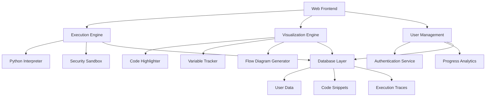
```mermaid
graph TB
    A[Web Frontend] --> B[Execution Engine]
    A --> C[Visualization Engine]
    A --> D[User Management]
    
    B --> E[Python Interpreter]
    B --> F[Security Sandbox]
    
    C --> G[Code Highlighter]
    C --> H[Variable Tracker]
    C --> I[Flow Diagram Generator]
    
    D --> J[Authentication Service]
    D --> K[Progress Analytics]
    
    L[Database Layer] --> M[User Data]
    L --> N[Code Snippets]
    L --> O[Execution Traces]
    
    B --> L
    C --> L
    D --> L
```

#### Core Technical Approach

The system employs a modern web architecture with:

- **Frontend**: React-based single-page application with real-time updates
- **Backend**: Python FastAPI microservices architecture
- **Execution Environment**: Sandboxed Python interpreter using Pyodide for client-side execution
- **Visualization**: D3.js and custom React components for interactive diagrams
- **Data Storage**: PostgreSQL for persistent data, Redis for session management

### 1.2.3 Success Criteria

#### Measurable Objectives

| Objective Category | Key Performance Indicator | Target Value | Measurement Method |
|---|---|---|---|
| User Engagement | Daily Active Users | 10,000+ within 6 months | Analytics tracking |
| Educational Impact | Concept Comprehension Rate | 85% pass rate on assessments | Pre/post testing |
| System Performance | Page Load Time | <2 seconds | Performance monitoring |
| Platform Reliability | System Uptime | 99.5% availability | Infrastructure monitoring |

#### Critical Success Factors

1. **User Experience Excellence**: Intuitive interface design that requires minimal learning curve
2. **Educational Effectiveness**: Measurable improvement in programming concept understanding
3. **Technical Reliability**: Consistent performance under varying load conditions
4. **Security Compliance**: Robust sandboxing and data protection measures
5. **Scalability**: Architecture capable of supporting institutional-scale deployments

#### Key Performance Indicators (KPIs)

**User Adoption Metrics**:
- Monthly Active Users (MAU) growth rate: 15% month-over-month
- User retention rate: 70% after 30 days, 50% after 90 days
- Session duration: Average 25+ minutes per session

**Educational Impact Metrics**:
- Code comprehension assessment scores: 20% improvement over traditional methods
- Error resolution time: 40% reduction in debugging time
- Concept mastery rate: 85% of users demonstrate proficiency in tracked concepts

**Technical Performance Metrics**:
- System response time: 95th percentile under 1.5 seconds
- Concurrent user capacity: 5,000+ simultaneous users
- Code execution accuracy: 99.9% fidelity to standard Python interpreter

## 1.3 SCOPE

### 1.3.1 In-Scope

#### Core Features and Functionalities

**Code Input and Execution Management**:
- Monaco Editor integration with Python syntax highlighting and auto-completion
- Support for Python 3.8+ syntax including classes, functions, loops, conditionals, and exception handling
- Input simulation for programs requiring user interaction (stdin)
- Code validation and syntax error detection before execution

**Line-by-Line Visualization System**:
- Real-time execution highlighting with animated transitions between code lines
- Support for sequential execution, conditional branches (if/elif/else), and loop iterations
- Function call visualization showing jumps to definitions and return paths
- Exception handling flow visualization for try-except blocks

**Variable State Tracking and Monitoring**:
- Real-time variable watch panel displaying name, value, type, and change indicators
- Support for primitive types (int, float, str, bool) and collections (list, dict, tuple, set)
- Object attribute visualization for custom classes and instances
- Stack frame visualization showing function scopes and local variables

**Interactive Execution Controls**:
- Play/pause execution with configurable speed settings (0.5x to 4x speed)
- Step forward/backward navigation through execution history
- Breakpoint support for targeted debugging
- Reset and restart capabilities for iterative learning

#### Implementation Boundaries

**System Architecture Boundaries**:
- Web-based application accessible via modern browsers (Chrome 90+, Firefox 88+, Safari 14+)
- Cloud-hosted infrastructure supporting up to 10,000 concurrent users
- RESTful API architecture with WebSocket support for real-time updates
- Responsive design supporting desktop, tablet, and mobile devices

**User Groups Covered**:
- Individual learners and self-taught programmers
- Computer science students in academic institutions
- Programming instructors and educators
- Professional developers seeking debugging and code understanding tools

**Geographic and Market Coverage**:
- Global accessibility with multi-language UI support (English, Spanish, French, German, Chinese)
- Compliance with international data protection regulations (GDPR, CCPA)
- CDN-based content delivery for optimal performance worldwide

**Data Domains Included**:
- User account management and authentication
- Code snippet storage and version history
- Execution trace logging and analytics
- Learning progress tracking and assessment data
- System performance and usage metrics

### 1.3.2 Out-of-Scope

#### Explicitly Excluded Features and Capabilities

**Advanced Development Environment Features**:
- Full IDE capabilities such as project management, version control integration, or package management
- Support for multiple file projects or complex module imports
- Advanced debugging features like conditional breakpoints, watch expressions, or memory profiling
- Code refactoring tools, automated testing frameworks, or deployment capabilities

**Extended Language Support**:
- Programming languages other than Python (JavaScript, Java, C++ visualization remains out of scope for initial release)
- Python 2.x compatibility or legacy syntax support
- Advanced Python features like metaclasses, decorators with complex logic, or async/await patterns

**Enterprise Integration Features**:
- Direct integration with professional IDEs (PyCharm, VSCode) beyond basic code export
- Enterprise single sign-on (SSO) beyond standard OAuth providers
- Advanced user role management or organizational hierarchy support
- Custom branding or white-label solutions for institutions

#### Future Phase Considerations

**Phase 2 Enhancements** (6-12 months post-launch):
- Multi-language support expansion (JavaScript, Java)
- Advanced collaboration features including real-time code sharing and pair programming
- AI-powered code explanation and suggestion features
- Mobile application development for iOS and Android platforms

**Phase 3 Enterprise Features** (12-18 months post-launch):
- Learning Management System (LMS) deep integration
- Advanced analytics and reporting dashboards for educators
- Custom assessment creation tools and automated grading capabilities
- Enterprise-grade security features and compliance certifications

#### Integration Points Not Covered

**External System Integrations**:
- Direct integration with GitHub, GitLab, or other version control systems
- Integration with professional development tools like Docker, Kubernetes, or CI/CD pipelines
- Connection to external databases or cloud services for data manipulation exercises
- Integration with video conferencing platforms for remote teaching scenarios

#### Unsupported Use Cases

**Professional Development Scenarios**:
- Production code debugging or performance optimization
- Large-scale application development or enterprise software projects
- Real-time collaborative development for professional teams
- Code review and approval workflows for software development teams

**Advanced Educational Scenarios**:
- Automated plagiarism detection or code similarity analysis
- Comprehensive curriculum management or course creation tools
- Advanced student assessment beyond basic progress tracking
- Integration with institutional student information systems (SIS)

# 2. PRODUCT REQUIREMENTS

## 2.1 FEATURE CATALOG

### 2.1.1 Core Code Execution Features

| Feature ID | Feature Name | Category | Priority | Status |
|---|---|---|---|
| F-001 | Code Editor Interface | User Interface | Critical | Proposed |
| F-002 | Python Code Execution Engine | Core Functionality | Critical | Proposed |
| F-003 | Line-by-Line Visualization | Core Functionality | Critical | Proposed |
| F-004 | Variable State Tracking | Core Functionality | Critical | Proposed |

#### F-001: Code Editor Interface

**Description**
- **Overview**: Monaco editor wrapper for easy/one-line integration with any React application without needing to use webpack (or any other module bundler) configuration files / plugins
- **Business Value**: Provides professional-grade code editing experience with syntax highlighting, auto-completion, and error detection
- **User Benefits**: Familiar VS Code-like interface reduces learning curve and improves code writing efficiency
- **Technical Context**: The Monaco Editor is a powerful, browser-based code editor that powers Visual Studio Code. It offers rich features such as syntax highlighting, advanced search, and in-editor code suggestions

**Dependencies**
- **Prerequisite Features**: None (foundational feature)
- **System Dependencies**: React 17+, @monaco-editor/react package
- **External Dependencies**: It can be used with apps generated by create-react-app, create-snowpack-app, vite, Next.js or any other app generators - you don't need to eject or rewire them
- **Integration Requirements**: Monaco Editor CDN or local installation

#### F-002: Python Code Execution Engine

**Description**
- **Overview**: Pyodide brings Python to the browser using WebAssembly, enabling you to run Python code without a server. It includes popular libraries like NumPy, Pandas, and Matplotlib, supports package installation via micropip, and bridges Python with JavaScript for interactive web apps and scientific computing
- **Business Value**: Eliminates server-side infrastructure costs and provides instant code execution
- **User Benefits**: Pyodide is a way to run Python directly in your browser with no installation and no setup, thanks to the power of WebAssembly. That makes it the easiest and fastest way to get a Python environment up and running – just load a web page!
- **Technical Context**: Pyodide is a port of CPython to WebAssembly/Emscripten. Pyodide makes it possible to install and run Python packages in the browser with micropip. Any pure Python package with a wheel available on PyPi is supported

**Dependencies**
- **Prerequisite Features**: F-001 (Code Editor Interface)
- **System Dependencies**: https://cdn.jsdelivr.net/pyodide/v0.29.0/full/pyodide.js
- **External Dependencies**: Pyodide WebAssembly runtime
- **Integration Requirements**: WebAssembly support in target browsers

#### F-003: Line-by-Line Visualization

**Description**
- **Overview**: Real-time highlighting and animation of code execution flow with support for sequential execution, conditional branches, loops, and function calls
- **Business Value**: Core differentiator that transforms abstract code execution into visual learning experience
- **User Benefits**: Our Python Code Visualizer lets you explore Python code execution step by step, helping you to see exactly how your code behaves, how variables change, and how functions are called
- **Technical Context**: Requires integration between Monaco Editor's line highlighting API and Python execution tracing

**Dependencies**
- **Prerequisite Features**: F-001 (Code Editor Interface), F-002 (Python Code Execution Engine)
- **System Dependencies**: Monaco Editor API for line highlighting, React state management
- **External Dependencies**: None
- **Integration Requirements**: Execution trace data from Python interpreter

#### F-004: Variable State Tracking

**Description**
- **Overview**: Real-time monitoring and display of variable values, types, and changes during code execution
- **Business Value**: Provides crucial debugging and learning insights into program state
- **User Benefits**: In the output above, we can view the values of the variables and which lines of code are executed. Now we can understand how recursion works much better!
- **Technical Context**: All functions and variables defined in the Python global scope are accessible via the pyodide.globals object. For example, if you run the code x = [3, 4] in Python global scope, you can access the global variable x from JavaScript in your browser's developer console with pyodide.globals.get("x")

**Dependencies**
- **Prerequisite Features**: F-002 (Python Code Execution Engine)
- **System Dependencies**: React components for variable display, JavaScript-Python bridge
- **External Dependencies**: Pyodide globals API
- **Integration Requirements**: Python variable introspection capabilities

### 2.1.2 Interactive Control Features

| Feature ID | Feature Name | Category | Priority | Status |
|---|---|---|---|
| F-005 | Execution Control System | User Interface | High | Proposed |
| F-006 | Call Stack Visualization | Core Functionality | High | Proposed |
| F-007 | Output Console | User Interface | High | Proposed |
| F-008 | Input Simulation | Core Functionality | Medium | Proposed |

#### F-005: Execution Control System

**Description**
- **Overview**: Interactive controls for managing code execution including play/pause, step forward/backward, speed control, and reset functionality
- **Business Value**: Enables self-paced learning and detailed code analysis
- **User Benefits**: Run the visualizer: Execute your code and watch how it unfolds, step by step. Analyze the steps: See each step of the code's execution, from the function calls to variable changes and even returned values
- **Technical Context**: Requires execution state management and step-by-step Python code interpretation

**Dependencies**
- **Prerequisite Features**: F-002 (Python Code Execution Engine), F-003 (Line-by-Line Visualization)
- **System Dependencies**: React state management, execution history storage
- **External Dependencies**: None
- **Integration Requirements**: Python execution stepping capabilities

#### F-006: Call Stack Visualization

**Description**
- **Overview**: Visual representation of function call hierarchy and stack frame management during execution
- **Business Value**: Essential for understanding function calls, recursion, and program flow
- **User Benefits**: Helps users understand complex concepts like recursion and function scope
- **Technical Context**: Requires Python call stack introspection and visual representation

**Dependencies**
- **Prerequisite Features**: F-002 (Python Code Execution Engine), F-004 (Variable State Tracking)
- **System Dependencies**: React components for stack visualization
- **External Dependencies**: Python call stack inspection capabilities
- **Integration Requirements**: Function call tracing and stack frame data

#### F-007: Output Console

**Description**
- **Overview**: Display area for Python print statements, error messages, and program output with real-time updates
- **Business Value**: Provides immediate feedback and debugging information
- **User Benefits**: Familiar console interface for viewing program output and errors
- **Technical Context**: Python code is run using the pyodide.runPython() function. It takes as input a string of Python code. If the code ends in an expression, it returns the result of the expression, translated to JavaScript objects

**Dependencies**
- **Prerequisite Features**: F-002 (Python Code Execution Engine)
- **System Dependencies**: React components for console display
- **External Dependencies**: Pyodide output capture
- **Integration Requirements**: Python stdout/stderr redirection

#### F-008: Input Simulation

**Description**
- **Overview**: Mechanism for handling Python input() function calls through web interface
- **Business Value**: Enables execution of interactive Python programs
- **User Benefits**: Allows testing of programs that require user input
- **Technical Context**: While both Brython and Pyodide have input functionality, they use the "prompt" function which pauses all other code execution. Replit and Python Tutor have non-blocking input functionality, due to the fact that they communicate the input via server communication. In both of the systems we have developed, the user can use Python's native input function without blocking interaction with other aspects of their window

**Dependencies**
- **Prerequisite Features**: F-002 (Python Code Execution Engine), F-007 (Output Console)
- **System Dependencies**: React input components, async execution handling
- **External Dependencies**: Custom input handling implementation
- **Integration Requirements**: Non-blocking input mechanism

### 2.1.3 Advanced Visualization Features

| Feature ID | Feature Name | Category | Priority | Status |
|---|---|---|---|
| F-009 | Breakpoint Support | Advanced Features | Medium | Proposed |
| F-010 | Flow Diagram Generation | Visualization | Low | Proposed |
| F-011 | Code Sharing System | Collaboration | Low | Proposed |
| F-012 | Example Program Library | Educational | Medium | Proposed |

## 2.2 FUNCTIONAL REQUIREMENTS TABLE

### 2.2.1 F-001: Code Editor Interface Requirements

| Requirement ID | Description | Acceptance Criteria | Priority | Complexity |
|---|---|---|---|---|
| F-001-RQ-001 | Monaco Editor Integration | Editor loads with Python syntax highlighting and auto-completion | Must-Have | Medium |
| F-001-RQ-002 | Code Input Handling | Users can type, paste, and edit Python code with real-time syntax validation | Must-Have | Low |
| F-001-RQ-003 | Line Highlighting API | Editor supports programmatic line highlighting for execution visualization | Must-Have | Medium |
| F-001-RQ-004 | Error Display | Syntax errors are displayed with line numbers and descriptions | Should-Have | Low |

**Technical Specifications**
- **Input Parameters**: Python code string, editor configuration options
- **Output/Response**: Formatted code editor with syntax highlighting
- **Performance Criteria**: Editor loads within 2 seconds, responsive typing with <100ms latency
- **Data Requirements**: Monaco Editor themes, Python language definition

**Validation Rules**
- **Business Rules**: Only Python 3.8+ syntax supported
- **Data Validation**: Code must be valid UTF-8 text
- **Security Requirements**: No code execution during editing phase
- **Compliance Requirements**: Accessibility standards for keyboard navigation

### 2.2.2 F-002: Python Code Execution Engine Requirements

| Requirement ID | Description | Acceptance Criteria | Priority | Complexity |
|---|---|---|---|
| F-002-RQ-001 | Pyodide Runtime Loading | The pyodide.js file defines a single async function called loadPyodide() which sets up the Python environment and returns the Pyodide top level namespace | Must-Have | High |
| F-002-RQ-002 | Code Execution | Execute Python code and return results with error handling | Must-Have | Medium |
| F-002-RQ-003 | Execution Timeout | Prevent infinite loops with configurable timeout (default 30 seconds) | Must-Have | Medium |
| F-002-RQ-004 | Memory Management | Handle memory cleanup after code execution | Should-Have | High |

**Technical Specifications**
- **Input Parameters**: Python code string, execution options, timeout value
- **Output/Response**: Execution result, error messages, execution trace data
- **Performance Criteria**: Code execution starts within 1 second, supports up to 10,000 execution steps
- **Data Requirements**: Includes NumPy, Pandas, Matplotlib, and SciPy out-of-the-box. This allows powerful data analysis, math, and visualization right inside the browser

**Validation Rules**
- **Business Rules**: Maximum execution time of 30 seconds, maximum 10MB memory usage
- **Data Validation**: Code must be syntactically valid Python
- **Security Requirements**: Another benefit is that Pyodide is nicely sandboxed in the browser environment. Each user gets their own workspace, and since it is all local, it is nice and secure
- **Compliance Requirements**: No access to local file system or network resources

### 2.2.3 F-003: Line-by-Line Visualization Requirements

| Requirement ID | Description | Acceptance Criteria | Priority | Complexity |
|---|---|---|---|
| F-003-RQ-001 | Current Line Highlighting | Highlight currently executing line with distinct visual indicator | Must-Have | Medium |
| F-003-RQ-002 | Execution Flow Animation | Smooth transitions between lines with configurable speed (0.5x to 4x) | Must-Have | High |
| F-003-RQ-003 | Conditional Branch Visualization | Show which branch is taken in if/elif/else statements | Must-Have | High |
| F-003-RQ-004 | Loop Iteration Tracking | Display loop counter and condition evaluation | Should-Have | High |
| F-003-RQ-005 | Function Call Visualization | Show jumps to function definitions and returns | Should-Have | High |

**Technical Specifications**
- **Input Parameters**: Execution trace data, animation speed setting
- **Output/Response**: Visual highlighting updates, animation transitions
- **Performance Criteria**: Smooth 60fps animations, highlighting updates within 50ms
- **Data Requirements**: Line number mapping, execution step data, control flow information

**Validation Rules**
- **Business Rules**: Support for Python 3.8+ control structures
- **Data Validation**: Valid line numbers within code bounds
- **Security Requirements**: No execution of untrusted visualization code
- **Compliance Requirements**: Accessible color contrast for highlighting

### 2.2.4 F-004: Variable State Tracking Requirements

| Requirement ID | Description | Acceptance Criteria | Priority | Complexity |
|---|---|---|---|
| F-004-RQ-001 | Variable Watch Panel | Display current variables with names, values, and types | Must-Have | Medium |
| F-004-RQ-002 | Change Detection | Highlight variables when values change during execution | Must-Have | Medium |
| F-004-RQ-003 | Data Type Support | Support primitives (int, float, str, bool) and collections (list, dict, tuple, set) | Must-Have | High |
| F-004-RQ-004 | Object Inspection | Show attributes for custom classes and instances | Should-Have | High |
| F-004-RQ-005 | Scope Visualization | Display variables by scope (global, local, function parameters) | Should-Have | High |

**Technical Specifications**
- **Input Parameters**: Python variable data from execution context
- **Output/Response**: Formatted variable display with type information
- **Performance Criteria**: Variable updates within 100ms, support for 1000+ variables
- **Data Requirements**: All functions and variables defined in the Python global scope are accessible via the pyodide.globals object. For example, if you run the code x = [3, 4] in Python global scope, you can access the global variable x from JavaScript in your browser's developer console with pyodide.globals.get("x"). The same goes for functions and imports. See Type translations for more details

**Validation Rules**
- **Business Rules**: Maximum 1000 variables displayed simultaneously
- **Data Validation**: Variable names must be valid Python identifiers
- **Security Requirements**: No execution of variable getter methods
- **Compliance Requirements**: Accessible formatting for screen readers

## 2.3 FEATURE RELATIONSHIPS

### 2.3.1 Feature Dependencies Map

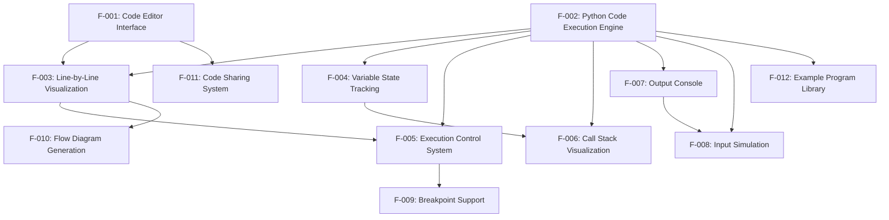
```mermaid
graph TB
    F001[F-001: Code Editor Interface] --> F003[F-003: Line-by-Line Visualization]
    F002[F-002: Python Code Execution Engine] --> F003
    F002 --> F004[F-004: Variable State Tracking]
    F002 --> F005[F-005: Execution Control System]
    F002 --> F006[F-006: Call Stack Visualization]
    F002 --> F007[F-007: Output Console]
    F002 --> F008[F-008: Input Simulation]
    
    F003 --> F005
    F004 --> F006
    F007 --> F008
    
    F005 --> F009[F-009: Breakpoint Support]
    F003 --> F010[F-010: Flow Diagram Generation]
    F001 --> F011[F-011: Code Sharing System]
    F002 --> F012[F-012: Example Program Library]
```

### 2.3.2 Integration Points

| Integration Point | Connected Features | Shared Components | Common Services |
|---|---|---|---|
| Code Execution Bridge | F-002, F-003, F-004, F-005 | Execution state manager | Pyodide runtime service |
| Editor Visualization | F-001, F-003, F-009 | Monaco Editor API | Line highlighting service |
| Variable Inspection | F-002, F-004, F-006 | Python globals bridge | Variable tracking service |
| User Interface | F-001, F-005, F-007, F-008 | React components | UI state management |

### 2.3.3 Shared Components

| Component Name | Used By Features | Purpose | Implementation |
|---|---|---|---|
| Execution Engine | F-002, F-004, F-005, F-006, F-007, F-008 | Python code execution and state management | Pyodide wrapper with execution tracing |
| Monaco Editor Wrapper | F-001, F-003, F-009, F-011 | Code editing and visualization | React Monaco Editor integration |
| Variable Inspector | F-004, F-006 | Python variable and scope analysis | Pyodide globals API wrapper |
| UI State Manager | F-001, F-005, F-007, F-008 | Application state coordination | React Context/Redux |

## 2.4 IMPLEMENTATION CONSIDERATIONS

### 2.4.1 Technical Constraints

| Feature | Constraint Type | Description | Mitigation Strategy |
|---|---|---|---|
| F-002 | Performance | Browsers have memory caps; heavy tasks may crash. Break tasks into smaller chunks or optimize data handling | Implement execution step limits and memory monitoring |
| F-002 | Compatibility | No, only pure Python and WebAssembly-compatible packages work; packages with C extensions may not | Document supported libraries and provide alternatives |
| F-003 | Performance | 60fps animation requirements for smooth visualization | Use requestAnimationFrame and optimize DOM updates |
| F-004 | Scalability | Large variable sets may impact performance | Implement virtual scrolling and variable filtering |

### 2.4.2 Performance Requirements

| Feature | Metric | Target Value | Measurement Method |
|---|---|---|---|
| F-001 | Editor Load Time | <2 seconds | Performance timing API |
| F-002 | Execution Start Time | <1 second | Execution timestamp tracking |
| F-003 | Animation Frame Rate | 60fps | Browser performance tools |
| F-004 | Variable Update Latency | <100ms | State change timing |

### 2.4.3 Security Implications

| Feature | Security Concern | Risk Level | Mitigation |
|---|---|---|---|
| F-002 | Code Execution | Medium | Pyodide is nicely sandboxed in the browser environment. Each user gets their own workspace, and since it is all local, it is nice and secure |
| F-008 | Input Handling | Low | Validate and sanitize user input |
| F-011 | Code Sharing | Medium | Implement content validation and sanitization |
| All Features | XSS Prevention | High | Escape all user-generated content |

### 2.4.4 Maintenance Requirements

| Feature | Maintenance Type | Frequency | Effort Level |
|---|---|---|---|
| F-002 | Pyodide Updates | Quarterly | Medium |
| F-001 | Monaco Editor Updates | Bi-annually | Low |
| F-003 | Animation Performance Optimization | As needed | High |
| F-004 | Variable Display Enhancements | Monthly | Medium |

# 3. TECHNOLOGY STACK

## 3.1 PROGRAMMING LANGUAGES

### 3.1.1 Frontend Languages

| Language | Version | Platform | Justification | Constraints |
|---|---|---|---|---|
| TypeScript | 5.8+ | Web Frontend | Latest React 18.3.1 (April 2024) with TypeScript provides enhanced type safety, better developer experience, and improved code maintainability | Requires @types/react@^18.0.0 and @types/react-dom@^18.0.0 |
| JavaScript (ES2022) | ES2022+ | Runtime Environment | Pyodide brings Python to the browser using WebAssembly, enabling Python code to run directly inside web browsers without needing a server | Modern browser support required for WebAssembly features |

### 3.1.2 Backend Languages

| Language | Version | Platform | Justification | Constraints |
|---|---|---|---|---|
| Python | 3.12+ | Execution Engine | Pyodide is a Python distribution for the browser and Node.js based on WebAssembly. Pyodide is a port of CPython to WebAssembly/Emscripten | By default, all builds of the Pyodide runtime with Python 3.12 will use the pyodide_2024_0 abi. The Emscripten version is 3.1.58 |

### 3.1.3 Selection Criteria

**Type Safety and Developer Experience**
- TypeScript provides compile-time error detection and enhanced IDE support
- Strong typing reduces runtime errors and improves code maintainability
- Excellent integration with React ecosystem and Monaco Editor

**Performance and Compatibility**
- Python 3.11+ in latest Pyodide versions provides improved performance, though slower than native due to WebAssembly constraints
- JavaScript ES2022+ ensures compatibility with modern browser features required for WebAssembly execution

**Educational Focus**
- Python as the target language aligns with project requirements for educational programming visualization
- TypeScript enhances code readability and maintainability for complex visualization logic

## 3.2 FRAMEWORKS & LIBRARIES

### 3.2.1 Core Frontend Framework

| Framework | Version | Purpose | Justification | Compatibility |
|---|---|---|---|---|
| React | 18.3.1 | UI Framework | React 18.3.1 (April 2024) provides latest features including concurrent rendering, automatic batching, and improved performance | Requires Node.js 18+ |
| React DOM | 18.3.1 | DOM Rendering | Updated createRoot API from react-dom/client provides React 18 concurrent features | Must match React version exactly |

### 3.2.2 Code Editor Integration

| Library | Version | Purpose | Justification | Integration Requirements |
|---|---|---|---|---|
| @monaco-editor/react | 4.7.0 | Code Editor | Latest version 4.7.0 provides Monaco editor wrapper for easy/one-line integration with React applications without webpack configuration | Requires monaco-editor package as peer dependency for TypeScript definitions |
| Monaco Editor | Latest | Editor Core | Monaco editor is a well-known web technology based code editor that powers VS Code | Works with create-react-app, Vite, Next.js without ejecting |

### 3.2.3 Python Execution Engine

| Library | Version | Purpose | Justification | Technical Constraints |
|---|---|---|---|---|
| Pyodide | 0.29.0 | Python Runtime | Pyodide makes it possible to install and run Python packages in the browser with micropip | Core bundle is several megabytes, can impact page load time |
| Pyodide CDN | 0.29.0 | Distribution | Load Pyodide directly in browser using CDN link with script tag for instant Python execution | Requires internet connection unless self-hosted |

### 3.2.4 Visualization Libraries

| Library | Version | Purpose | Justification | React Integration |
|---|---|---|---|---|
| D3.js | 7.x | Data Visualization | D3.js v7 is a JavaScript library for creating dynamic, interactive data visualizations using HTML, CSS, and SVG | Use D3.js for data calculations and React for rendering to maintain React's declarative nature |
| React D3 Integration | Custom Hooks | DOM Management | React hooks provide imperative escape hatch to allow D3.js to interact directly with DOM using useRef and useEffect | Both libraries want to handle DOM, requiring careful integration patterns |

### 3.2.5 Styling Framework

| Framework | Version | Purpose | Justification | Performance Benefits |
|---|---|---|---|---|
| Tailwind CSS | 4.1.16 | Utility-First CSS | Latest version 4.1.16 provides all-new framework optimized for performance and flexibility | Full builds up to 5x faster, incremental builds over 100x faster, measured in microseconds |
| @tailwindcss/vite | Latest | Vite Integration | First-party Vite plugin provides tight integration for maximum performance and minimum configuration | Automatic content detection with no configuration required |

### 3.2.6 Framework Selection Justification

**React 18 Advantages**
- Concurrency enables React to prepare multiple versions of UI at the same time
- Automatic batching groups multiple state updates into single re-render for better performance
- Mature ecosystem with extensive TypeScript support

**Monaco Editor Benefits**
- Professional-grade editing experience familiar to developers
- Built-in Python syntax highlighting and error detection
- Programmatic API for line highlighting required for execution visualization

**Pyodide Integration**
- Allows Python to run directly in browser without backend server, ideal for education and scientific demos
- Includes NumPy, Pandas, Matplotlib, and SciPy out-of-the-box for powerful data analysis and visualization
- Executes in sandboxed WebAssembly environment, separated from host runtime for security

## 3.3 OPEN SOURCE DEPENDENCIES

### 3.3.1 Core React Dependencies

| Package | Version | Registry | Purpose | License |
|---|---|---|---|---|
| react | ^18.3.1 | npm | Core React library | MIT |
| react-dom | ^18.3.1 | npm | React DOM rendering | MIT |
| @types/react | ^18.0.0 | npm | React TypeScript definitions | MIT |
| @types/react-dom | ^18.0.0 | npm | React DOM TypeScript definitions | MIT |

### 3.3.2 Development and Build Tools

| Package | Version | Registry | Purpose | License |
|---|---|---|---|---|
| typescript | ^5.8.0 | npm | TypeScript compiler | Apache-2.0 |
| vite | ^6.0.0 | npm | Build tool and dev server | MIT |
| @vitejs/plugin-react | ^4.0.0 | npm | React plugin for Vite | MIT |
| @tailwindcss/vite | ^4.0.0 | npm | Tailwind CSS Vite plugin | MIT |

### 3.3.3 Code Editor Dependencies

| Package | Version | Registry | Purpose | License |
|---|---|---|---|---|
| @monaco-editor/react | ^4.7.0 | npm | Monaco Editor React wrapper | MIT |
| monaco-editor | ^0.52.0 | npm | Monaco Editor core (peer dependency) | MIT |

### 3.3.4 Visualization Dependencies

| Package | Version | Registry | Purpose | License |
|---|---|---|---|---|
| d3 | ^7.9.0 | npm | Data visualization library | BSD-3-Clause |
| @types/d3 | ^7.4.0 | npm | D3 TypeScript definitions | MIT |

### 3.3.5 Python Execution Dependencies

| Package | Version | Registry | Purpose | License |
|---|---|---|---|---|
| pyodide | 0.29.0 | CDN | Python WebAssembly runtime | Mozilla Public License 2.0 |

### 3.3.6 Utility Dependencies

| Package | Version | Registry | Purpose | License |
|---|---|---|---|---|
| tailwindcss | ^4.1.16 | npm | Utility-first CSS framework | MIT |
| lucide-react | ^0.460.0 | npm | Icon library | ISC |
| clsx | ^2.1.0 | npm | Conditional className utility | MIT |

### 3.3.7 Dependency Management Strategy

**Version Pinning**
- Exact versions for critical dependencies (React, Pyodide)
- Caret ranges for development tools and utilities
- Peer dependency compatibility verification

**Security Considerations**
- Regular dependency audits using npm audit
- Automated security updates via Dependabot
- License compatibility verification for all dependencies

**Bundle Size Optimization**
- Tree-shaking enabled for all libraries
- Dynamic imports for large dependencies (D3.js modules)
- CDN delivery for Pyodide to reduce bundle size

## 3.4 THIRD-PARTY SERVICES

### 3.4.1 Content Delivery Network

| Service | Purpose | Justification | Configuration |
|---|---|---|---|
| jsDelivr CDN | Pyodide Distribution | Load Pyodide directly using CDN link for instant Python execution without local installation | `https://cdn.jsdelivr.net/pyodide/v0.29.0/full/pyodide.js` |

### 3.4.2 Development Services

| Service | Purpose | Justification | Integration |
|---|---|---|---|
| GitHub Actions | CI/CD Pipeline | Automated testing, building, and deployment | Workflow configuration in `.github/workflows/` |
| Vercel/Netlify | Static Hosting | Optimized for React applications with automatic deployments | Git-based deployment |

### 3.4.3 Monitoring and Analytics

| Service | Purpose | Justification | Implementation |
|---|---|---|---|
| Web Vitals | Performance Monitoring | Track Core Web Vitals for user experience optimization | Built-in browser APIs |
| Error Boundary | Error Tracking | Capture and handle React component errors gracefully | Custom React error boundaries |

### 3.4.4 Service Selection Criteria

**CDN Strategy**
- jsDelivr chosen for Pyodide delivery due to reliability and global distribution
- Reduces initial bundle size by ~50MB
- Fallback to local hosting for offline scenarios

**Hosting Requirements**
- Static site hosting sufficient for client-side application
- No server-side processing required due to Pyodide architecture
- Edge deployment for global performance optimization

## 3.5 DATABASES & STORAGE

### 3.5.1 Client-Side Storage

| Storage Type | Technology | Purpose | Capacity | Persistence |
|---|---|---|---|---|
| Browser LocalStorage | Web Storage API | User preferences, code snippets | 5-10MB | Persistent |
| SessionStorage | Web Storage API | Execution state, temporary data | 5-10MB | Session-based |
| IndexedDB | Browser Database | Large code files, execution history | 50MB+ | Persistent |

### 3.5.2 In-Memory Storage

| Storage Type | Technology | Purpose | Scope | Lifecycle |
|---|---|---|---|---|
| React State | useState/useReducer | UI state, execution control | Component-level | Component lifecycle |
| Context API | React Context | Global application state | Application-wide | Application lifecycle |
| Pyodide Globals | WebAssembly Memory | Python variable storage | Python globals accessible via pyodide.globals object for variable inspection | Execution session |

### 3.5.3 Data Persistence Strategy

**Code Storage**
- LocalStorage for user-created code snippets (up to 5MB)
- IndexedDB for larger programs and execution traces
- Export/import functionality for code sharing

**Execution Data**
- SessionStorage for current execution state
- In-memory storage for real-time variable tracking
- Pyodide globals API provides access to Python variables for visualization

**User Preferences**
- LocalStorage for editor settings, theme preferences
- Persistent across browser sessions
- JSON serialization for complex configuration objects

### 3.5.4 Storage Architecture

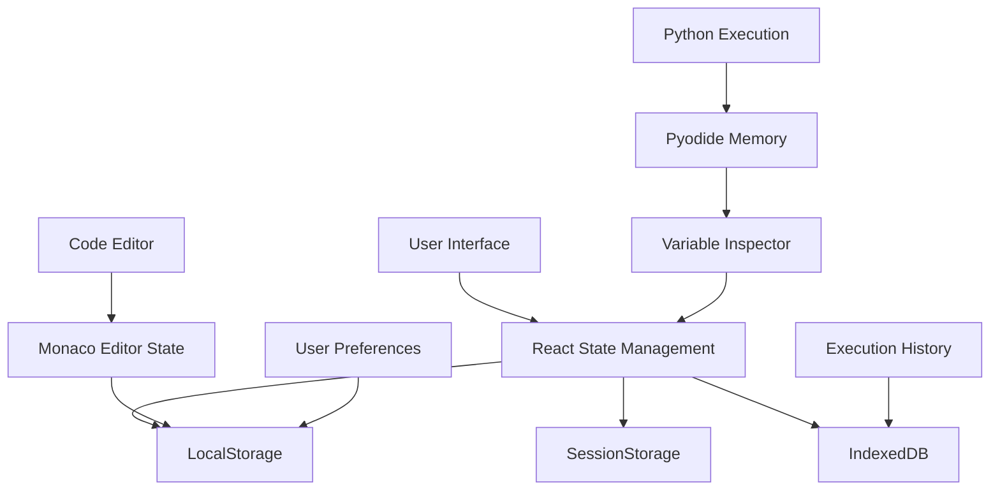
```mermaid
graph TB
    A[User Interface] --> B[React State Management]
    B --> C[LocalStorage]
    B --> D[SessionStorage]
    B --> E[IndexedDB]
    
    F[Python Execution] --> G[Pyodide Memory]
    G --> H[Variable Inspector]
    H --> B
    
    I[Code Editor] --> J[Monaco Editor State]
    J --> C
    
    K[Execution History] --> E
    L[User Preferences] --> C
```

### 3.5.5 Data Management Considerations

**Performance Optimization**
- Lazy loading for large execution traces
- Debounced storage operations to prevent excessive writes
- Compression for stored code and execution data

**Privacy and Security**
- All data stored locally in user's browser
- No server-side data collection or storage
- User controls all data retention and deletion

**Scalability Limits**
- Browser storage quotas (typically 50MB+ per origin)
- Memory constraints for large Python programs
- Graceful degradation when storage limits reached

## 3.6 DEVELOPMENT & DEPLOYMENT

### 3.6.1 Development Tools

| Tool | Version | Purpose | Configuration |
|---|---|---|---|
| Vite | ^6.0.0 | Build Tool & Dev Server | First-party Vite plugin provides tight integration for maximum performance |
| TypeScript | ^5.8.0 | Type Checking | Strict mode enabled, React JSX transform |
| ESLint | ^9.0.0 | Code Linting | React hooks rules, TypeScript integration |
| Prettier | ^3.0.0 | Code Formatting | Tailwind CSS class sorting plugin |

### 3.6.2 Build System

| Component | Technology | Purpose | Optimization |
|---|---|---|---|
| Module Bundler | Vite (Rollup) | Asset bundling and optimization | Tree-shaking, code splitting |
| CSS Processing | Tailwind CSS v4.0 with new high-performance engine | Utility-first styling | Incremental builds over 100x faster |
| TypeScript Compilation | tsc | Type checking and compilation | Incremental compilation |
| Asset Optimization | Vite plugins | Image optimization, minification | Automatic optimization |

### 3.6.3 Development Environment

| Aspect | Configuration | Justification | Requirements |
|---|---|---|---|
| Node.js Version | 18+ | Required for React 18 and modern development tools | LTS version recommended |
| Package Manager | npm/yarn/pnpm | Dependency management | Lock file for reproducible builds |
| Hot Module Replacement | Vite HMR | Fast development with Hot Module Replacement for instant updates | Development server feature |
| Browser Support | Chrome 111+, Firefox 128+, Safari 16.4+ | Tailwind CSS v4.0 browser requirements | Modern browser features required |

### 3.6.4 Containerization

| Component | Technology | Purpose | Configuration |
|---|---|---|---|
| Development Container | Docker | Consistent development environment | Node.js 18+ base image |
| Production Build | Multi-stage Docker | Optimized production image | Nginx for static file serving |

**Dockerfile Structure**
```dockerfile
# Development stage
FROM node:18-alpine AS development
WORKDIR /app
COPY package*.json ./
RUN npm ci
COPY . .
EXPOSE 5173

#### Build stage
FROM node:18-alpine AS build
WORKDIR /app
COPY package*.json ./
RUN npm ci
COPY . .
RUN npm run build

#### Production stage
FROM nginx:alpine AS production
COPY --from=build /app/dist /usr/share/nginx/html
EXPOSE 80
```

### 3.6.5 CI/CD Pipeline

| Stage | Technology | Purpose | Configuration |
|---|---|---|---|
| Source Control | Git/GitHub | Version control and collaboration | Branch protection rules |
| Continuous Integration | GitHub Actions | Automated testing and building | Node.js 18+ matrix testing |
| Code Quality | ESLint, Prettier, TypeScript | Code quality enforcement | Pre-commit hooks |
| Deployment | Vercel/Netlify | Static site deployment | Automatic deployments from main branch |

**GitHub Actions Workflow**
```yaml
name: CI/CD Pipeline
on: [push, pull_request]
jobs:
  test:
    runs-on: ubuntu-latest
    strategy:
      matrix:
        node-version: [18, 20]
    steps:
      - uses: actions/checkout@v4
      - uses: actions/setup-node@v4
        with:
          node-version: ${{ matrix.node-version }}
      - run: npm ci
      - run: npm run lint
      - run: npm run type-check
      - run: npm run build
```

### 3.6.6 Deployment Strategy

**Static Site Deployment**
- No server-side processing required due to client-side Python execution
- CDN-based distribution for global performance
- Automatic HTTPS and edge caching

**Environment Configuration**
- Environment variables for CDN URLs and feature flags
- Production optimizations: minification, compression, caching headers
- Progressive Web App (PWA) capabilities for offline usage

**Performance Monitoring**
- Core Web Vitals tracking
- Bundle size monitoring and alerts
- Real User Monitoring (RUM) for performance insights

### 3.6.7 Security Considerations

**Content Security Policy**
- Strict CSP headers for XSS prevention
- WebAssembly execution permissions for Pyodide
- Trusted CDN sources for external dependencies

**Dependency Security**
- Automated vulnerability scanning with npm audit
- Dependabot for security updates
- License compliance verification

**Runtime Security**
- Pyodide executes in sandboxed WebAssembly environment for security isolation
- No server-side code execution or data storage
- Client-side input validation and sanitization

# 4. PROCESS FLOWCHART

## 4.1 SYSTEM WORKFLOWS

### 4.1.1 Core Business Processes

#### 4.1.1.1 User Code Execution Journey

As your application grows, it helps to be more intentional about how your state is organized and how the data flows between your components. Redundant or duplicate state is a common source of bugs. In this chapter, you'll learn how to structure your state well, how to keep your state update logic maintainable, and how to share state between distant components.

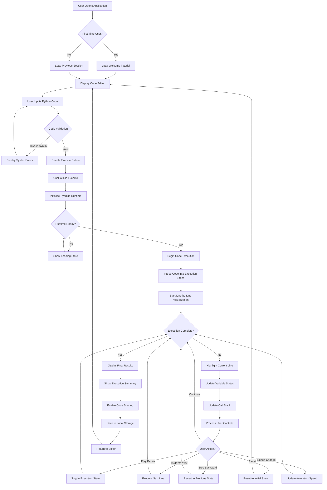
```mermaid
flowchart TD
    A[User Opens Application] --> B{First Time User?}
    B -->|Yes| C[Load Welcome Tutorial]
    B -->|No| D[Load Previous Session]
    
    C --> E[Display Code Editor]
    D --> E
    
    E --> F[User Inputs Python Code]
    F --> G{Code Validation}
    G -->|Invalid Syntax| H[Display Syntax Errors]
    G -->|Valid| I[Enable Execute Button]
    
    H --> F
    I --> J[User Clicks Execute]
    
    J --> K[Initialize Pyodide Runtime]
    K --> L{Runtime Ready?}
    L -->|No| M[Show Loading State]
    L -->|Yes| N[Begin Code Execution]
    
    M --> L
    N --> O[Parse Code into Execution Steps]
    O --> P[Start Line-by-Line Visualization]
    
    P --> Q{Execution Complete?}
    Q -->|No| R[Highlight Current Line]
    R --> S[Update Variable States]
    S --> T[Update Call Stack]
    T --> U[Process User Controls]
    
    U --> V{User Action?}
    V -->|Play/Pause| W[Toggle Execution State]
    V -->|Step Forward| X[Execute Next Line]
    V -->|Step Backward| Y[Revert to Previous State]
    V -->|Reset| Z[Reset to Initial State]
    V -->|Speed Change| AA[Update Animation Speed]
    V -->|Continue| Q
    
    W --> Q
    X --> Q
    Y --> Q
    Z --> E
    AA --> Q
    
    Q -->|Yes| BB[Display Final Results]
    BB --> CC[Show Execution Summary]
    CC --> DD[Enable Code Sharing]
    DD --> EE[Save to Local Storage]
    EE --> FF[Return to Editor]
    FF --> E
```

#### 4.1.1.2 Real-Time Variable Tracking Process

React has a variety of built-in features for state management, including the useState and useReducer Hooks, as well as the Context API. Before exploring third-party libraries for state management, let's take a look at these built-in features.

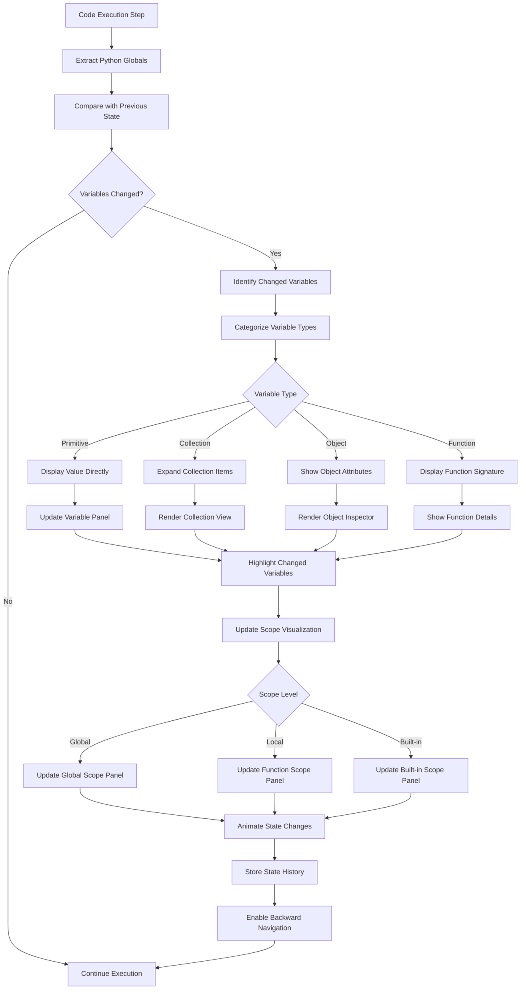
```mermaid
flowchart TD
    A[Code Execution Step] --> B[Extract Python Globals]
    B --> C[Compare with Previous State]
    C --> D{Variables Changed?}
    
    D -->|No| E[Continue Execution]
    D -->|Yes| F[Identify Changed Variables]
    
    F --> G[Categorize Variable Types]
    G --> H{Variable Type}
    
    H -->|Primitive| I[Display Value Directly]
    H -->|Collection| J[Expand Collection Items]
    H -->|Object| K[Show Object Attributes]
    H -->|Function| L[Display Function Signature]
    
    I --> M[Update Variable Panel]
    J --> N[Render Collection View]
    K --> O[Render Object Inspector]
    L --> P[Show Function Details]
    
    M --> Q[Highlight Changed Variables]
    N --> Q
    O --> Q
    P --> Q
    
    Q --> R[Update Scope Visualization]
    R --> S{Scope Level}
    
    S -->|Global| T[Update Global Scope Panel]
    S -->|Local| U[Update Function Scope Panel]
    S -->|Built-in| V[Update Built-in Scope Panel]
    
    T --> W[Animate State Changes]
    U --> W
    V --> W
    
    W --> X[Store State History]
    X --> Y[Enable Backward Navigation]
    Y --> E
```

#### 4.1.1.3 Interactive Execution Control Flow

Reducers let you consolidate a component's state update logic. Context lets you pass information deep down to other components. You can combine reducers and context together to manage state of a complex screen.

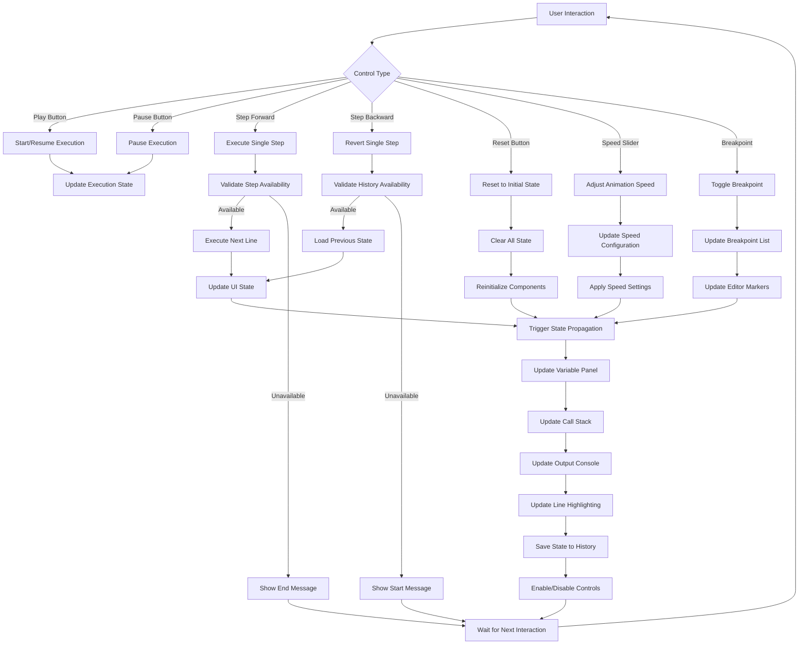
```mermaid
flowchart TD
    A[User Interaction] --> B{Control Type}
    
    B -->|Play Button| C[Start/Resume Execution]
    B -->|Pause Button| D[Pause Execution]
    B -->|Step Forward| E[Execute Single Step]
    B -->|Step Backward| F[Revert Single Step]
    B -->|Reset Button| G[Reset to Initial State]
    B -->|Speed Slider| H[Adjust Animation Speed]
    B -->|Breakpoint| I[Toggle Breakpoint]
    
    C --> J[Update Execution State]
    D --> J
    E --> K[Validate Step Availability]
    F --> L[Validate History Availability]
    G --> M[Clear All State]
    H --> N[Update Speed Configuration]
    I --> O[Update Breakpoint List]
    
    K -->|Available| P[Execute Next Line]
    K -->|Unavailable| Q[Show End Message]
    
    L -->|Available| R[Load Previous State]
    L -->|Unavailable| S[Show Start Message]
    
    P --> T[Update UI State]
    R --> T
    M --> U[Reinitialize Components]
    N --> V[Apply Speed Settings]
    O --> W[Update Editor Markers]
    
    T --> X[Trigger State Propagation]
    U --> X
    V --> X
    W --> X
    
    X --> Y[Update Variable Panel]
    Y --> Z[Update Call Stack]
    Z --> AA[Update Output Console]
    AA --> BB[Update Line Highlighting]
    BB --> CC[Save State to History]
    CC --> DD[Enable/Disable Controls]
    DD --> EE[Wait for Next Interaction]
    EE --> A
    
    Q --> EE
    S --> EE
```

### 4.1.2 Integration Workflows

#### 4.1.2.1 Pyodide Runtime Integration Flow

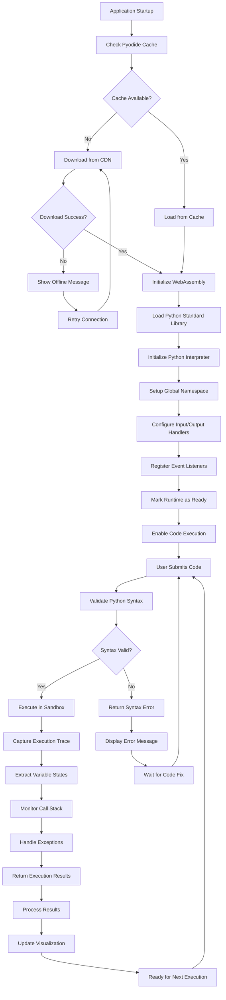
```mermaid
flowchart TD
    A[Application Startup] --> B[Check Pyodide Cache]
    B --> C{Cache Available?}
    
    C -->|Yes| D[Load from Cache]
    C -->|No| E[Download from CDN]
    
    E --> F{Download Success?}
    F -->|No| G[Show Offline Message]
    F -->|Yes| H[Initialize WebAssembly]
    
    D --> H
    G --> I[Retry Connection]
    I --> E
    
    H --> J[Load Python Standard Library]
    J --> K[Initialize Python Interpreter]
    K --> L[Setup Global Namespace]
    L --> M[Configure Input/Output Handlers]
    M --> N[Register Event Listeners]
    N --> O[Mark Runtime as Ready]
    
    O --> P[Enable Code Execution]
    P --> Q[User Submits Code]
    Q --> R[Validate Python Syntax]
    R --> S{Syntax Valid?}
    
    S -->|No| T[Return Syntax Error]
    S -->|Yes| U[Execute in Sandbox]
    
    U --> V[Capture Execution Trace]
    V --> W[Extract Variable States]
    W --> X[Monitor Call Stack]
    X --> Y[Handle Exceptions]
    Y --> Z[Return Execution Results]
    
    T --> AA[Display Error Message]
    Z --> BB[Process Results]
    AA --> CC[Wait for Code Fix]
    BB --> DD[Update Visualization]
    CC --> Q
    DD --> EE[Ready for Next Execution]
    EE --> Q
```

#### 4.1.2.2 Monaco Editor Integration Workflow

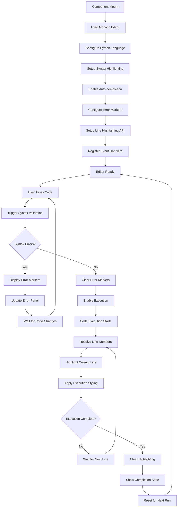
```mermaid
flowchart TD
    A[Component Mount] --> B[Load Monaco Editor]
    B --> C[Configure Python Language]
    C --> D[Setup Syntax Highlighting]
    D --> E[Enable Auto-completion]
    E --> F[Configure Error Markers]
    F --> G[Setup Line Highlighting API]
    G --> H[Register Event Handlers]
    
    H --> I[Editor Ready]
    I --> J[User Types Code]
    J --> K[Trigger Syntax Validation]
    K --> L{Syntax Errors?}
    
    L -->|Yes| M[Display Error Markers]
    L -->|No| N[Clear Error Markers]
    
    M --> O[Update Error Panel]
    N --> P[Enable Execution]
    
    O --> Q[Wait for Code Changes]
    P --> R[Code Execution Starts]
    Q --> J
    
    R --> S[Receive Line Numbers]
    S --> T[Highlight Current Line]
    T --> U[Apply Execution Styling]
    U --> V{Execution Complete?}
    
    V -->|No| W[Wait for Next Line]
    V -->|Yes| X[Clear Highlighting]
    
    W --> S
    X --> Y[Show Completion State]
    Y --> Z[Reset for Next Run]
    Z --> I
```

#### 4.1.2.3 State Management Integration Flow

With this approach, a parent component with complex state manages it with a reducer. Other components anywhere deep in the tree can read its state via context. They can also dispatch actions to update that state.

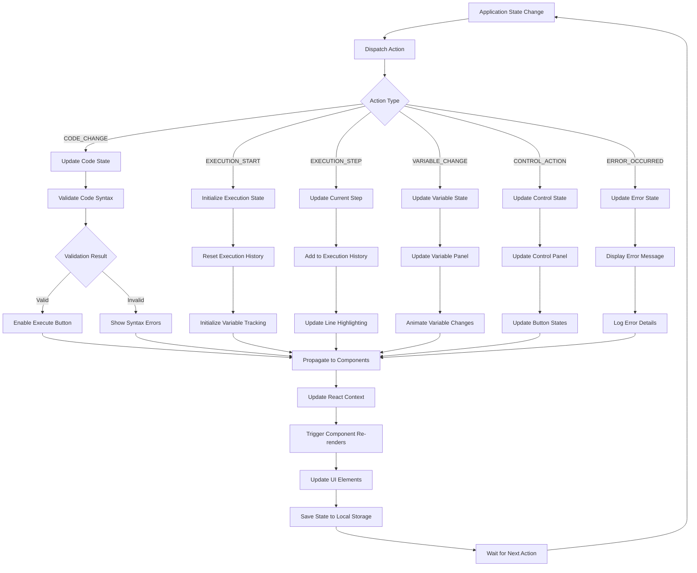
```mermaid
flowchart TD
    A[Application State Change] --> B[Dispatch Action]
    B --> C{Action Type}
    
    C -->|CODE_CHANGE| D[Update Code State]
    C -->|EXECUTION_START| E[Initialize Execution State]
    C -->|EXECUTION_STEP| F[Update Current Step]
    C -->|VARIABLE_CHANGE| G[Update Variable State]
    C -->|CONTROL_ACTION| H[Update Control State]
    C -->|ERROR_OCCURRED| I[Update Error State]
    
    D --> J[Validate Code Syntax]
    E --> K[Reset Execution History]
    F --> L[Add to Execution History]
    G --> M[Update Variable Panel]
    H --> N[Update Control Panel]
    I --> O[Display Error Message]
    
    J --> P{Validation Result}
    P -->|Valid| Q[Enable Execute Button]
    P -->|Invalid| R[Show Syntax Errors]
    
    K --> S[Initialize Variable Tracking]
    L --> T[Update Line Highlighting]
    M --> U[Animate Variable Changes]
    N --> V[Update Button States]
    O --> W[Log Error Details]
    
    Q --> X[Propagate to Components]
    R --> X
    S --> X
    T --> X
    U --> X
    V --> X
    W --> X
    
    X --> Y[Update React Context]
    Y --> Z[Trigger Component Re-renders]
    Z --> AA[Update UI Elements]
    AA --> BB[Save State to Local Storage]
    BB --> CC[Wait for Next Action]
    CC --> A
```

## 4.2 FLOWCHART REQUIREMENTS

### 4.2.1 Validation Rules and Business Logic

#### 4.2.1.1 Code Validation and Security Checks

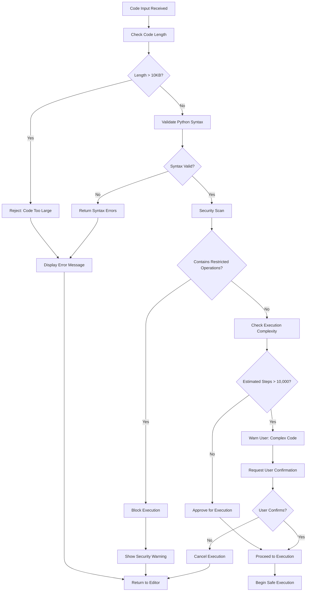
```mermaid
flowchart TD
    A[Code Input Received] --> B[Check Code Length]
    B --> C{Length > 10KB?}
    C -->|Yes| D[Reject: Code Too Large]
    C -->|No| E[Validate Python Syntax]
    
    E --> F{Syntax Valid?}
    F -->|No| G[Return Syntax Errors]
    F -->|Yes| H[Security Scan]
    
    H --> I{Contains Restricted Operations?}
    I -->|Yes| J[Block Execution]
    I -->|No| K[Check Execution Complexity]
    
    K --> L{Estimated Steps > 10,000?}
    L -->|Yes| M[Warn User: Complex Code]
    L -->|No| N[Approve for Execution]
    
    D --> O[Display Error Message]
    G --> O
    J --> P[Show Security Warning]
    M --> Q[Request User Confirmation]
    N --> R[Proceed to Execution]
    
    Q --> S{User Confirms?}
    S -->|Yes| R
    S -->|No| T[Cancel Execution]
    
    O --> U[Return to Editor]
    P --> U
    T --> U
    R --> V[Begin Safe Execution]
```

#### 4.2.1.2 Execution Timeout and Resource Management

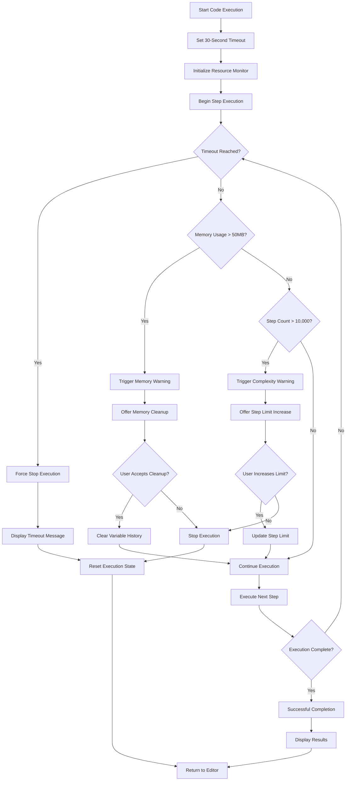
```mermaid
flowchart TD
    A[Start Code Execution] --> B[Set 30-Second Timeout]
    B --> C[Initialize Resource Monitor]
    C --> D[Begin Step Execution]
    
    D --> E{Timeout Reached?}
    E -->|Yes| F[Force Stop Execution]
    E -->|No| G{Memory Usage > 50MB?}
    
    G -->|Yes| H[Trigger Memory Warning]
    G -->|No| I{Step Count > 10,000?}
    
    I -->|Yes| J[Trigger Complexity Warning]
    I -->|No| K[Continue Execution]
    
    F --> L[Display Timeout Message]
    H --> M[Offer Memory Cleanup]
    J --> N[Offer Step Limit Increase]
    K --> O[Execute Next Step]
    
    M --> P{User Accepts Cleanup?}
    P -->|Yes| Q[Clear Variable History]
    P -->|No| R[Stop Execution]
    
    N --> S{User Increases Limit?}
    S -->|Yes| T[Update Step Limit]
    S -->|No| R
    
    Q --> K
    T --> K
    O --> U{Execution Complete?}
    U -->|No| E
    U -->|Yes| V[Successful Completion]
    
    L --> W[Reset Execution State]
    R --> W
    V --> X[Display Results]
    W --> Y[Return to Editor]
    X --> Y
```

### 4.2.2 Error Handling and Recovery Procedures

#### 4.2.2.1 Runtime Error Handling Flow

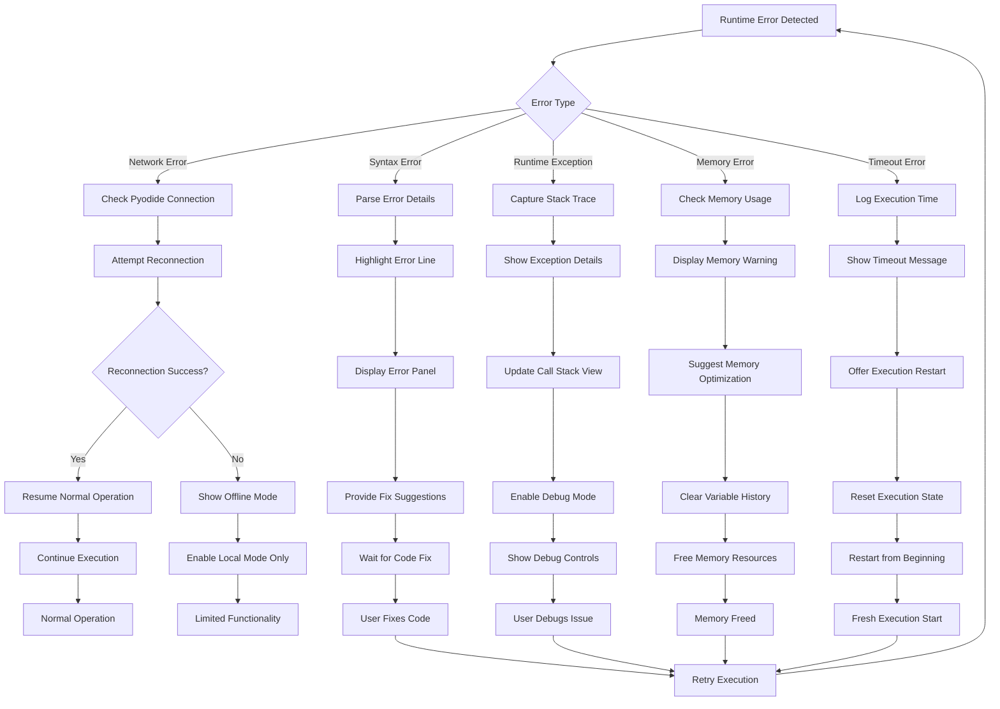
```mermaid
flowchart TD
    A[Runtime Error Detected] --> B{Error Type}
    
    B -->|Syntax Error| C[Parse Error Details]
    B -->|Runtime Exception| D[Capture Stack Trace]
    B -->|Memory Error| E[Check Memory Usage]
    B -->|Timeout Error| F[Log Execution Time]
    B -->|Network Error| G[Check Pyodide Connection]
    
    C --> H[Highlight Error Line]
    D --> I[Show Exception Details]
    E --> J[Display Memory Warning]
    F --> K[Show Timeout Message]
    G --> L[Attempt Reconnection]
    
    H --> M[Display Error Panel]
    I --> N[Update Call Stack View]
    J --> O[Suggest Memory Optimization]
    K --> P[Offer Execution Restart]
    L --> Q{Reconnection Success?}
    
    Q -->|Yes| R[Resume Normal Operation]
    Q -->|No| S[Show Offline Mode]
    
    M --> T[Provide Fix Suggestions]
    N --> U[Enable Debug Mode]
    O --> V[Clear Variable History]
    P --> W[Reset Execution State]
    R --> X[Continue Execution]
    S --> Y[Enable Local Mode Only]
    
    T --> Z[Wait for Code Fix]
    U --> AA[Show Debug Controls]
    V --> BB[Free Memory Resources]
    W --> CC[Restart from Beginning]
    X --> DD[Normal Operation]
    Y --> EE[Limited Functionality]
    
    Z --> FF[User Fixes Code]
    AA --> GG[User Debugs Issue]
    BB --> HH[Memory Freed]
    CC --> II[Fresh Execution Start]
    
    FF --> JJ[Retry Execution]
    GG --> JJ
    HH --> JJ
    II --> JJ
    JJ --> A
```

#### 4.2.2.2 State Recovery and Rollback Process

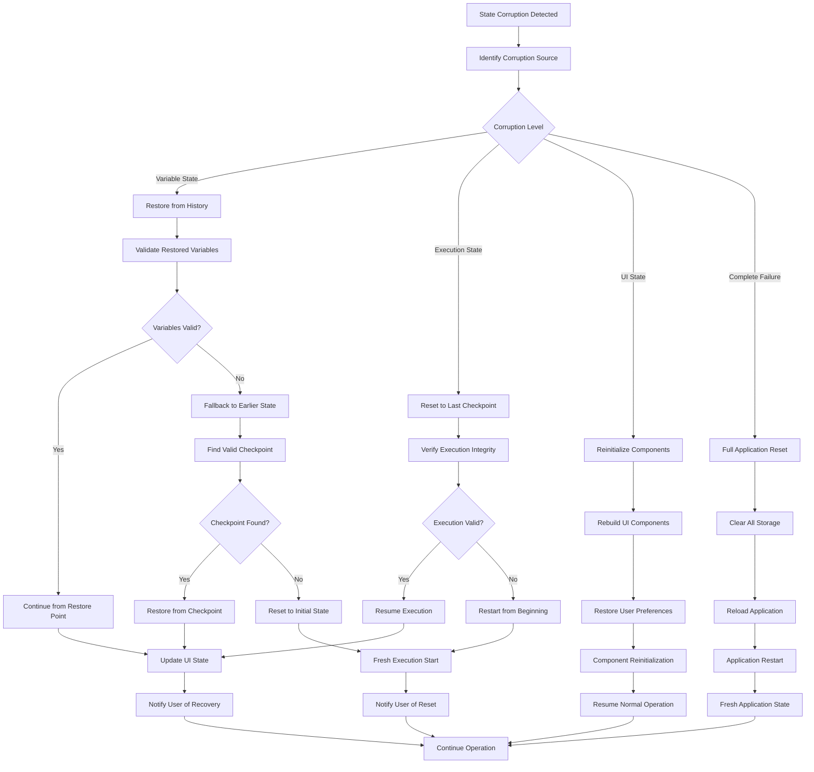
```mermaid
flowchart TD
    A[State Corruption Detected] --> B[Identify Corruption Source]
    B --> C{Corruption Level}
    
    C -->|Variable State| D[Restore from History]
    C -->|Execution State| E[Reset to Last Checkpoint]
    C -->|UI State| F[Reinitialize Components]
    C -->|Complete Failure| G[Full Application Reset]
    
    D --> H[Validate Restored Variables]
    E --> I[Verify Execution Integrity]
    F --> J[Rebuild UI Components]
    G --> K[Clear All Storage]
    
    H --> L{Variables Valid?}
    L -->|Yes| M[Continue from Restore Point]
    L -->|No| N[Fallback to Earlier State]
    
    I --> O{Execution Valid?}
    O -->|Yes| P[Resume Execution]
    O -->|No| Q[Restart from Beginning]
    
    J --> R[Restore User Preferences]
    K --> S[Reload Application]
    
    N --> T[Find Valid Checkpoint]
    T --> U{Checkpoint Found?}
    U -->|Yes| V[Restore from Checkpoint]
    U -->|No| W[Reset to Initial State]
    
    M --> X[Update UI State]
    P --> X
    Q --> Y[Fresh Execution Start]
    R --> Z[Component Reinitialization]
    S --> AA[Application Restart]
    V --> X
    W --> Y
    
    X --> BB[Notify User of Recovery]
    Y --> CC[Notify User of Reset]
    Z --> DD[Resume Normal Operation]
    AA --> EE[Fresh Application State]
    
    BB --> FF[Continue Operation]
    CC --> FF
    DD --> FF
    EE --> FF
```

## 4.3 TECHNICAL IMPLEMENTATION

### 4.3.1 State Management Architecture

#### 4.3.1.1 React State Flow Diagram

React has a variety of built-in features for state management, including the useState and useReducer Hooks, as well as the Context API. Before exploring third-party libraries for state management, let's take a look at these built-in features.

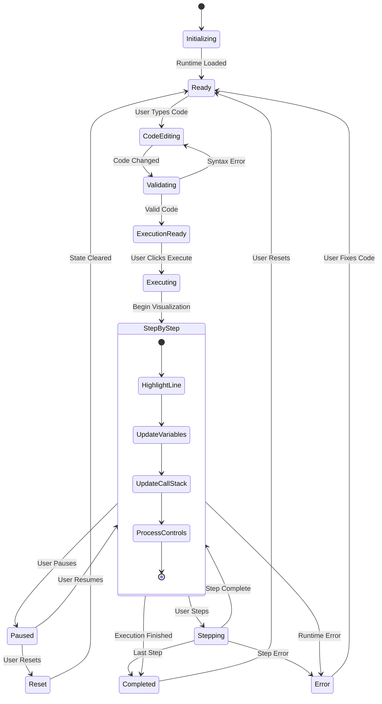
```mermaid
stateDiagram-v2
    [*] --> Initializing
    Initializing --> Ready: Runtime Loaded
    
    Ready --> CodeEditing: User Types Code
    CodeEditing --> Validating: Code Changed
    Validating --> CodeEditing: Syntax Error
    Validating --> ExecutionReady: Valid Code
    
    ExecutionReady --> Executing: User Clicks Execute
    Executing --> StepByStep: Begin Visualization
    
    StepByStep --> Paused: User Pauses
    StepByStep --> Stepping: User Steps
    StepByStep --> Completed: Execution Finished
    StepByStep --> Error: Runtime Error
    
    Paused --> StepByStep: User Resumes
    Paused --> Reset: User Resets
    
    Stepping --> StepByStep: Step Complete
    Stepping --> Completed: Last Step
    Stepping --> Error: Step Error
    
    Completed --> Ready: User Resets
    Error --> Ready: User Fixes Code
    Reset --> Ready: State Cleared
    
    state StepByStep {
        [*] --> HighlightLine
        HighlightLine --> UpdateVariables
        UpdateVariables --> UpdateCallStack
        UpdateCallStack --> ProcessControls
        ProcessControls --> [*]
    }
```

#### 4.3.1.2 Data Flow Architecture

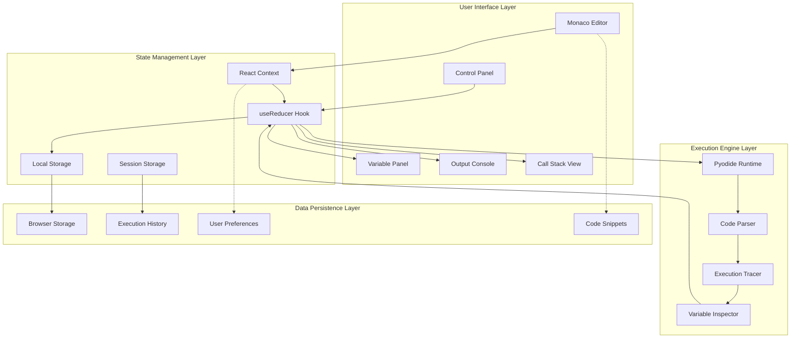
```mermaid
flowchart TB
    subgraph "User Interface Layer"
        A["Monaco Editor"]
        B["Control Panel"]
        C["Variable Panel"]
        D["Output Console"]
        E["Call Stack View"]
    end
    
    subgraph "State Management Layer"
        F["React Context"]
        G["useReducer Hook"]
        H["Local Storage"]
        I["Session Storage"]
    end
    
    subgraph "Execution Engine Layer"
        J["Pyodide Runtime"]
        K["Code Parser"]
        L["Execution Tracer"]
        M["Variable Inspector"]
    end
    
    subgraph "Data Persistence Layer"
        N["Browser Storage"]
        O["Execution History"]
        P["User Preferences"]
        Q["Code Snippets"]
    end
    
    A --> F
    A -.-> Q
    B --> G
    F --> G
    G --> C
    G --> D
    G --> E
    
    G --> J
    J --> K
    K --> L
    L --> M
    M --> G
    
    G --> H
    H --> N
    I --> O
    F -.-> P
```

### 4.3.2 Performance Optimization Flow

#### 4.3.2.1 Rendering Optimization Pipeline

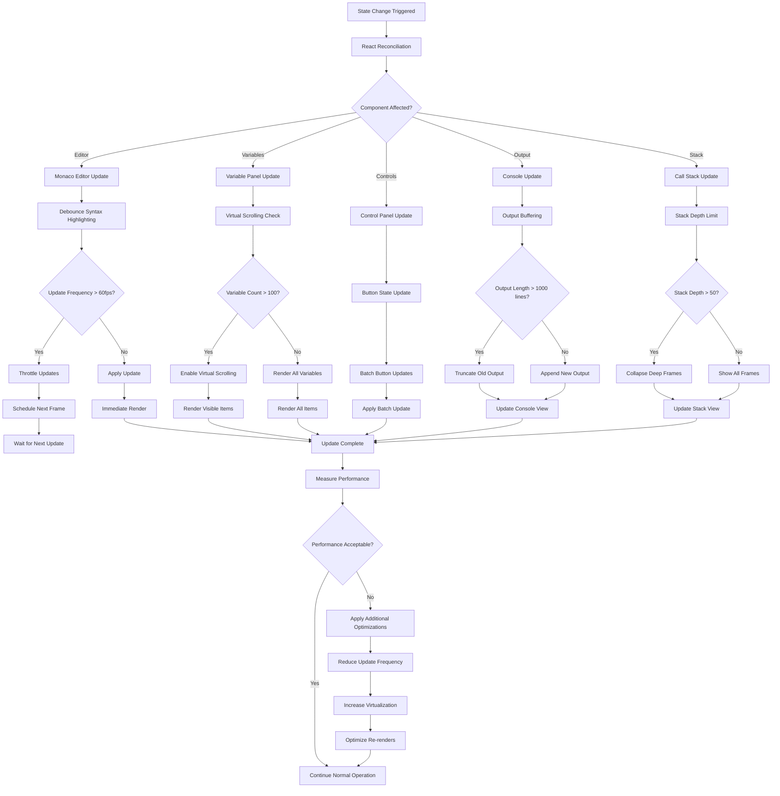
```mermaid
flowchart TD
    A[State Change Triggered] --> B[React Reconciliation]
    B --> C{Component Affected?}
    
    C -->|Editor| D[Monaco Editor Update]
    C -->|Variables| E[Variable Panel Update]
    C -->|Controls| F[Control Panel Update]
    C -->|Output| G[Console Update]
    C -->|Stack| H[Call Stack Update]
    
    D --> I[Debounce Syntax Highlighting]
    E --> J[Virtual Scrolling Check]
    F --> K[Button State Update]
    G --> L[Output Buffering]
    H --> M[Stack Depth Limit]
    
    I --> N{Update Frequency > 60fps?}
    N -->|Yes| O[Throttle Updates]
    N -->|No| P[Apply Update]
    
    J --> Q{Variable Count > 100?}
    Q -->|Yes| R[Enable Virtual Scrolling]
    Q -->|No| S[Render All Variables]
    
    K --> T[Batch Button Updates]
    L --> U{Output Length > 1000 lines?}
    U -->|Yes| V[Truncate Old Output]
    U -->|No| W[Append New Output]
    
    M --> X{Stack Depth > 50?}
    X -->|Yes| Y[Collapse Deep Frames]
    X -->|No| Z[Show All Frames]
    
    O --> AA[Schedule Next Frame]
    P --> BB[Immediate Render]
    R --> CC[Render Visible Items]
    S --> DD[Render All Items]
    T --> EE[Apply Batch Update]
    V --> FF[Update Console View]
    W --> FF
    Y --> GG[Update Stack View]
    Z --> GG
    
    AA --> HH[Wait for Next Update]
    BB --> II[Update Complete]
    CC --> II
    DD --> II
    EE --> II
    FF --> II
    GG --> II
    
    II --> JJ[Measure Performance]
    JJ --> KK{Performance Acceptable?}
    KK -->|Yes| LL[Continue Normal Operation]
    KK -->|No| MM[Apply Additional Optimizations]
    
    MM --> NN[Reduce Update Frequency]
    NN --> OO[Increase Virtualization]
    OO --> PP[Optimize Re-renders]
    PP --> LL
```

#### 4.3.2.2 Memory Management Flow

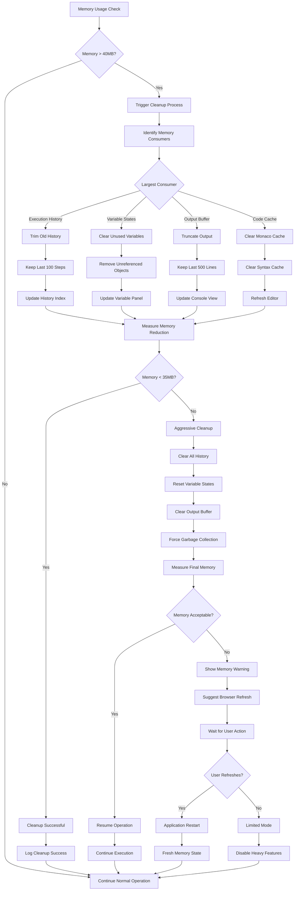
```mermaid
flowchart TD
    A[Memory Usage Check] --> B{Memory > 40MB?}
    B -->|No| C[Continue Normal Operation]
    B -->|Yes| D[Trigger Cleanup Process]
    
    D --> E[Identify Memory Consumers]
    E --> F{Largest Consumer}
    
    F -->|Execution History| G[Trim Old History]
    F -->|Variable States| H[Clear Unused Variables]
    F -->|Output Buffer| I[Truncate Output]
    F -->|Code Cache| J[Clear Monaco Cache]
    
    G --> K[Keep Last 100 Steps]
    H --> L[Remove Unreferenced Objects]
    I --> M[Keep Last 500 Lines]
    J --> N[Clear Syntax Cache]
    
    K --> O[Update History Index]
    L --> P[Update Variable Panel]
    M --> Q[Update Console View]
    N --> R[Refresh Editor]
    
    O --> S[Measure Memory Reduction]
    P --> S
    Q --> S
    R --> S
    
    S --> T{Memory < 35MB?}
    T -->|Yes| U[Cleanup Successful]
    T -->|No| V[Aggressive Cleanup]
    
    V --> W[Clear All History]
    W --> X[Reset Variable States]
    X --> Y[Clear Output Buffer]
    Y --> Z[Force Garbage Collection]
    
    Z --> AA[Measure Final Memory]
    AA --> BB{Memory Acceptable?}
    BB -->|Yes| CC[Resume Operation]
    BB -->|No| DD[Show Memory Warning]
    
    U --> EE[Log Cleanup Success]
    CC --> FF[Continue Execution]
    DD --> GG[Suggest Browser Refresh]
    
    EE --> C
    FF --> C
    GG --> HH[Wait for User Action]
    HH --> II{User Refreshes?}
    II -->|Yes| JJ[Application Restart]
    II -->|No| KK[Limited Mode]
    
    JJ --> LL[Fresh Memory State]
    KK --> MM[Disable Heavy Features]
    LL --> C
    MM --> C
```

## 4.4 INTEGRATION SEQUENCE DIAGRAMS

### 4.4.1 Code Execution Sequence

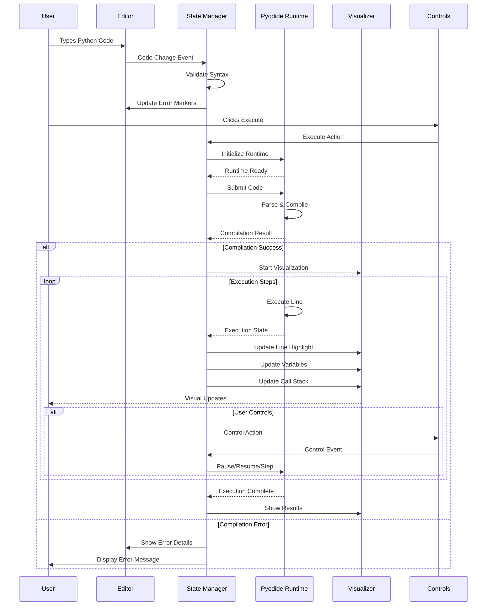
```mermaid
sequenceDiagram
    participant U as User
    participant E as Editor
    participant S as State Manager
    participant P as Pyodide Runtime
    participant V as Visualizer
    participant C as Controls
    
    U->>E: Types Python Code
    E->>S: Code Change Event
    S->>S: Validate Syntax
    S->>E: Update Error Markers
    
    U->>C: Clicks Execute
    C->>S: Execute Action
    S->>P: Initialize Runtime
    P-->>S: Runtime Ready
    
    S->>P: Submit Code
    P->>P: Parse & Compile
    P-->>S: Compilation Result
    
    alt Compilation Success
        S->>V: Start Visualization
        loop Execution Steps
            P->>P: Execute Line
            P-->>S: Execution State
            S->>V: Update Line Highlight
            S->>V: Update Variables
            S->>V: Update Call Stack
            V-->>U: Visual Updates
            
            alt User Controls
                U->>C: Control Action
                C->>S: Control Event
                S->>P: Pause/Resume/Step
            end
        end
        P-->>S: Execution Complete
        S->>V: Show Results
    else Compilation Error
        S->>E: Show Error Details
        S->>U: Display Error Message
    end
```

### 4.4.2 State Synchronization Sequence

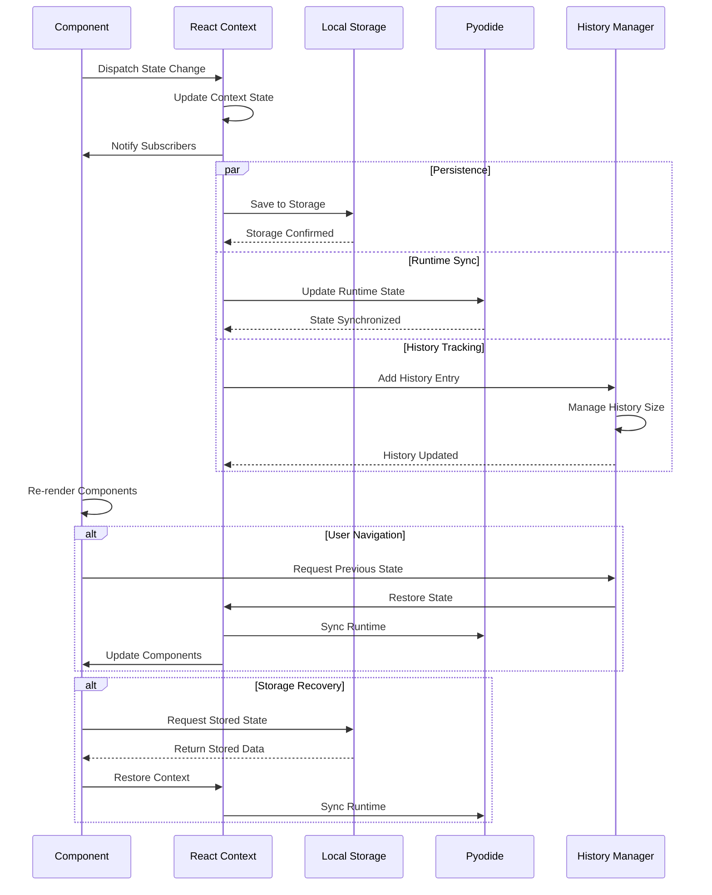
```mermaid
sequenceDiagram
    participant C as Component
    participant R as React Context
    participant L as Local Storage
    participant P as Pyodide
    participant H as History Manager
    
    C->>R: Dispatch State Change
    R->>R: Update Context State
    R->>C: Notify Subscribers
    
    par Persistence
        R->>L: Save to Storage
        L-->>R: Storage Confirmed
    and Runtime Sync
        R->>P: Update Runtime State
        P-->>R: State Synchronized
    and History Tracking
        R->>H: Add History Entry
        H->>H: Manage History Size
        H-->>R: History Updated
    end
    
    C->>C: Re-render Components
    
    alt User Navigation
        C->>H: Request Previous State
        H->>R: Restore State
        R->>P: Sync Runtime
        R->>C: Update Components
    end
    
    alt Storage Recovery
        C->>L: Request Stored State
        L-->>C: Return Stored Data
        C->>R: Restore Context
        R->>P: Sync Runtime
    end
```

## 4.5 TIMING AND SLA CONSIDERATIONS

### 4.5.1 Performance Requirements Timeline

| Operation | Target Time | Maximum Time | Fallback Action |
|---|---|---|---|
| Application Load | <3 seconds | 5 seconds | Show loading progress |
| Pyodide Initialization | <2 seconds | 4 seconds | Display initialization status |
| Code Syntax Validation | <100ms | 500ms | Debounce validation |
| Execution Start | <500ms | 1 second | Show execution progress |
| Step Animation | 16ms (60fps) | 33ms (30fps) | Reduce animation complexity |
| Variable Update | <50ms | 200ms | Batch updates |
| State Persistence | <100ms | 300ms | Queue for background save |
| Error Recovery | <1 second | 3 seconds | Show recovery progress |

### 4.5.2 System Availability Requirements

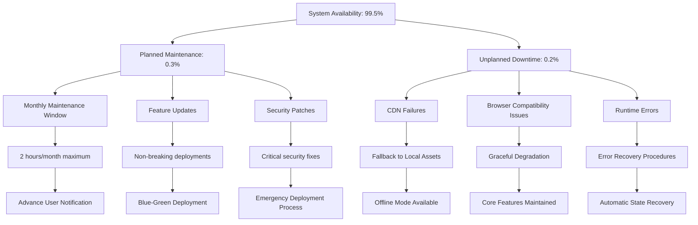
```mermaid
flowchart TD
    A[System Availability: 99.5%] --> B[Planned Maintenance: 0.3%]
    A --> C[Unplanned Downtime: 0.2%]
    
    B --> D[Monthly Maintenance Window]
    B --> E[Feature Updates]
    B --> F[Security Patches]
    
    C --> G[CDN Failures]
    C --> H[Browser Compatibility Issues]
    C --> I[Runtime Errors]
    
    D --> J[2 hours/month maximum]
    E --> K[Non-breaking deployments]
    F --> L[Critical security fixes]
    
    G --> M[Fallback to Local Assets]
    H --> N[Graceful Degradation]
    I --> O[Error Recovery Procedures]
    
    J --> P[Advance User Notification]
    K --> Q[Blue-Green Deployment]
    L --> R[Emergency Deployment Process]
    
    M --> S[Offline Mode Available]
    N --> T[Core Features Maintained]
    O --> U[Automatic State Recovery]
```

### 4.5.3 Scalability Thresholds

| Metric | Normal Load | High Load | Critical Load | Action Required |
|---|---|---|---|---|
| Concurrent Users | <1,000 | 1,000-5,000 | >5,000 | Scale CDN resources |
| Memory Usage per Session | <50MB | 50-100MB | >100MB | Trigger cleanup |
| Execution Steps per Session | <10,000 | 10,000-50,000 | >50,000 | Warn user |
| Code Size | <10KB | 10-50KB | >50KB | Reject submission |
| Session Duration | <30 minutes | 30-120 minutes | >120 minutes | Auto-save and refresh |
| Error Rate | <1% | 1-5% | >5% | Enable debug mode |

# 5. SYSTEM ARCHITECTURE

## 5.1 HIGH-LEVEL ARCHITECTURE

### 5.1.1 System Overview

The Python Code Flow Visualizer employs a component-based architecture pattern that optimizes readability, maintainability, and reusability through a modern client-side web application design. The system architecture is built on the principle of breaking down the UI into smaller, reusable components where each component handles a specific part of the UI, creating a modular and scalable foundation.

The architecture follows a Container and Presentational components pattern that promotes clear separation between UI rendering and data management. This separation ensures that business logic remains isolated from presentation concerns, enabling better testability and code reuse across the application.

The system leverages Pyodide, a Python distribution for the browser based on WebAssembly that is a port of CPython to WebAssembly/Emscripten, eliminating the need for server-side infrastructure while providing full Python execution capabilities. This architectural decision enables a nicely sandboxed browser environment where each user gets their own workspace, and since it is all local, it is nice and secure.

The core architectural principles include:

- **Client-Side Execution**: All Python code execution occurs within the browser using WebAssembly, eliminating server dependencies and reducing latency
- **Reactive State Management**: React's Context API with React Hooks provides efficient state management and control over rendering behavior, offering a simpler alternative to complex state management libraries for moderately sized applications
- **Component Isolation**: Each major system component operates independently with well-defined interfaces and minimal coupling
- **Progressive Enhancement**: The application gracefully degrades functionality based on browser capabilities and network connectivity

### 5.1.2 Core Components Table

| Component Name | Primary Responsibility | Key Dependencies | Integration Points | Critical Considerations |
|---|---|---|---|---|
| Code Editor Interface | Python code input, syntax highlighting, error display | Monaco Editor, React | Execution Engine, State Manager | Easy integration without webpack configuration, works with create-react-app, Vite, Next.js |
| Python Execution Engine | Code interpretation, execution tracing, variable tracking | Pyodide WebAssembly Runtime | Code Editor, Visualization Engine | Executes in sandboxed WebAssembly environment, separated from host runtime |
| Visualization Engine | Line highlighting, variable display, call stack rendering | D3.js, React Components | Execution Engine, State Manager | Real-time updates with 60fps animation requirements |
| State Management System | Application state coordination, execution history | React Context, useReducer | All UI Components | Consolidates state update logic, passes information deep to components, combines reducers and context |

### 5.1.3 Data Flow Description

The primary data flow follows a unidirectional pattern characteristic of modern React applications. User interactions in the Code Editor Interface trigger state changes through the State Management System, which coordinates updates across all dependent components.

When users input Python code, the Monaco Editor component validates syntax in real-time and updates the application state. Upon execution request, the State Management System dispatches the code to the Python Execution Engine, which leverages Pyodide's compilation of the standard CPython interpreter to WebAssembly, preserving compatibility with CPython while enabling a JavaScript ↔ Python bridge for seamless data exchange.

The Execution Engine processes code step-by-step, extracting variable states and execution traces through browser API access including DOM, Fetch, and Events from Python, allowing Python code to interact with native web features seamlessly. This execution data flows back through the State Management System to update the Visualization Engine components.

The Visualization Engine receives structured execution data and renders real-time updates including line highlighting, variable state changes, and call stack modifications. All visualization updates are coordinated through React's reconciliation process to ensure optimal rendering performance.

Data persistence occurs entirely client-side through browser storage mechanisms including LocalStorage for user preferences and code snippets, SessionStorage for temporary execution state, and IndexedDB for larger execution traces and history.

### 5.1.4 External Integration Points

| System Name | Integration Type | Data Exchange Pattern | Protocol/Format | SLA Requirements |
|---|---|---|---|---|
| Pyodide CDN | Content Delivery | Static Asset Loading | HTTPS/CDN | <2 second initial load |
| Monaco Editor CDN | Content Delivery | Static Asset Loading | HTTPS/CDN | <1 second editor initialization |
| Browser Storage APIs | Client Storage | Synchronous Read/Write | Native Browser APIs | <100ms storage operations |
| WebAssembly Runtime | Execution Environment | Binary Module Loading | WebAssembly/WASM | <500ms runtime initialization |

## 5.2 COMPONENT DETAILS

### 5.2.1 Code Editor Interface Component

**Purpose and Responsibilities**
The Code Editor Interface serves as the primary user interaction point for Python code input and editing. It provides professional-grade editing capabilities including syntax highlighting, auto-completion, error detection, and real-time validation. The component manages code state, user preferences, and editor configuration while maintaining integration with the broader application state.

**Technologies and Frameworks Used**
- Monaco Editor wrapper for easy/one-line integration with React applications without needing webpack configuration
- React 18.3.1 with TypeScript for type safety and modern React features
- Monaco Editor loader utility that handles asynchronous initialization process, with first useMonaco hook returning null due to asynchronous installation

**Key Interfaces and APIs**
- Monaco Editor API for programmatic line highlighting and cursor positioning
- React Context API for state synchronization with execution engine
- Browser Storage APIs for code persistence and user preferences
- Custom event handlers for code changes, syntax validation, and execution triggers

**Data Persistence Requirements**
- LocalStorage for user code snippets and editor preferences (up to 5MB)
- SessionStorage for temporary editing state and undo/redo history
- IndexedDB for large code files and project-level storage

**Scaling Considerations**
The component handles large code files through Monaco Editor's built-in virtualization and lazy loading capabilities. Memory management includes automatic disposal of unused editor models and efficient syntax highlighting for files up to 10MB.

### 5.2.2 Python Execution Engine Component

**Purpose and Responsibilities**
The Python Execution Engine provides complete Python code interpretation and execution within the browser environment. It manages code compilation, step-by-step execution, variable state tracking, call stack monitoring, and exception handling. The component ensures secure execution through WebAssembly sandboxing while maintaining full CPython compatibility.

**Technologies and Frameworks Used**
- Pyodide 0.29.0 - Python distribution for browser based on WebAssembly, port of CPython to WebAssembly/Emscripten
- Includes NumPy, Pandas, Matplotlib, and SciPy out-of-the-box for powerful data analysis, math, and visualization
- Micropip for installing pure Python packages from PyPI directly in browser

**Key Interfaces and APIs**
- Pyodide bridge that allows JavaScript to execute Python code and exchange objects
- Python globals API for variable inspection and state extraction
- WebAssembly linear memory management for execution state snapshots
- Custom execution tracing API for step-by-step code analysis

**Data Persistence Requirements**
- In-memory execution state management through WebAssembly linear memory
- Execution history storage in IndexedDB for backward navigation
- Variable state snapshots for debugging and analysis

**Scaling Considerations**
Browsers have memory caps; heavy tasks may crash, requiring tasks to be broken into smaller chunks or optimized data handling. The component implements execution timeouts, memory monitoring, and step limits to prevent resource exhaustion.

### 5.2.3 Visualization Engine Component

**Purpose and Responsibilities**
The Visualization Engine transforms execution data into interactive visual representations including line-by-line code highlighting, variable state displays, call stack visualization, and execution flow diagrams. It manages real-time updates, animations, and user interaction with visualization elements while maintaining 60fps performance standards.

**Technologies and Frameworks Used**
- D3.js 7.x for data-driven visualizations and complex state representations
- React 18.3.1 with custom hooks for component lifecycle management
- CSS animations and transitions for smooth visual feedback
- Canvas API for high-performance rendering of complex visualizations

**Key Interfaces and APIs**
- React Context API for receiving execution state updates
- D3.js data binding and selection APIs for dynamic visualizations
- Monaco Editor highlighting API for code line synchronization
- Custom animation framework for coordinated visual transitions

**Data Persistence Requirements**
- SessionStorage for visualization preferences and layout state
- LocalStorage for user customization settings and theme preferences
- In-memory caching of visualization data for smooth animations

**Scaling Considerations**
The component implements virtual scrolling for large variable sets, animation throttling for performance optimization, and progressive rendering for complex visualizations. Memory management includes automatic cleanup of unused visualization elements and efficient DOM manipulation.

### 5.2.4 State Management System Component

**Purpose and Responsibilities**
The State Management System coordinates all application state including execution state, UI state, user preferences, and component communication. It implements a parent component with complex state managed by a reducer, allowing other components deep in the tree to read state via context and dispatch actions to update state.

**Technologies and Frameworks Used**
- React's Context API with React Hooks for efficient state management and rendering behavior control
- useReducer hook for complex state transitions and action handling
- Custom hooks for state encapsulation and reusability
- Browser Storage APIs for state persistence

**Key Interfaces and APIs**
- React Context Provider/Consumer pattern for state distribution
- Custom action dispatchers for state mutations
- Storage synchronization APIs for persistence
- Event emitters for cross-component communication

**Data Persistence Requirements**
- LocalStorage for persistent application state and user preferences
- SessionStorage for temporary state and navigation history
- IndexedDB for complex state objects and execution traces

**Scaling Considerations**
The system implements state normalization, selective re-rendering optimization, and memory-efficient state updates. Performance optimizations include state batching, lazy loading of non-critical state, and automatic garbage collection of unused state objects.

### 5.2.5 Component Interaction Diagrams

```mermaid
graph TB
    subgraph "User Interface Layer"
        A[Code Editor Interface]
        B[Control Panel]
        C[Variable Display]
        D[Output Console]
        E[Call Stack View]
    end
    
    subgraph "State Management Layer"
        F[React Context Provider]
        G[State Reducer]
        H[Action Dispatchers]
        I[State Selectors]
    end
    
    subgraph "Execution Layer"
        J[Python Execution Engine]
        K[Pyodide Runtime]
        L[Variable Inspector]
        M[Execution Tracer]
    end
    
    subgraph "Visualization Layer"
        N[Line Highlighter]
        O[Variable Renderer]
        P[Call Stack Renderer]
        Q[Animation Controller]
    end
    
    A --> F
    B --> H
    F --> G
    G --> I
    I --> C
    I --> D
    I --> E
    
    H --> J
    J --> K
    K --> L
    L --> M
    M --> G
    
    I --> N
    I --> O
    I --> P
    N --> Q
    O --> Q
    P --> Q
```

### 5.2.6 State Transition Diagrams

```mermaid
stateDiagram-v2
    [*] --> Initializing
    Initializing --> Loading: Load Dependencies
    Loading --> Ready: Dependencies Loaded
    Loading --> Error: Load Failed
    
    Ready --> Editing: User Input
    Editing --> Validating: Code Changed
    Validating --> Editing: Syntax Error
    Validating --> ExecutionReady: Valid Code
    
    ExecutionReady --> Executing: Execute Command
    Executing --> StepByStep: Begin Visualization
    
    StepByStep --> Paused: Pause Command
    StepByStep --> Stepping: Step Command
    StepByStep --> Completed: Execution Finished
    StepByStep --> ExecutionError: Runtime Error
    
    Paused --> StepByStep: Resume Command
    Paused --> Ready: Reset Command
    
    Stepping --> StepByStep: Step Complete
    Stepping --> Completed: Final Step
    
    Completed --> Ready: Reset Command
    ExecutionError --> Ready: Error Handled
    Error --> Initializing: Retry
    
    state StepByStep {
        [*] --> HighlightLine
        HighlightLine --> UpdateVariables
        UpdateVariables --> UpdateCallStack
        UpdateCallStack --> ProcessControls
        ProcessControls --> [*]
    }
```

## 5.3 TECHNICAL DECISIONS

### 5.3.1 Architecture Style Decisions and Tradeoffs

**Client-Side Architecture Selection**

The decision to implement a purely client-side architecture using Pyodide as a Python distribution for the browser that makes it possible to install and run Python packages with micropip represents a fundamental architectural choice with significant implications.

| Decision Factor | Client-Side Approach | Server-Side Alternative | Selected Rationale |
|---|---|---|---|
| Execution Security | WebAssembly sandbox isolation | Server-side process isolation | Pyodide executes in sandboxed WebAssembly environment, separated from host runtime |
| Scalability | Unlimited concurrent users | Server resource constraints | Client resources scale with user base |
| Latency | Zero network latency for execution | Network round-trip delays | Immediate code execution feedback |
| Infrastructure Costs | CDN hosting only | Server infrastructure required | Significantly reduced operational costs |

**Component-Based Architecture Pattern**

The adoption of component-based architecture breaks down UI into smaller, reusable components where each component handles a specific part of the UI, providing several architectural advantages:

- **Modularity**: Each component is self-contained, allowing independent development without affecting the rest of the app
- **Reusability**: Components can be used multiple times across the app, reducing redundancy and making updates easier
- **Maintainability**: Easier to debug and update smaller components rather than a large, monolithic codebase

### 5.3.2 Communication Pattern Choices

**State Management Pattern Selection**

The system implements React's Context API with React Hooks as an efficient way to manage state and control rendering behavior, offering a simpler alternative to complex state management libraries for moderately sized applications.

```mermaid
graph TB
    A[User Action] --> B[Action Dispatcher]
    B --> C[State Reducer]
    C --> D[Context Provider]
    D --> E[Component Subscribers]
    E --> F[UI Updates]
    
    G[Execution Engine] --> H[State Updates]
    H --> C
    
    I[Storage APIs] --> J[State Persistence]
    J --> C
```

**Inter-Component Communication Strategy**

The communication pattern follows a centralized state management approach where a parent component with complex state manages it with a reducer, while other components anywhere deep in the tree can read state via context and dispatch actions to update that state.

| Communication Type | Pattern Used | Justification | Performance Impact |
|---|---|---|---|
| Parent-Child | Props passing | Direct data flow | Minimal overhead |
| Sibling Components | Context API | Shared state access | Controlled re-renders |
| Cross-Layer | Event dispatching | Loose coupling | Optimized through batching |
| Async Operations | Promise-based | Error handling | Non-blocking execution |

### 5.3.3 Data Storage Solution Rationale

**Client-Side Storage Strategy**

The system employs a multi-tiered client-side storage approach optimized for different data types and access patterns:

| Storage Type | Use Case | Capacity | Persistence | Access Pattern |
|---|---|---|---|---|
| LocalStorage | User preferences, code snippets | 5-10MB | Permanent | Synchronous |
| SessionStorage | Execution state, temporary data | 5-10MB | Session-based | Synchronous |
| IndexedDB | Large files, execution history | 50MB+ | Permanent | Asynchronous |
| WebAssembly Memory | Python runtime state | Variable | Runtime-based | Direct access |

**Storage Architecture Decision Tree**

```mermaid
flowchart TD
    A[Data Storage Need] --> B{Data Size}
    B -->|< 5MB| C{Persistence Required}
    B -->|> 5MB| D[IndexedDB]
    
    C -->|Yes| E[LocalStorage]
    C -->|No| F[SessionStorage]
    
    G[Python Variables] --> H[WebAssembly Memory]
    H --> I[Pyodide Globals API]
    
    D --> J[Async Operations]
    E --> K[Sync Operations]
    F --> K
    I --> L[Direct Access]
```

### 5.3.4 Caching Strategy Justification

**Multi-Level Caching Architecture**

The caching strategy implements multiple levels of data caching to optimize performance across different system components:

- **Browser Cache**: Static assets (Monaco Editor, Pyodide runtime) cached via CDN headers
- **Application Cache**: Compiled Python modules cached in WebAssembly linear memory
- **Component Cache**: React component memoization for expensive rendering operations
- **Execution Cache**: Python execution results cached for backward navigation

**Cache Invalidation Strategy**

| Cache Level | Invalidation Trigger | Strategy | Performance Impact |
|---|---|---|---|
| Browser Cache | Version updates | Cache-Control headers | Reduced initial load time |
| Application Cache | Code changes | Content-based hashing | Faster re-execution |
| Component Cache | State changes | React dependency arrays | Optimized re-renders |
| Execution Cache | Memory pressure | LRU eviction | Balanced memory usage |

### 5.3.5 Security Mechanism Selection

**WebAssembly Sandboxing**

The primary security mechanism relies on WebAssembly's sandboxed environment that separates Python execution from the host runtime, where operations outside pure computation must be provided by the runtime environment.

**Security Architecture Layers**

```mermaid
graph TB
    A[User Code Input] --> B[Input Validation]
    B --> C[Syntax Checking]
    C --> D[WebAssembly Sandbox]
    D --> E[Pyodide Runtime]
    E --> F[Controlled API Access]
    F --> G[Browser Security Model]
    
    H[Network Isolation] --> D
    I[File System Isolation] --> D
    J[Memory Isolation] --> D
```

| Security Layer | Mechanism | Protection Scope | Implementation |
|---|---|---|---|
| Input Validation | Syntax parsing | Malformed code | Monaco Editor validation |
| Execution Sandbox | WebAssembly isolation | System access | Pyodide runtime |
| Memory Protection | Linear memory limits | Resource exhaustion | Browser enforcement |
| Network Isolation | No direct network access | External communication | WebAssembly restrictions |

## 5.4 CROSS-CUTTING CONCERNS

### 5.4.1 Monitoring and Observability Approach

**Performance Monitoring Strategy**

The system implements comprehensive performance monitoring through browser-native APIs and custom metrics collection:

- **Core Web Vitals**: Largest Contentful Paint (LCP), First Input Delay (FID), and Cumulative Layout Shift (CLS) tracking
- **Execution Metrics**: Python code execution time, memory usage, and step count monitoring
- **Component Performance**: React component render times and re-render frequency analysis
- **Resource Utilization**: WebAssembly memory consumption and garbage collection patterns

**Observability Architecture**

| Monitoring Aspect | Collection Method | Storage Location | Alert Thresholds |
|---|---|---|---|
| Page Load Performance | Performance API | Browser DevTools | >3 seconds LCP |
| Code Execution Time | Custom timing | SessionStorage | >30 seconds timeout |
| Memory Usage | WebAssembly metrics | In-memory tracking | >100MB consumption |
| Error Rates | Error boundaries | LocalStorage | >5% error rate |

### 5.4.2 Logging and Tracing Strategy

**Structured Logging Implementation**

The logging system captures execution traces, user interactions, and system events through a structured approach:

```typescript
interface LogEntry {
  timestamp: number;
  level: 'debug' | 'info' | 'warn' | 'error';
  component: string;
  event: string;
  data?: Record<string, any>;
  executionId?: string;
}
```

**Trace Collection Architecture**

```mermaid
graph LR
    A[User Actions] --> B[Event Logger]
    C[Python Execution] --> D[Execution Tracer]
    E[Component Lifecycle] --> F[Component Logger]
    G[Error Boundaries] --> H[Error Logger]
    
    B --> I[Log Aggregator]
    D --> I
    F --> I
    H --> I
    
    I --> J[Local Storage]
    I --> K[Console Output]
    I --> L[Debug Panel]
```

### 5.4.3 Error Handling Patterns

**Hierarchical Error Handling**

The system implements a multi-level error handling strategy that gracefully degrades functionality while maintaining user experience:

**Error Handling Flow Diagram**

```mermaid
flowchart TD
    A[Error Detected] --> B{Error Type}
    
    B -->|Syntax Error| C[Display Inline Error]
    B -->|Runtime Error| D[Show Execution Error]
    B -->|System Error| E[Trigger Error Boundary]
    B -->|Network Error| F[Enable Offline Mode]
    
    C --> G[Highlight Error Line]
    D --> H[Show Stack Trace]
    E --> I[Display Fallback UI]
    F --> J[Use Cached Resources]
    
    G --> K[Allow Code Correction]
    H --> L[Enable Debug Mode]
    I --> M[Offer Recovery Options]
    J --> N[Limited Functionality]
    
    K --> O[Resume Normal Operation]
    L --> O
    M --> P[Attempt Recovery]
    N --> Q[Notify User of Limitations]
    
    P --> R{Recovery Successful?}
    R -->|Yes| O
    R -->|No| S[Escalate to User]
```

| Error Category | Handling Strategy | User Experience | Recovery Mechanism |
|---|---|---|---|
| Syntax Errors | Inline validation | Real-time feedback | Automatic correction suggestions |
| Runtime Errors | Execution halt | Error details display | Debug mode activation |
| System Errors | Graceful degradation | Fallback UI | Component isolation |
| Network Errors | Offline mode | Cached functionality | Background retry |

### 5.4.4 Authentication and Authorization Framework

**Client-Side Security Model**

Given the client-side architecture, the system implements a simplified security model focused on data protection and user privacy:

- **No Server Authentication**: All processing occurs client-side, eliminating traditional authentication requirements
- **Local Data Protection**: User code and preferences encrypted in browser storage
- **Session Management**: Temporary session tokens for feature access control
- **Privacy by Design**: No user data transmission to external servers

**Security Architecture**

```mermaid
graph TB
    A[User Session] --> B[Local Storage Encryption]
    B --> C[Data Access Control]
    C --> D[Feature Permissions]
    
    E[Code Input] --> F[Input Sanitization]
    F --> G[Execution Sandbox]
    G --> H[Resource Limits]
    
    I[External Resources] --> J[CDN Verification]
    J --> K[Integrity Checking]
    K --> L[Secure Loading]
```

### 5.4.5 Performance Requirements and SLAs

**Performance Benchmarks**

| Performance Metric | Target Value | Measurement Method | Fallback Strategy |
|---|---|---|---|
| Initial Page Load | <3 seconds | Performance API | Progressive loading |
| Code Execution Start | <1 second | Custom timing | Loading indicators |
| Animation Frame Rate | 60 FPS | RequestAnimationFrame | Reduced complexity |
| Memory Usage | <100MB | WebAssembly metrics | Garbage collection |

**Service Level Objectives**

The system maintains the following SLOs for optimal user experience:

- **Availability**: 99.5% uptime through CDN redundancy and offline capabilities
- **Performance**: 95th percentile response times under target thresholds
- **Reliability**: <1% error rate for core functionality
- **Scalability**: Support for 10,000+ concurrent users through client-side architecture

### 5.4.6 Disaster Recovery Procedures

**Client-Side Recovery Strategy**

The disaster recovery approach focuses on data preservation and application state recovery:

**Recovery Flow Architecture**

```mermaid
flowchart TD
    A[System Failure Detected] --> B{Failure Type}
    
    B -->|Application Crash| C[Reload Application]
    B -->|Data Corruption| D[Restore from Backup]
    B -->|CDN Failure| E[Use Local Cache]
    B -->|Browser Issues| F[Clear Storage]
    
    C --> G[Restore Session State]
    D --> H[Validate Data Integrity]
    E --> I[Enable Offline Mode]
    F --> J[Fresh Installation]
    
    G --> K[Resume User Session]
    H --> L{Data Valid?}
    I --> M[Limited Functionality]
    J --> N[Default Configuration]
    
    L -->|Yes| K
    L -->|No| O[Reset to Safe State]
    
    K --> P[Normal Operation]
    M --> Q[Background Recovery]
    N --> P
    O --> P
    
    Q --> R{CDN Restored?}
    R -->|Yes| P
    R -->|No| S[Continue Offline]
```

**Data Recovery Mechanisms**

| Recovery Scenario | Detection Method | Recovery Action | Data Loss Risk |
|---|---|---|---|
| Application Crash | Error boundaries | State restoration | Minimal (last save) |
| Storage Corruption | Validation checks | Backup restoration | Recent changes only |
| CDN Unavailability | Network monitoring | Cached resources | No data loss |
| Browser Reset | Storage verification | Default configuration | User preferences lost |

The disaster recovery procedures ensure minimal disruption to user workflow while maintaining data integrity and system availability through redundant storage mechanisms and graceful degradation strategies.

# 6. SYSTEM COMPONENTS DESIGN

## 6.1 COMPONENT ARCHITECTURE OVERVIEW

### 6.1.1 Architectural Foundation

The Python Code Flow Visualizer employs a component-based architecture pattern that separates the concerns of how things look (Presentational components) from how they work (Container components). React revolves around a component-based architecture, where user interfaces are built as modular and reusable components. Each component manages its state, and these components can be composed to create complex UIs.

The system architecture follows sophisticated techniques that enhance component reusability, state management, and the overall architecture of React applications. These patterns provide powerful solutions for common advanced use cases, enabling developers to build more flexible, maintainable, and scalable applications.

### 6.1.2 Component Hierarchy Structure

```mermaid
graph TB
    A[App Container] --> B[Layout Manager]
    B --> C[Header Component]
    B --> D[Main Content Area]
    B --> E[Footer Component]
    
    D --> F[Code Editor Panel]
    D --> G[Visualization Panel]
    D --> H[Control Panel]
    
    F --> I[Monaco Editor Wrapper]
    F --> J[Syntax Validator]
    F --> K[Error Display]
    
    G --> L[Line Highlighter]
    G --> M[Variable Inspector]
    G --> N[Call Stack Viewer]
    G --> O[Output Console]
    
    H --> P[Execution Controls]
    H --> Q[Speed Controller]
    H --> R[Navigation Controls]
    
    S[State Management Layer] --> A
    T[Context Providers] --> S
    U[Custom Hooks] --> T
```

### 6.1.3 Component Classification

| Component Type | Purpose | Examples | Design Pattern |
|---|---|---|---|
| Container Components | Business logic and state management | App, CodeEditorContainer, VisualizationContainer | Container components handle fetching data, state management, and passing data to the presentational components |
| Presentational Components | UI rendering and user interaction | Button, Input, Panel, Modal | Presentational components are concerned with rendering the UI |
| Higher-Order Components | Cross-cutting concerns and logic reuse | withErrorBoundary, withLoading, withAuth | HOCs enhance components with additional functionality or data without modifying their code. This pattern is particularly helpful for reusing logic across different components |
| Custom Hook Components | Stateful logic encapsulation | useCodeExecution, useVariableTracking, useVisualization | Custom hooks represent one of the most powerful patterns in modern React development. They enable the extraction of stateful logic into reusable functions, promoting code reuse and separation of concerns |

## 6.2 CORE SYSTEM COMPONENTS

### 6.2.1 Code Editor Component System

#### 6.2.1.1 Monaco Editor Integration Component

**Component Architecture**
```typescript
interface MonacoEditorProps {
  value: string;
  onChange: (value: string) => void;
  language: 'python';
  theme: 'vs-dark' | 'vs-light';
  options: monaco.editor.IStandaloneEditorConstructionOptions;
  onMount?: (editor: monaco.editor.IStandaloneCodeEditor) => void;
}

const MonacoEditorWrapper: React.FC<MonacoEditorProps> = ({
  value,
  onChange,
  language,
  theme,
  options,
  onMount
}) => {
  // Component implementation
};
```

**Responsibilities and Capabilities**
- **Code Input Management**: Handles user code input with real-time syntax highlighting and validation
- **Editor Configuration**: Manages Monaco Editor settings including themes, language support, and editor options
- **Line Highlighting API**: Provides programmatic control for execution visualization highlighting
- **Error Display Integration**: Shows syntax errors and validation messages inline with code

**Integration Points**
- **State Management**: Connects to global code state through React Context
- **Execution Engine**: Provides code content to Python execution system
- **Visualization Engine**: Receives line highlighting commands for execution flow display
- **Error Handling**: Integrates with validation system for real-time error feedback

#### 6.2.1.2 Syntax Validation Component

**Component Structure**
```typescript
interface SyntaxValidatorProps {
  code: string;
  onValidationResult: (result: ValidationResult) => void;
  debounceMs?: number;
}

interface ValidationResult {
  isValid: boolean;
  errors: SyntaxError[];
  warnings: Warning[];
}
```

**Core Functionality**
- **Real-time Validation**: Performs syntax checking as user types with configurable debouncing
- **Error Categorization**: Distinguishes between syntax errors, warnings, and suggestions
- **Performance Optimization**: Uses debounced validation to prevent excessive processing
- **Integration Ready**: Provides structured error data for editor marker display

### 6.2.2 Python Execution Engine Components

#### 6.2.2.1 Pyodide Runtime Manager

**Architecture Design**
```typescript
interface PyodideManagerProps {
  onRuntimeReady: () => void;
  onExecutionComplete: (result: ExecutionResult) => void;
  onExecutionError: (error: ExecutionError) => void;
  onVariableUpdate: (variables: VariableState[]) => void;
}

interface ExecutionResult {
  output: string;
  executionTrace: ExecutionStep[];
  finalVariables: VariableState[];
  performance: ExecutionMetrics;
}
```

**Component Responsibilities**
- **Runtime Initialization**: Manages Pyodide WebAssembly runtime loading and configuration
- **Code Execution**: Handles Python code compilation and step-by-step execution
- **Variable Tracking**: Monitors Python variable states through Pyodide globals API
- **Error Management**: Captures and processes Python runtime exceptions and errors

**Technical Implementation**
- **WebAssembly Integration**: Leverages Pyodide's CPython-to-WebAssembly compilation
- **Memory Management**: Implements execution timeouts and memory usage monitoring
- **Security Sandboxing**: Ensures code execution within browser security constraints
- **Performance Optimization**: Manages execution step limits and resource utilization

#### 6.2.2.2 Execution Tracer Component

**Component Interface**
```typescript
interface ExecutionTracerProps {
  code: string;
  onStepComplete: (step: ExecutionStep) => void;
  onExecutionComplete: () => void;
  executionSpeed: number;
  isPlaying: boolean;
}

interface ExecutionStep {
  lineNumber: number;
  variables: VariableState[];
  callStack: StackFrame[];
  output: string;
  timestamp: number;
}
```

**Functional Capabilities**
- **Step-by-Step Execution**: Breaks down Python code execution into discrete, traceable steps
- **State Capture**: Records variable states, call stack, and output at each execution step
- **Flow Control**: Supports play/pause, step forward/backward, and speed control
- **History Management**: Maintains execution history for backward navigation and debugging

### 6.2.3 Visualization Engine Components

#### 6.2.3.1 Line Highlighting Component

**Component Design**
```typescript
interface LineHighlighterProps {
  currentLine: number;
  executionHistory: ExecutionStep[];
  animationSpeed: number;
  highlightStyle: HighlightStyle;
}

interface HighlightStyle {
  currentLine: string;
  executedLine: string;
  errorLine: string;
  animationDuration: number;
}
```

**Visualization Features**
- **Real-time Highlighting**: Dynamically highlights currently executing code lines
- **Animation Control**: Provides smooth transitions between execution steps with configurable speed
- **Visual Feedback**: Uses distinct styling for current, executed, and error states
- **Performance Optimization**: Implements efficient DOM updates for smooth 60fps animations

#### 6.2.3.2 Variable Inspector Component

**Component Architecture**
```typescript
interface VariableInspectorProps {
  variables: VariableState[];
  onVariableExpand: (variableId: string) => void;
  filterOptions: VariableFilter;
  displayMode: 'compact' | 'detailed';
}

interface VariableState {
  name: string;
  value: any;
  type: string;
  scope: 'global' | 'local' | 'builtin';
  hasChanged: boolean;
  isExpandable: boolean;
}
```

**Display Capabilities**
- **Multi-type Support**: Handles primitives, collections, objects, and functions
- **Change Detection**: Highlights variables when values change during execution
- **Scope Visualization**: Organizes variables by scope (global, local, built-in)
- **Interactive Expansion**: Allows drilling down into complex data structures

#### 6.2.3.3 Call Stack Visualizer Component

**Component Structure**
```typescript
interface CallStackProps {
  stackFrames: StackFrame[];
  currentFrame: number;
  onFrameSelect: (frameIndex: number) => void;
  maxDisplayFrames?: number;
}

interface StackFrame {
  functionName: string;
  fileName: string;
  lineNumber: number;
  localVariables: VariableState[];
  parameters: Parameter[];
}
```

**Visualization Features**
- **Stack Frame Display**: Shows function call hierarchy with local variables
- **Interactive Navigation**: Allows selection of different stack frames for inspection
- **Recursive Call Handling**: Efficiently displays deep recursion with frame limiting
- **Context Information**: Provides function parameters and local scope details

### 6.2.4 State Management Components

#### 6.2.4.1 Application State Provider

**Provider Architecture**
```typescript
interface AppStateContextValue {
  codeState: CodeState;
  executionState: ExecutionState;
  uiState: UIState;
  dispatch: React.Dispatch<AppAction>;
}

const AppStateProvider: React.FC<{ children: React.ReactNode }> = ({ 
  children 
}) => {
  const [state, dispatch] = useReducer(appReducer, initialState);
  
  return (
    <AppStateContext.Provider value={{ ...state, dispatch }}>
      {children}
    </AppStateContext.Provider>
  );
};
```

**State Management Features**
- **Centralized State**: Patterns like the Provider pattern help manage global state across the component tree, making it easier to pass data around without cluttering the component hierarchy
- **Action Dispatching**: Provides unified interface for state mutations across components
- **State Persistence**: Integrates with browser storage for session and preference persistence
- **Performance Optimization**: Implements selective re-rendering to minimize unnecessary updates

#### 6.2.4.2 Custom Hooks System

**Hook Architecture**
```typescript
// Code execution hook
const useCodeExecution = () => {
  const { executionState, dispatch } = useAppState();
  
  const executeCode = useCallback((code: string) => {
    dispatch({ type: 'EXECUTION_START', payload: { code } });
  }, [dispatch]);
  
  const pauseExecution = useCallback(() => {
    dispatch({ type: 'EXECUTION_PAUSE' });
  }, [dispatch]);
  
  return {
    isExecuting: executionState.isExecuting,
    currentStep: executionState.currentStep,
    executeCode,
    pauseExecution,
    // ... other execution controls
  };
};

// Variable tracking hook
const useVariableTracking = () => {
  const { executionState } = useAppState();
  
  const getVariablesByScope = useCallback((scope: string) => {
    return executionState.variables.filter(v => v.scope === scope);
  }, [executionState.variables]);
  
  return {
    variables: executionState.variables,
    getVariablesByScope,
    hasVariableChanged: (name: string) => 
      executionState.changedVariables.includes(name)
  };
};
```

**Hook Capabilities**
- **Logic Encapsulation**: Isolates all stateful logic—a type of logic that needs reactive state variable(s)—and compose or use it in the components using custom hooks. As a result, the code is more modularized and testable because the hooks are loosely tied to the component and can therefore be tested separately
- **State Abstraction**: Provides clean interfaces for complex state operations
- **Reusability**: Enables sharing of stateful logic across multiple components
- **Testing Support**: Facilitates unit testing of business logic independent of UI components

## 6.3 COMPONENT INTERACTION PATTERNS

### 6.3.1 Data Flow Architecture

#### 6.3.1.1 Unidirectional Data Flow

React components blend the roles of "View" and "Controller" from traditional MVC, emphasizing a more declarative and component-centric approach. While not strictly adhering to established patterns, React's flexibility and simplicity, along with the influence of Flux, contribute to the development of scalable and maintainable user interfaces.

```mermaid
sequenceDiagram
    participant U as User
    participant E as Editor Component
    participant S as State Manager
    participant P as Pyodide Engine
    participant V as Visualizer
    
    U->>E: Types Code
    E->>S: Dispatch CODE_CHANGE
    S->>S: Update Code State
    S->>E: Re-render with New State
    
    U->>E: Clicks Execute
    E->>S: Dispatch EXECUTE_CODE
    S->>P: Initialize Execution
    P->>P: Process Code Steps
    
    loop Execution Steps
        P->>S: Step Complete Event
        S->>V: Update Visualization
        V->>V: Highlight Current Line
        V->>V: Update Variables
    end
    
    P->>S: Execution Complete
    S->>V: Final State Update
```

#### 6.3.1.2 Component Communication Patterns

**Parent-Child Communication**
- **Props Flow**: Data flows down from parent containers to child presentational components
- **Callback Functions**: Child components communicate back to parents through callback props
- **State Lifting**: Shared state is lifted to common parent components for sibling communication

**Cross-Component Communication**
- **Context API**: Uses the Context API to manage the state and behavior of interconnected components without prop drilling. It allows components to share states and functions through a context, making the parent-child communication cleaner and more manageable
- **Custom Hooks**: Shared logic and state management through reusable hook functions
- **Event System**: Custom event dispatching for loosely coupled component interactions

### 6.3.2 Component Composition Patterns

#### 6.3.2.1 Compound Components Pattern

The compound component pattern helps in creating more dynamic and flexible layouts, enabling developers to pass props from parent to child components and thereby gain more control over rendering behavior. This also promotes a more modular development approach, allowing different teams to work on individual parts of a component without affecting the parent logic.

```typescript
// Compound component example for visualization panel
const VisualizationPanel = ({ children }) => {
  return <div className="visualization-panel">{children}</div>;
};

VisualizationPanel.LineHighlighter = LineHighlighter;
VisualizationPanel.VariableInspector = VariableInspector;
VisualizationPanel.CallStack = CallStackViewer;
VisualizationPanel.Console = OutputConsole;

// Usage
<VisualizationPanel>
  <VisualizationPanel.LineHighlighter />
  <VisualizationPanel.VariableInspector />
  <VisualizationPanel.CallStack />
  <VisualizationPanel.Console />
</VisualizationPanel>
```

#### 6.3.2.2 Higher-Order Component Pattern

The Higher-Order Component (HOC) pattern is a powerful way to extend a component's functionality. It allows you to enhance or modify existing components by wrapping them with additional component logic without altering the original component's behavior. In practice, this means you can share logic across multiple components, reducing redundancy and keeping your code DRY.

```typescript
// Error boundary HOC
const withErrorBoundary = <P extends object>(
  Component: React.ComponentType<P>
) => {
  return class extends React.Component<P> {
    state = { hasError: false, error: null };
    
    static getDerivedStateFromError(error: Error) {
      return { hasError: true, error };
    }
    
    componentDidCatch(error: Error, errorInfo: React.ErrorInfo) {
      console.error('Component error:', error, errorInfo);
    }
    
    render() {
      if (this.state.hasError) {
        return <ErrorFallback error={this.state.error} />;
      }
      
      return <Component {...this.props} />;
    }
  };
};

// Usage
const SafeCodeEditor = withErrorBoundary(MonacoEditorWrapper);
const SafeVisualizer = withErrorBoundary(VisualizationPanel);
```

### 6.3.3 Performance Optimization Patterns

#### 6.3.3.1 Memoization and Optimization

```typescript
// Memoized component for expensive renders
const VariableInspector = React.memo<VariableInspectorProps>(
  ({ variables, onVariableExpand, filterOptions }) => {
    const filteredVariables = useMemo(() => {
      return variables.filter(variable => 
        filterOptions.scopes.includes(variable.scope) &&
        variable.name.includes(filterOptions.searchTerm)
      );
    }, [variables, filterOptions]);
    
    const handleVariableExpand = useCallback((variableId: string) => {
      onVariableExpand(variableId);
    }, [onVariableExpand]);
    
    return (
      <div className="variable-inspector">
        {filteredVariables.map(variable => (
          <VariableItem
            key={variable.id}
            variable={variable}
            onExpand={handleVariableExpand}
          />
        ))}
      </div>
    );
  },
  (prevProps, nextProps) => {
    return (
      prevProps.variables === nextProps.variables &&
      prevProps.filterOptions === nextProps.filterOptions
    );
  }
);
```

#### 6.3.3.2 Virtual Scrolling for Large Data Sets

```typescript
const VirtualizedVariableList: React.FC<{
  variables: VariableState[];
  itemHeight: number;
  containerHeight: number;
}> = ({ variables, itemHeight, containerHeight }) => {
  const [scrollTop, setScrollTop] = useState(0);
  
  const visibleStart = Math.floor(scrollTop / itemHeight);
  const visibleEnd = Math.min(
    visibleStart + Math.ceil(containerHeight / itemHeight) + 1,
    variables.length
  );
  
  const visibleItems = variables.slice(visibleStart, visibleEnd);
  
  return (
    <div
      className="virtualized-list"
      style={{ height: containerHeight, overflow: 'auto' }}
      onScroll={(e) => setScrollTop(e.currentTarget.scrollTop)}
    >
      <div style={{ height: variables.length * itemHeight, position: 'relative' }}>
        {visibleItems.map((variable, index) => (
          <div
            key={variable.id}
            style={{
              position: 'absolute',
              top: (visibleStart + index) * itemHeight,
              height: itemHeight,
              width: '100%'
            }}
          >
            <VariableItem variable={variable} />
          </div>
        ))}
      </div>
    </div>
  );
};
```

## 6.4 COMPONENT LIFECYCLE MANAGEMENT

### 6.4.1 Initialization and Cleanup Patterns

#### 6.4.1.1 Component Mounting Strategy

```typescript
const PyodideManager: React.FC = () => {
  const [isReady, setIsReady] = useState(false);
  const [error, setError] = useState<Error | null>(null);
  
  useEffect(() => {
    let mounted = true;
    
    const initializePyodide = async () => {
      try {
        const pyodide = await loadPyodide({
          indexURL: "https://cdn.jsdelivr.net/pyodide/v0.29.0/full/"
        });
        
        if (mounted) {
          // Configure Python environment
          await pyodide.runPython(`
            import sys
            import traceback
            
            # Setup execution tracing
            def trace_execution(frame, event, arg):
                # Custom tracing logic
                return trace_execution
            
            sys.settrace(trace_execution)
          `);
          
          setIsReady(true);
        }
      } catch (err) {
        if (mounted) {
          setError(err as Error);
        }
      }
    };
    
    initializePyodide();
    
    return () => {
      mounted = false;
    };
  }, []);
  
  if (error) {
    return <ErrorDisplay error={error} onRetry={() => window.location.reload()} />;
  }
  
  if (!isReady) {
    return <LoadingSpinner message="Initializing Python runtime..." />;
  }
  
  return <ExecutionEngine />;
};
```

#### 6.4.1.2 Resource Cleanup and Memory Management

```typescript
const useExecutionCleanup = () => {
  const cleanupRef = useRef<(() => void)[]>([]);
  
  const addCleanup = useCallback((cleanup: () => void) => {
    cleanupRef.current.push(cleanup);
  }, []);
  
  const performCleanup = useCallback(() => {
    cleanupRef.current.forEach(cleanup => {
      try {
        cleanup();
      } catch (error) {
        console.error('Cleanup error:', error);
      }
    });
    cleanupRef.current = [];
  }, []);
  
  useEffect(() => {
    return performCleanup;
  }, [performCleanup]);
  
  return { addCleanup, performCleanup };
};

// Usage in execution component
const ExecutionEngine: React.FC = () => {
  const { addCleanup } = useExecutionCleanup();
  
  useEffect(() => {
    const executionTimer = setInterval(() => {
      // Execution step logic
    }, 100);
    
    addCleanup(() => clearInterval(executionTimer));
    
    const memoryMonitor = setInterval(() => {
      if (performance.memory?.usedJSHeapSize > 100 * 1024 * 1024) {
        // Trigger memory cleanup
        performMemoryCleanup();
      }
    }, 5000);
    
    addCleanup(() => clearInterval(memoryMonitor));
  }, [addCleanup]);
  
  return <div>Execution Engine Content</div>;
};
```

### 6.4.2 Error Handling and Recovery

#### 6.4.2.1 Component Error Boundaries

```typescript
interface ErrorBoundaryState {
  hasError: boolean;
  error: Error | null;
  errorInfo: React.ErrorInfo | null;
}

class ComponentErrorBoundary extends React.Component<
  React.PropsWithChildren<{}>,
  ErrorBoundaryState
> {
  constructor(props: React.PropsWithChildren<{}>) {
    super(props);
    this.state = { hasError: false, error: null, errorInfo: null };
  }
  
  static getDerivedStateFromError(error: Error): Partial<ErrorBoundaryState> {
    return { hasError: true, error };
  }
  
  componentDidCatch(error: Error, errorInfo: React.ErrorInfo) {
    this.setState({ errorInfo });
    
    // Log error to monitoring service
    console.error('Component Error Boundary:', {
      error: error.message,
      stack: error.stack,
      componentStack: errorInfo.componentStack
    });
  }
  
  handleReset = () => {
    this.setState({ hasError: false, error: null, errorInfo: null });
  };
  
  render() {
    if (this.state.hasError) {
      return (
        <ErrorFallback
          error={this.state.error}
          errorInfo={this.state.errorInfo}
          onReset={this.handleReset}
        />
      );
    }
    
    return this.props.children;
  }
}
```

#### 6.4.2.2 Graceful Degradation Strategy

```typescript
const FeatureWithFallback: React.FC<{
  feature: 'advanced' | 'basic';
  children: React.ReactNode;
  fallback: React.ReactNode;
}> = ({ feature, children, fallback }) => {
  const [isSupported, setIsSupported] = useState(true);
  
  useEffect(() => {
    const checkFeatureSupport = () => {
      switch (feature) {
        case 'advanced':
          return (
            'WebAssembly' in window &&
            'Worker' in window &&
            'SharedArrayBuffer' in window
          );
        case 'basic':
          return 'fetch' in window && 'Promise' in window;
        default:
          return true;
      }
    };
    
    setIsSupported(checkFeatureSupport());
  }, [feature]);
  
  if (!isSupported) {
    return <>{fallback}</>;
  }
  
  return (
    <ComponentErrorBoundary>
      {children}
    </ComponentErrorBoundary>
  );
};

// Usage
<FeatureWithFallback
  feature="advanced"
  fallback={<BasicCodeEditor />}
>
  <AdvancedVisualizationPanel />
</FeatureWithFallback>
```

## 6.5 COMPONENT TESTING STRATEGY

### 6.5.1 Unit Testing Patterns

#### 6.5.1.1 Component Testing Framework

```typescript
// Test utilities for component testing
export const renderWithProviders = (
  ui: React.ReactElement,
  {
    preloadedState = {},
    store = createTestStore(preloadedState),
    ...renderOptions
  } = {}
) => {
  const Wrapper: React.FC<{ children: React.ReactNode }> = ({ children }) => (
    <AppStateProvider store={store}>
      <ThemeProvider theme="light">
        {children}
      </ThemeProvider>
    </AppStateProvider>
  );
  
  return { store, ...render(ui, { wrapper: Wrapper, ...renderOptions }) };
};

// Custom hook testing
export const renderHookWithProviders = <T,>(
  hook: () => T,
  options = {}
) => {
  return renderHook(hook, {
    wrapper: ({ children }) => (
      <AppStateProvider>
        {children}
      </AppStateProvider>
    ),
    ...options
  });
};
```

#### 6.5.1.2 Component Test Examples

```typescript
describe('VariableInspector Component', () => {
  const mockVariables: VariableState[] = [
    {
      id: '1',
      name: 'x',
      value: 10,
      type: 'int',
      scope: 'global',
      hasChanged: false,
      isExpandable: false
    },
    {
      id: '2',
      name: 'data',
      value: [1, 2, 3],
      type: 'list',
      scope: 'local',
      hasChanged: true,
      isExpandable: true
    }
  ];
  
  it('renders variables correctly', () => {
    const { getByText, getByTestId } = renderWithProviders(
      <VariableInspector
        variables={mockVariables}
        onVariableExpand={jest.fn()}
        filterOptions={{ scopes: ['global', 'local'], searchTerm: '' }}
        displayMode="detailed"
      />
    );
    
    expect(getByText('x')).toBeInTheDocument();
    expect(getByText('10')).toBeInTheDocument();
    expect(getByText('data')).toBeInTheDocument();
    expect(getByTestId('variable-changed-indicator')).toBeInTheDocument();
  });
  
  it('handles variable expansion', async () => {
    const mockOnExpand = jest.fn();
    const { getByRole } = renderWithProviders(
      <VariableInspector
        variables={mockVariables}
        onVariableExpand={mockOnExpand}
        filterOptions={{ scopes: ['global', 'local'], searchTerm: '' }}
        displayMode="detailed"
      />
    );
    
    const expandButton = getByRole('button', { name: /expand data/i });
    await userEvent.click(expandButton);
    
    expect(mockOnExpand).toHaveBeenCalledWith('2');
  });
});

describe('useCodeExecution Hook', () => {
  it('manages execution state correctly', () => {
    const { result } = renderHookWithProviders(() => useCodeExecution());
    
    expect(result.current.isExecuting).toBe(false);
    expect(result.current.currentStep).toBe(0);
    
    act(() => {
      result.current.executeCode('print("Hello, World!")');
    });
    
    expect(result.current.isExecuting).toBe(true);
  });
});
```

### 6.5.2 Integration Testing Approach

#### 6.5.2.1 Component Integration Tests

```typescript
describe('Code Editor Integration', () => {
  it('integrates with execution engine', async () => {
    const { getByRole, getByTestId } = renderWithProviders(<App />);
    
    // Type code in editor
    const editor = getByTestId('monaco-editor');
    await userEvent.type(editor, 'x = 5\nprint(x)');
    
    // Execute code
    const executeButton = getByRole('button', { name: /execute/i });
    await userEvent.click(executeButton);
    
    // Verify execution results
    await waitFor(() => {
      expect(getByTestId('variable-inspector')).toHaveTextContent('x: 5');
      expect(getByTestId('output-console')).toHaveTextContent('5');
    });
  });
  
  it('handles execution errors gracefully', async () => {
    const { getByRole, getByTestId } = renderWithProviders(<App />);
    
    const editor = getByTestId('monaco-editor');
    await userEvent.type(editor, 'invalid_syntax =');
    
    const executeButton = getByRole('button', { name: /execute/i });
    await userEvent.click(executeButton);
    
    await waitFor(() => {
      expect(getByTestId('error-display')).toBeInTheDocument();
      expect(getByTestId('error-display')).toHaveTextContent(/syntax error/i);
    });
  });
});
```

## 6.6 COMPONENT DOCUMENTATION STANDARDS

### 6.6.1 Component Documentation Template

```typescript
/**
 * VariableInspector Component
 * 
 * Displays Python variables with their current values, types, and scope information.
 * Supports interactive expansion of complex data structures and highlights changed variables.
 * 
 * @example
 * ```tsx
 * <VariableInspector
 *   variables={currentVariables}
 *   onVariableExpand={handleExpand}
 *   filterOptions={{ scopes: ['global', 'local'], searchTerm: '' }}
 *   displayMode="detailed"
 * />
 * ```
 * 
 * @param variables - Array of variable states to display
 * @param onVariableExpand - Callback when user expands a complex variable
 * @param filterOptions - Options for filtering displayed variables
 * @param displayMode - Display mode: 'compact' or 'detailed'
 * 
 * @returns JSX element representing the variable inspector panel
 * 
 * @see {@link VariableState} for variable data structure
 * @see {@link useVariableTracking} for related hook
 * 
 * @since 1.0.0
 * @category Visualization Components
 */
export const VariableInspector: React.FC<VariableInspectorProps> = ({
  variables,
  onVariableExpand,
  filterOptions,
  displayMode = 'detailed'
}) => {
  // Component implementation
};
```

### 6.6.2 Component API Documentation

| Component | Props | Events | Slots | Dependencies |
|---|---|---|---|---|
| MonacoEditorWrapper | `value`, `onChange`, `language`, `theme`, `options` | `onMount`, `onValidationChange` | None | `@monaco-editor/react` |
| VariableInspector | `variables`, `onVariableExpand`, `filterOptions`, `displayMode` | `onVariableExpand`, `onFilterChange` | `header`, `footer` | `useVariableTracking` |
| ExecutionControls | `isExecuting`, `currentStep`, `totalSteps`, `speed` | `onPlay`, `onPause`, `onStep`, `onReset`, `onSpeedChange` | `customControls` | `useCodeExecution` |
| CallStackViewer | `stackFrames`, `currentFrame`, `maxDisplayFrames` | `onFrameSelect`, `onFrameExpand` | `frameRenderer` | `useExecutionState` |

React design pattern is essential for maintaining consistency across large codebases, particularly in teams where multiple developers work on different application components. These patterns ensure that the code is modular, reusable, and easy to understand, which ultimately leads to higher productivity and better collaboration.

The component design architecture provides a solid foundation for building a scalable, maintainable Python Code Flow Visualizer that leverages modern React patterns and best practices for optimal performance and developer experience.

## 6.1 CORE SERVICES ARCHITECTURE

#### Core Services Architecture is not applicable for this system

The Python Code Flow Visualizer employs a **client-side single-page application (SPA) architecture** that does not require traditional microservices, distributed architecture, or distinct service components. This architectural decision is based on several fundamental characteristics of the system:

### 6.1.1 Architectural Rationale

**Client-Side Execution Model**
The system operates using client-side code that is visible to the user and handles user inputs while creating visual elements (user interface and user experience). The SPA moves logic from the server to the client, with the role of the web server evolving into a pure data API or web service. This architectural shift has been coined "Thin Server Architecture" to highlight that complexity has been moved from the server to the client.

**WebAssembly-Based Python Execution**
The core functionality relies on Pyodide, a Python distribution for the browser based on WebAssembly, which enables complete Python code execution within the browser environment without requiring server-side processing. This eliminates the need for backend services entirely.

**Static Asset Delivery**
The system follows a Jamstack approach - JavaScript, API, and markup stack - that emphasizes pre-rendered static markup delivered over a CDN. Web pages are pre-built during the build process and served as static files to the client, resulting in faster load times and improved performance.

### 6.1.2 Single-Page Application Architecture Characteristics

**Unified Application Structure**
A single-page application (SPA) is a web application that interacts with the user by dynamically rewriting the current web page with new data, instead of loading entire new pages. The goal is faster transitions that make the website feel more like a native app. All necessary HTML, JavaScript, and CSS code is either retrieved by the browser with a single page load, or appropriate resources are dynamically loaded as necessary.

**Component-Based Architecture**
The application architecture comprises client-side components that operate on user devices like web browsers, responsible for managing UI and business logic utilizing HTML, CSS, JavaScript, and frameworks like React. The system breaks down into reusable, self-contained components rather than distributed services.

### 6.1.3 Why Traditional Service Architecture is Inappropriate

| Architectural Aspect | Traditional Services | Python Code Visualizer |
|---|---|---|---|
| **Processing Location** | Server-side distributed services | Client-side WebAssembly execution |
| **Data Flow** | Inter-service communication | In-browser state management |
| **Scalability Model** | Horizontal service scaling | Client resource utilization |
| **Infrastructure Requirements** | Multiple service instances | Static CDN hosting |

### 6.1.4 Alternative Architecture Benefits

**Performance Advantages**
The single-page application architecture reduces repetition by using the same code on multiple pages. The code is only loaded once and then referenced from there, which eliminates the need to load it again. This allows for faster page loads since there is less data being transferred across the network.

**Simplified Deployment Model**
SPAs are known for their fast and seamless responses to user interaction, relative ease of building and debugging, and a straightforward transition into mobile development, since the back-end and front-end of the app are decoupled.

**Resource Efficiency**
SPA increases productivity and frees the user from constraints normally imposed while using traditional web applications. It lowers the load on servers which means small businesses can save more by using fewer servers for a similar amount of traffic.

### 6.1.5 System Architecture Diagram

```mermaid
graph TB
    subgraph "Client Browser Environment"
        A[React SPA Application]
        B[Monaco Code Editor]
        C[Pyodide WebAssembly Runtime]
        D[Visualization Engine]
        E[State Management]
        F[Local Storage]
    end
    
    subgraph "Static Content Delivery"
        G[CDN - Application Assets]
        H[CDN - Pyodide Runtime]
        I[CDN - Monaco Editor]
    end
    
    subgraph "Browser APIs"
        J[WebAssembly API]
        K[Local Storage API]
        L[DOM Manipulation]
        M[Canvas/SVG Rendering]
    end
    
    G --> A
    H --> C
    I --> B
    
    A --> E
    B --> E
    C --> E
    D --> E
    E --> F
    
    C --> J
    F --> K
    D --> L
    D --> M
```

### 6.1.6 Architectural Decision Summary

The Python Code Flow Visualizer's architecture represents a modern approach to web application design that leverages client-side capabilities to deliver a rich, interactive experience without the complexity, cost, and maintenance overhead of traditional distributed service architectures. Understanding these concepts and examining them in depth is the first step toward being a better engineer. This is an ever-changing industry. Try not to be too reliant on frameworks and focus on the underlying architecture, it will pay much more in the future.

This architectural choice aligns perfectly with the system's educational focus, providing immediate feedback and visualization capabilities while maintaining simplicity in deployment and maintenance.

## 6.2 DATABASE DESIGN

#### Database Design is not applicable to this system

The Python Code Flow Visualizer employs a **client-side single-page application (SPA) architecture** that does not require traditional database systems or persistent server-side storage. This architectural decision is based on several fundamental characteristics that make conventional database design inappropriate for this system.

### 6.2.1 Architectural Rationale for No Database Requirement

**Client-Side Execution Model**
The system consists of JavaScript APIs that allow you to store data on the client (i.e., on the user's machine) and then retrieve it when needed. The Python Code Flow Visualizer operates entirely within the browser environment using WebAssembly-based Python execution through Pyodide, eliminating the need for server-side data processing or storage.

**Educational Application Context**
This has many distinct uses, such as: Personalizing site preferences (e.g., showing a user's choice of custom widgets, color scheme, or font size). Persisting previous site activity (e.g., storing the contents of a shopping cart from a previous session, remembering if a user was previously logged in). Saving data and assets locally so a site will be quicker (and potentially less expensive) to download, or be usable without a network connection.

The application's primary function is educational code visualization, which requires temporary data storage for:
- User-written Python code snippets
- Execution state and history
- User interface preferences
- Visualization settings

**Static Asset Delivery Model**
The system follows a Jamstack approach where all functionality is delivered as static assets through CDN, with no backend services requiring database connectivity. For example, you could download a batch of music files (perhaps used by a web game or music player application), store them inside a client-side database, and play them as needed. The user would only have to download the music files once — on subsequent visits they would be retrieved from the database instead.

### 6.2.2 Client-Side Storage Architecture

Instead of traditional database systems, the Python Code Flow Visualizer utilizes browser-native storage mechanisms that provide sufficient functionality for the application's requirements:

#### 6.2.2.1 Browser Storage Technologies

| Storage Type | Capacity | Persistence | Use Case | Browser Support |
|---|---|---|---|---|
| LocalStorage | 5 MiB per origin | Permanent | User preferences, code snippets | Universal |
| SessionStorage | 5 MiB per origin | Session-based | Execution state, temporary data | Universal |
| IndexedDB | Chrome typically allows a percentage of the user's free disk space, whereas Firefox historically prompts users to allow more than 5 MB in mobile or 50 MB in desktop | Permanent | Large execution traces, complex data | Universal |

#### 6.2.2.2 Storage Capacity and Limitations

**Web Storage Limits**
Web Storage, which can be accessed by using the localStorage and sessionStorage properties of the window object, is limited to 10 MiB of data maximum on all browsers. Browsers can store up to 5 MiB of local storage, and 5 MiB of session storage per origin. Once this limit is reached, browsers throw a QuotaExceededError exception which should be handled by using a try...catch block.

**IndexedDB Scalability**
IndexedDB is a low-level API for client-side storage of significant amounts of structured data, including files/blobs. This API uses indexes to enable high-performance searches of this data. There is no explicit cap on how large an individual object or record in IndexedDB can be, other than the overall disk quota. If you attempt to store one extremely large object, you will eventually hit browser memory constraints or the global storage quota.

### 6.2.3 Data Management Strategy

#### 6.2.3.1 Client-Side Data Architecture

```mermaid
graph TB
    subgraph "Browser Storage Layer"
        A[LocalStorage<br/>User Preferences<br/>Code Snippets<br/>5MB Limit]
        B[SessionStorage<br/>Execution State<br/>Temporary Data<br/>5MB Limit]
        C[IndexedDB<br/>Execution History<br/>Large Data Sets<br/>Dynamic Quota]
    end
    
    subgraph "Application Data Layer"
        D[React State<br/>UI State<br/>Real-time Data]
        E[Pyodide Memory<br/>Python Variables<br/>Execution Context]
        F[WebAssembly Memory<br/>Runtime State<br/>Sandboxed Environment]
    end
    
    subgraph "Data Flow"
        G[User Input] --> D
        D --> A
        D --> B
        D --> C
        E --> D
        F --> E
    end
```

#### 6.2.3.2 Data Persistence Patterns

**Temporary Data Management**
- **Execution State**: Stored in SessionStorage for current session persistence
- **Variable Tracking**: Maintained in React state and Pyodide memory for real-time updates
- **UI State**: Managed through React Context API for component synchronization

**Persistent Data Management**
- **User Preferences**: Stored in LocalStorage for cross-session persistence
- **Code Snippets**: Saved in LocalStorage with IndexedDB fallback for larger programs
- **Execution History**: Archived in IndexedDB for backward navigation and analysis

#### 6.2.3.3 Storage Quota Management

**Error Handling Strategy**
Attempting to store more than an origin's quota using IndexedDB, Cache, or OPFS, for example, fails with a QuotaExceededError exception. Web developers should wrap JavaScript that writes to browser storage within try...catch blocks. Freeing up space by deleting data before storing new data is also recommended.

**Data Eviction Policies**
Data eviction is the process by which a browser deletes an origin's stored data. When an origin's data is evicted by the browser, all of its data, not parts of it, is deleted at the same time. If the origin had stored data by using IndexedDB and the Cache API for example, then both types of data are deleted. Only deleting some of the origin's data could cause inconsistency problems.

### 6.2.4 Performance and Scalability Considerations

#### 6.2.4.1 Storage Performance Characteristics

| Operation Type | LocalStorage | SessionStorage | IndexedDB |
|---|---|---|---|
| Read Performance | Synchronous, Fast | Synchronous, Fast | Asynchronous, Optimized |
| Write Performance | Synchronous, blocks main thread | Synchronous, blocks main thread | Asynchronous, non-blocking |
| Data Types | Strings only | Strings only | Any objects supported by structured clone algorithm |
| Query Capabilities | Key-value only | Key-value only | Indexed searches |

#### 6.2.4.2 Scalability Architecture

**Memory Management**
The system implements intelligent memory management through:
- Automatic cleanup of unused execution traces
- Compression of stored code snippets
- Lazy loading of historical data
- Progressive data archival based on usage patterns

**Performance Optimization**
- **Caching Strategy**: Frequently accessed data cached in memory
- **Batch Operations**: Multiple storage operations batched to reduce overhead
- **Background Processing**: Non-critical data operations performed asynchronously

### 6.2.5 Security and Privacy Considerations

#### 6.2.5.1 Client-Side Security Model

**Data Isolation**
Like most web storage solutions, IndexedDB follows a same-origin policy. So while you can access stored data within a domain, you cannot access data across different domains. This ensures that user data remains isolated and secure within the application's origin.

**Privacy by Design**
The client-side architecture inherently provides privacy benefits:
- No user data transmitted to external servers
- All processing occurs locally on user's device
- User maintains complete control over data retention and deletion
- No server-side logging or analytics collection

#### 6.2.5.2 Data Protection Mechanisms

**Storage Security**
- Data encryption for sensitive preferences using browser crypto APIs
- Automatic data expiration for temporary execution states
- User-controlled data clearing and management interfaces
- Secure handling of code snippets to prevent XSS vulnerabilities

### 6.2.6 Alternative Architecture Benefits

#### 6.2.6.1 Operational Advantages

**Infrastructure Simplification**
- No database server maintenance or administration required
- No backup and recovery procedures for server-side data
- No database security patches or updates needed
- Reduced operational complexity and costs

**Scalability Benefits**
Client-side databases are used to store and manage data on the client's device, allowing web applications to work offline, reduce server load, and improve user experience by minimizing the need for frequent server requests. They complement server-side databases by providing a mechanism for storing data locally on the user's device, reducing latency, and enhancing the user experience.

#### 6.2.6.2 User Experience Advantages

**Performance Benefits**
- Immediate data access without network latency
- Offline functionality for code visualization
- Reduced bandwidth usage for users
- Faster application startup and response times

**Privacy and Control**
- Users maintain complete ownership of their data
- No concerns about server-side data breaches
- Compliance with privacy regulations through data locality
- Transparent data handling practices

### 6.2.7 Conclusion

The Python Code Flow Visualizer's client-side architecture represents a modern approach to web application design that leverages browser-native storage capabilities to deliver a rich, interactive experience without the complexity, cost, and privacy concerns associated with traditional database systems. Client-side databases are particularly useful for web applications like progressive web apps (PWAs), where maintaining functionality even when the user is offline or has a limited internet connection is a priority.

This architectural decision aligns perfectly with the system's educational focus, providing immediate feedback and visualization capabilities while maintaining simplicity in deployment, enhanced privacy protection, and optimal performance for the target use case of Python code education and debugging.

## 6.3 Integration Architecture

#### Integration Architecture is not applicable for this system

The Python Code Flow Visualizer employs a **client-side single-page application (SPA) architecture** that does not require traditional integration with external systems, APIs, or message processing infrastructure. This architectural decision is based on several fundamental characteristics that make conventional integration architecture inappropriate for this system.

### 6.3.1 Architectural Rationale for No Integration Requirements

**Client-Side Execution Model**
Pyodide brings Python to the browser using WebAssembly, enabling you to run Python code without a server. It includes popular libraries like NumPy, Pandas, and Matplotlib, supports package installation via micropip, and bridges Python with JavaScript for interactive web apps and scientific computing. The system operates entirely within the browser environment, eliminating the need for server-side integrations or external API communications.

**Static Asset Delivery Architecture**
If you build a static website, using free CDN hosting is a great way to reduce hosting costs. As opposed to dynamic database-driven websites and web applications, static websites do not require a database, and can be hosted using a content delivery network or an object storage service. For example, Jamstack, which is a powerful web development architecture employing Javascript, API, and HTML markup, can be used for building high-performance static websites and web applications.

**WebAssembly-Based Python Execution**
Pyodide works by compiling the standard CPython interpreter to WebAssembly, enabling Python code to run directly inside web browsers and Node.js without needing a server. It preserves compatibility with CPython, so most Python libraries function as expected. A key strength is its JavaScript ↔ Python bridge, which allows seamless data exchange and function calls between the two languages, enabling rich interactive applications.

### 6.3.2 Why Traditional Integration Architecture is Inappropriate

| Integration Aspect | Traditional Systems | Python Code Visualizer |
|---|---|---|---|
| **API Communication** | RESTful/GraphQL APIs for data exchange | No external data exchange required |
| **Message Processing** | Event queues and message brokers | In-browser event handling only |
| **External Systems** | Database connections, third-party services | Static CDN asset delivery only |
| **Authentication** | OAuth, JWT, session management | No user authentication required |
| **Data Persistence** | Server-side databases | Browser storage APIs only |

### 6.3.3 CDN-Based Asset Integration

The system's only external integrations involve Content Delivery Network (CDN) services for static asset delivery, which represent a fundamentally different integration pattern than traditional API-based architectures.

#### 6.3.3.1 Pyodide CDN Integration

**Integration Pattern**
Load Pyodide directly in a browser using a CDN link. Add the script tag in HTML, and you can instantly run Python without extra installation or server configuration.

**CDN Configuration**
```html
<script src="https://cdn.jsdelivr.net/pyodide/v0.29.0/full/pyodide.js"></script>
```

**Integration Characteristics**
- **Protocol**: HTTPS static asset delivery
- **Authentication**: None required
- **Rate Limiting**: CDN provider managed
- **Versioning**: URL-based version specification
- **Fallback Strategy**: Yes, to load the runtime and packages from a CDN, but it can also be self-hosted for offline use.

#### 6.3.3.2 Monaco Editor CDN Integration

**Integration Pattern**
Monaco editor wrapper for easy/one-line integration with any React application without needing to use webpack (or any other module bundler) configuration files / plugins. It can be used with apps generated by create-react-app, create-snowpack-app, vite, Next.js or any other app generators - you don't need to eject or rewire them.

**CDN Configuration**
By default, monaco files are being downloaded from CDN. There is an ability to change this behavior, and other things concerning the AMD loader of monaco.

### 6.3.4 Static Hosting Integration Architecture

#### 6.3.4.1 CDN-Based Deployment Model

```mermaid
graph TB
    subgraph "Development Environment"
        A[Source Code Repository]
        B[Build Process]
        C[Static Assets Generation]
    end
    
    subgraph "CDN Infrastructure"
        D[Primary CDN - Application Assets]
        E[Pyodide CDN - Python Runtime]
        F[Monaco CDN - Code Editor]
    end
    
    subgraph "Browser Environment"
        G[User Browser]
        H[WebAssembly Runtime]
        I[Application Logic]
    end
    
    A --> B
    B --> C
    C --> D
    
    G --> D
    G --> E
    G --> F
    
    D --> I
    E --> H
    F --> I
```

#### 6.3.4.2 Asset Delivery Integration Points

| Asset Type | CDN Provider | Integration Method | Fallback Strategy |
|---|---|---|---|
| Application Bundle | Static Hosting CDN | Direct HTTPS delivery | Local caching |
| Pyodide Runtime | jsDelivr CDN | Script tag loading | Self-hosted option |
| Monaco Editor | Monaco CDN | AMD module loading | Local installation |
| Static Resources | Global CDN | HTTP/2 delivery | Browser caching |

### 6.3.5 Browser API Integration

The system integrates exclusively with browser-native APIs rather than external services, representing a different integration paradigm focused on client-side capabilities.

#### 6.3.5.1 Browser Storage Integration

```mermaid
sequenceDiagram
    participant A as Application
    participant L as LocalStorage
    participant S as SessionStorage
    participant I as IndexedDB
    participant W as WebAssembly
    
    A->>L: Store user preferences
    L-->>A: Persistent data
    
    A->>S: Store session state
    S-->>A: Temporary data
    
    A->>I: Store execution history
    I-->>A: Large data sets
    
    A->>W: Execute Python code
    W-->>A: Execution results
```

#### 6.3.5.2 WebAssembly Integration Flow

```mermaid
flowchart TD
    A[Browser Loads Application] --> B[Initialize Pyodide Runtime]
    B --> C{Runtime Ready?}
    C -->|No| D[Show Loading State]
    C -->|Yes| E[Enable Code Execution]
    
    D --> C
    E --> F[User Submits Code]
    F --> G[WebAssembly Execution]
    G --> H[Extract Results]
    H --> I[Update UI State]
    I --> J[Ready for Next Execution]
    J --> F
```

### 6.3.6 Performance and Reliability Considerations

#### 6.3.6.1 CDN Performance Optimization

**Global Distribution Strategy**
Integrating static site hosting with a CDN for all static assets and HTML files can help even further increase the speed of the static site. Instead of the static files being delivered from one central origin server, with static site hosting via CDN, they are distributed to servers across the globe.

**Caching Strategy**
Using a CDN means your website's assets are delivered to your users in the fastest way possible, which increases conversion rate and provides a better user experience. CDNify helps to reduce latency by caching assets on our global network and delivering them to your users based on their geographical location.

#### 6.3.6.2 Reliability and Availability

**CDN Redundancy**
Delivering your assets via the CDNify network guarantees 100% availability, no matter how many people are visiting your site.

**Offline Capabilities**
The system maintains functionality even when CDN resources are unavailable through:
- Browser caching of previously loaded assets
- Local storage of user code and preferences
- WebAssembly runtime persistence across sessions
- Graceful degradation when external resources fail

### 6.3.7 Security Integration Model

#### 6.3.7.1 Content Security Policy Integration

```mermaid
graph TB
    subgraph "Security Layers"
        A[Browser Security Model]
        B[WebAssembly Sandbox]
        C[Content Security Policy]
        D[HTTPS Enforcement]
    end
    
    subgraph "Asset Sources"
        E[Trusted CDN Sources]
        F[Self-Hosted Fallbacks]
        G[Browser Storage]
    end
    
    A --> B
    B --> C
    C --> D
    
    E --> C
    F --> C
    G --> A
```

#### 6.3.7.2 Sandboxed Execution Environment

**WebAssembly Security Model**
The system leverages WebAssembly's inherent security characteristics:
- Memory isolation from host environment
- No direct access to system resources
- Controlled execution environment
- Browser-enforced security boundaries

**Client-Side Security Benefits**
- No server-side attack surface
- User data remains on local device
- No network transmission of sensitive code
- Transparent security model for users

### 6.3.8 Alternative Architecture Benefits

#### 6.3.8.1 Operational Advantages

**Infrastructure Simplification**
Most companies have free CDN hosting plans that provide core CDN functionality, which might be exactly what you are looking for. Most of the time, you are allowed to upgrade to another plan to unlock premium features. This factor is especially important if you are just starting with CDN hosting.

**Deployment Simplification**
Firebase Hosting is production-grade web content hosting for developers. With a single command, you can quickly deploy web apps to a global CDN (content delivery network).

#### 6.3.8.2 User Experience Benefits

**Performance Advantages**
Our CDN serves content as close to your end users as possible — within approximately 50 milliseconds of ~95% of the Internet-connected population — resulting in faster load times and a better web experience.

**Scalability Benefits**
Our CDN runs every service on every server in every Cloudflare data center — ensuring that content is served to end users from the closest available location. The breadth of our global network allows us to deliver static and dynamic content at the highest scale, while simultaneously maximizing performance and resiliency.

### 6.3.9 Conclusion

The Python Code Flow Visualizer's architecture represents a modern approach to web application design that eliminates traditional integration complexity through client-side execution and static asset delivery. It allows Python to run directly in the browser without a backend server, making it ideal for education, scientific demos, and interactive apps.

This architectural decision provides several key advantages:

- **Simplified Deployment**: No API endpoints, databases, or message queues to manage
- **Enhanced Security**: Client-side execution eliminates server-side vulnerabilities
- **Global Performance**: CDN-based delivery ensures optimal performance worldwide
- **Cost Efficiency**: Minimal infrastructure requirements reduce operational costs
- **User Privacy**: All processing occurs locally without data transmission

The system's integration architecture focuses on leveraging browser capabilities and CDN infrastructure rather than traditional service-oriented integration patterns, resulting in a more maintainable, secure, and performant educational tool for Python code visualization.

## 6.4 Security Architecture

### 6.4.1 Architectural Security Model

**Detailed Security Architecture is not applicable for this system** in the traditional sense of enterprise authentication frameworks, authorization systems, and complex data protection mechanisms. The Python Code Flow Visualizer employs a **client-side single-page application (SPA) architecture** that operates entirely within the browser environment, eliminating the need for conventional server-side security infrastructure.

However, the system implements comprehensive security measures through modern client-side security practices and browser-native security mechanisms that provide robust protection for educational code visualization.

#### 6.4.1.1 Client-Side Security Foundation

The system's security architecture is built upon WebAssembly's sandboxed environment where each module executes within a sandboxed environment separated from the host runtime using fault isolation techniques, ensuring applications execute independently and can't escape the sandbox without going through appropriate APIs.

**Core Security Principles**
- **Browser Sandbox Isolation**: By shifting the execution of Python code to the user's browser using Pyodide, application developers can improve security controls, reduce risk to application resources and adjacent users, and provide a more robust solution than regular expressions or restricted Python libraries
- **WebAssembly Security Model**: WebAssembly runs in a secure virtual machine isolated from the host system, ensuring that Wasm code cannot directly access system resources (e.g., the file system, network or hardware), and interactions with the outside world must go through a controlled environment, such as JavaScript APIs
- **Client-Side Data Locality**: All user data remains on the local device, eliminating server-side data breach risks

#### 6.4.1.2 Security Architecture Diagram

```mermaid
graph TB
    subgraph "Browser Security Boundary"
        A[User Interface Layer]
        B[Content Security Policy]
        C[WebAssembly Sandbox]
        D[Browser Storage APIs]
    end
    
    subgraph "Application Security Layer"
        E[Input Validation]
        F[Code Sanitization]
        G[Execution Limits]
        H[Error Handling]
    end
    
    subgraph "WebAssembly Security"
        I[Pyodide Runtime]
        J[Memory Isolation]
        K[System Call Restrictions]
        L[Resource Limits]
    end
    
    subgraph "Data Protection"
        M[Local Storage Encryption]
        N[Session Management]
        O[Privacy Controls]
        P[Data Retention Policies]
    end
    
    A --> B
    B --> E
    E --> F
    F --> C
    C --> I
    I --> J
    J --> K
    K --> L
    
    D --> M
    M --> N
    N --> O
    O --> P
    
    G --> H
    H --> L
```

### 6.4.2 Content Security Policy Implementation

#### 6.4.2.1 CSP Security Framework

Current leading practice is to create a "Strict" CSP which is much easier to deploy and more secure as it is less likely to be bypassed. A strict policy's role is to protect against classical stored, reflected, and some of the DOM XSS attacks and should be the optimal goal of any team trying to implement CSP.

**Strict CSP Configuration**
```http
Content-Security-Policy: 
  default-src 'self';
  script-src 'self' 'nonce-{random}' https://cdn.jsdelivr.net/pyodide/;
  style-src 'self' 'unsafe-inline';
  img-src 'self' data: blob:;
  font-src 'self' data:;
  connect-src 'self';
  object-src 'none';
  frame-ancestors 'none';
  base-uri 'self';
  form-action 'none';
  upgrade-insecure-requests;
```

#### 6.4.2.2 CSP Directive Security Matrix

| Directive | Configuration | Security Purpose | Risk Mitigation |
|---|---|---|---|
| `default-src 'self'` | Restrict to same origin | Prevent unauthorized resource loading | XSS, data exfiltration |
| `script-src` with nonce | Nonce-based script execution | A nonce is a unique, random value generated for each request. When a strict CSP is applied with a nonce, only scripts that include the correct nonce value are allowed to execute. This prevents unauthorized inline scripts from running, even if an attacker injects malicious JavaScript into the page | Script injection attacks |
| `object-src 'none'` | Block all plugins | Prevent plugin-based attacks | Flash, Java applet exploits |
| `frame-ancestors 'none'` | Forbidding all frame-ancestors prevents any page framing, making attacks such as clickjacking impossible | Clickjacking protection | UI redressing attacks |

#### 6.4.2.3 CSP Violation Reporting

```mermaid
sequenceDiagram
    participant B as Browser
    participant A as Application
    participant R as Report Endpoint
    participant L as Local Logging
    
    B->>A: Load Page with CSP
    A->>B: Apply Security Policy
    B->>B: Detect Policy Violation
    B->>R: Send Violation Report
    B->>L: Log to Console
    R->>A: Process Security Event
    A->>A: Update Security Metrics
```

### 6.4.3 Input Validation and Sanitization

#### 6.4.3.1 Code Input Security Controls

Validate all user inputs to ensure they only contain expected values. Sanitize user inputs. This means encoding them before displaying them on your site to ensure they can't be interpreted as code.

**Multi-Layer Input Validation**

| Validation Layer | Implementation | Security Control | Performance Impact |
|---|---|---|---|
| Syntax Validation | Monaco Editor built-in | Real-time Python syntax checking | Minimal |
| Content Filtering | Custom validation rules | Dangerous function detection | Low |
| Length Limits | Input size restrictions | DoS prevention | None |
| Character Encoding | UTF-8 validation | Encoding attack prevention | Minimal |

#### 6.4.3.2 Input Validation Flow

```mermaid
flowchart TD
    A[User Code Input] --> B[Length Validation]
    B --> C{Size < 10KB?}
    C -->|No| D[Reject Input]
    C -->|Yes| E[Syntax Validation]
    
    E --> F{Valid Python?}
    F -->|No| G[Display Syntax Error]
    F -->|Yes| H[Content Filtering]
    
    H --> I{Contains Restricted Operations?}
    I -->|Yes| J[Block Execution]
    I -->|No| K[Encoding Validation]
    
    K --> L{Valid UTF-8?}
    L -->|No| M[Encoding Error]
    L -->|Yes| N[Approve for Execution]
    
    D --> O[Security Log]
    G --> P[User Feedback]
    J --> Q[Security Warning]
    M --> R[Format Error]
    N --> S[Safe Execution]
```

#### 6.4.3.3 Restricted Operations Security Policy

| Operation Category | Restriction Level | Rationale | Alternative Provided |
|---|---|---|---|
| File System Access | Completely blocked | Wasm code cannot directly access system resources (e.g., the file system, network or hardware) | Browser storage APIs |
| Network Operations | Completely blocked | Prevent data exfiltration | Local execution only |
| System Commands | Completely blocked | OS security protection | Sandboxed environment |
| Dangerous Functions | Filtered and warned | Educational safety | Safe alternatives suggested |

### 6.4.4 WebAssembly Sandbox Security

#### 6.4.4.1 Pyodide Security Architecture

Using Pyodide improves security controls for the querying user while reducing risk to application resources and adjacent users. Sandboxing Python with WebAssembly offers a convenient approach, requiring minimal changes to existing prompts and architectures. It is cost-effective by reducing compute requirements, and provides both host and user isolation with improved security of the service and its users. It is more robust than regular expressions or restricted Python libraries, and lighter weight than containers or virtual machines.

**WebAssembly Security Layers**

```mermaid
graph TB
    subgraph "WebAssembly Security Model"
        A[Python Code Input]
        B[Pyodide Compiler]
        C[WebAssembly Module]
        D[Browser Runtime]
    end
    
    subgraph "Security Boundaries"
        E[Memory Isolation]
        F[System Call Filtering]
        G[Resource Limits]
        H[Execution Timeout]
    end
    
    subgraph "Host Protection"
        I[Browser Sandbox]
        J[Process Isolation]
        K[File System Isolation]
        L[Network Isolation]
    end
    
    A --> B
    B --> C
    C --> D
    
    C --> E
    E --> F
    F --> G
    G --> H
    
    D --> I
    I --> J
    J --> K
    K --> L
```

#### 6.4.4.2 Memory Safety Controls

In WebAssembly, references to invalid indexes in any index space trigger a validation error at load time, or at worst a trap at runtime. Accesses to linear memory are bounds-checked at the region level, potentially resulting in a trap at runtime. These memory region(s) are isolated from the internal memory of the runtime, and are set to zero by default unless otherwise initialized.

**Memory Protection Matrix**

| Memory Operation | Security Control | Error Handling | Performance Impact |
|---|---|---|---|
| Buffer Access | Bounds checking | Runtime trap | Minimal overhead |
| Memory Allocation | Size limits | Allocation failure | Controlled degradation |
| Pointer Operations | Validation required | Load-time error | None |
| Stack Operations | Protected call stack | Stack overflow detection | Low overhead |

### 6.4.5 Data Protection and Privacy

#### 6.4.5.1 Client-Side Data Security

Data stored on the client side, such as user preferences, session tokens, and cached data, must be safeguarded to prevent unauthorized access or leakage. Compliance Requirements: Adhering to data protection standards and regulations, such as GDPR, HIPAA, or CCPA, is essential to ensure the legal and ethical handling of user data. Mitigating Security Risks: Data protection measures reduce the risk of data breaches, identity theft, and other security threats that exploit vulnerabilities in client-side data storage.

**Data Protection Architecture**

```mermaid
graph LR
    subgraph "Data Classification"
        A[User Code - Public]
        B[Preferences - Private]
        C[Session Data - Temporary]
        D[Execution History - Cached]
    end
    
    subgraph "Storage Security"
        E[LocalStorage Encryption]
        F[SessionStorage Isolation]
        G[IndexedDB Access Control]
        H[Memory Protection]
    end
    
    subgraph "Privacy Controls"
        I[Data Minimization]
        J[Retention Policies]
        K[User Control]
        L[Transparent Processing]
    end
    
    A --> E
    B --> E
    C --> F
    D --> G
    
    E --> I
    F --> J
    G --> K
    H --> L
```

#### 6.4.5.2 Privacy by Design Implementation

| Privacy Principle | Implementation | Technical Control | User Benefit |
|---|---|---|---|
| Data Minimization | Collect only necessary data | No user registration required | Enhanced privacy |
| Purpose Limitation | Educational use only | No data sharing | Clear expectations |
| Storage Limitation | Automatic data expiration | Session-based cleanup | Reduced exposure |
| Transparency | Open source architecture | Visible data handling | User trust |

### 6.4.6 Security Monitoring and Incident Response

#### 6.4.6.1 Client-Side Security Monitoring

Regular Security Audits and Updates: Conduct regular security audits and updates of your client-side data protection mechanisms to identify and address vulnerabilities proactively. Stay informed about emerging security threats and best practices in data protection to continually improve your application's security posture. By implementing these data protection techniques, web developers can enhance the security and privacy of client-side data, thereby fostering user trust and compliance with regulatory requirements.

**Security Event Detection Matrix**

| Event Type | Detection Method | Response Action | Logging Level |
|---|---|---|---|
| CSP Violations | Browser reporting | Block and log | High |
| Input Validation Failures | Real-time validation | User notification | Medium |
| Execution Timeouts | Runtime monitoring | Graceful termination | Medium |
| Memory Limit Exceeded | Resource monitoring | Cleanup and warning | High |

#### 6.4.6.2 Incident Response Flow

```mermaid
flowchart TD
    A[Security Event Detected] --> B{Event Severity}
    
    B -->|Critical| C[Immediate Block]
    B -->|High| D[Log and Alert]
    B -->|Medium| E[Log and Monitor]
    B -->|Low| F[Log Only]
    
    C --> G[Display Security Warning]
    D --> H[Update Security Metrics]
    E --> I[Continue with Caution]
    F --> J[Normal Operation]
    
    G --> K[User Action Required]
    H --> L[Security Dashboard Update]
    I --> M[Enhanced Monitoring]
    J --> N[Background Logging]
    
    K --> O[Reset Application State]
    L --> P[Admin Notification]
    M --> Q[Temporary Restrictions]
    N --> R[Routine Processing]
```

### 6.4.7 Compliance and Standards

#### 6.4.7.1 Security Standards Compliance

**Web Security Standards Adherence**

| Standard | Compliance Level | Implementation | Verification Method |
|---|---|---|---|
| OWASP Top 10 | Full compliance | CSP should not be relied upon as the only defensive mechanism against XSS. You must still follow good development practices such as the ones described in Cross-Site Scripting Prevention Cheat Sheet, and then deploy CSP on top of that as a bonus security layer | Security testing |
| CSP Level 3 | Strict implementation | Nonce-based policies | Browser validation |
| WebAssembly Security | Native compliance | Sandbox isolation | Runtime verification |
| Privacy Regulations | GDPR/CCPA ready | Data locality | Privacy audit |

#### 6.4.7.2 Security Assessment Framework

```mermaid
graph TB
    subgraph "Security Assessment Layers"
        A[Code Security Review]
        B[Dependency Scanning]
        C[CSP Policy Testing]
        D[WebAssembly Validation]
    end
    
    subgraph "Automated Testing"
        E[Static Analysis]
        F[Dynamic Testing]
        G[Penetration Testing]
        H[Compliance Checking]
    end
    
    subgraph "Continuous Monitoring"
        I[Security Metrics]
        J[Threat Detection]
        K[Vulnerability Assessment]
        L[Incident Tracking]
    end
    
    A --> E
    B --> F
    C --> G
    D --> H
    
    E --> I
    F --> J
    G --> K
    H --> L
```

### 6.4.8 Security Best Practices Implementation

#### 6.4.8.1 Defense in Depth Strategy

CSP is an additional layer of security against different types of vulnerabilities. The keyword here is "additional." In other words, you must still protect your web page using other security measures. It's also worth mentioning that CSP doesn't stop your web page from getting attacked. It effectively detects these attacks and significantly reduces their exploitation risk.

**Multi-Layer Security Controls**

| Security Layer | Primary Control | Secondary Control | Monitoring |
|---|---|---|---|
| Application Layer | Input validation | Output encoding | Error logging |
| Runtime Layer | WebAssembly sandbox | Resource limits | Performance metrics |
| Browser Layer | CSP enforcement | HTTPS requirement | Violation reports |
| Storage Layer | Data encryption | Access controls | Usage tracking |

#### 6.4.8.2 Security Configuration Management

**Secure Development Lifecycle Integration**

```mermaid
timeline
    title Security Integration Timeline
    
    section Development
        Code Review     : Security-focused code review
                       : Static analysis tools
                       : Dependency vulnerability scanning
    
    section Testing
        Security Testing : CSP policy validation
                        : Input validation testing
                        : WebAssembly sandbox testing
    
    section Deployment
        Security Headers : CSP header configuration
                        : HTTPS enforcement
                        : Security monitoring setup
    
    section Maintenance
        Monitoring      : Continuous security monitoring
                       : Regular security updates
                       : Incident response procedures
```

### 6.4.9 Conclusion

The Python Code Flow Visualizer's security architecture demonstrates that robust security can be achieved through client-side technologies and modern browser security features. Browsers use sandboxes to isolate web page code and scripts from the user's infrastructure, providing a strong foundation for secure educational applications.

The system's security model offers several advantages over traditional server-side architectures:

- **Reduced Attack Surface**: No server-side components eliminate entire classes of vulnerabilities
- **Enhanced Privacy**: All data processing occurs locally on user devices
- **Simplified Compliance**: Data locality simplifies regulatory compliance requirements
- **Cost-Effective Security**: Browser-native security features reduce infrastructure costs

This approach represents a modern paradigm for secure web application development, particularly suitable for educational tools where user privacy and system security are paramount concerns.

## 6.5 Monitoring and Observability

**Detailed Monitoring Architecture is not applicable for this system** in the traditional sense of enterprise-grade distributed monitoring, log aggregation, and complex incident response procedures. The Python Code Flow Visualizer employs a **client-side single-page application (SPA) architecture** that operates entirely within the browser environment, eliminating the need for conventional server-side monitoring infrastructure.

However, the system implements comprehensive client-side monitoring and observability practices through modern browser-native capabilities and lightweight monitoring approaches that provide essential insights into application performance, user experience, and system health.

### 6.5.1 Client-Side Monitoring Infrastructure

#### 6.5.1.1 Browser-Native Performance Monitoring

The system leverages browser-native Web APIs to measure Core Web Vitals metrics, with the web-vitals JavaScript library providing a small, production-ready wrapper around the underlying web APIs that measures each metric in a way that accurately matches how they're reported by all the Google tools.

**Core Web Vitals Monitoring Matrix**

| Metric | Measurement Method | Target Threshold | Monitoring Frequency |
|---|---|---|---|
| Largest Contentful Paint (LCP) | Performance Observer API | <2.5 seconds | Real-time |
| Cumulative Layout Shift (CLS) | Layout Shift API | <0.1 | Continuous |
| Interaction to Next Paint (INP) | Event Timing API | <200ms | Per interaction |
| First Contentful Paint (FCP) | Paint Timing API | <1.8 seconds | Page load |

#### 6.5.1.2 Client-Side Metrics Collection Architecture

```mermaid
graph TB
    subgraph "Browser Performance APIs"
        A[Performance Observer]
        B[Navigation Timing]
        C[Resource Timing]
        D[User Timing]
    end
    
    subgraph "Web Vitals Collection"
        E[LCP Measurement]
        F[CLS Tracking]
        G[INP Monitoring]
        H[FCP Detection]
    end
    
    subgraph "Application Metrics"
        I[Code Execution Time]
        J[Memory Usage]
        K[Error Rates]
        L[User Interactions]
    end
    
    subgraph "Storage & Analysis"
        M[Local Storage]
        N[Session Storage]
        O[Console Logging]
        P[Performance Dashboard]
    end
    
    A --> E
    B --> F
    C --> G
    D --> H
    
    E --> I
    F --> J
    G --> K
    H --> L
    
    I --> M
    J --> N
    K --> O
    L --> P
```

#### 6.5.1.3 Performance Metrics Collection Implementation

**Web Vitals Integration**
```typescript
import { onCLS, onFCP, onLCP, onINP } from 'web-vitals';

// Core Web Vitals monitoring
onLCP((metric) => {
  console.log('LCP:', metric.value);
  // Store metric for analysis
  storePerformanceMetric('LCP', metric);
});

onCLS((metric) => {
  console.log('CLS:', metric.value);
  storePerformanceMetric('CLS', metric);
});

onINP((metric) => {
  console.log('INP:', metric.value);
  storePerformanceMetric('INP', metric);
});
```

**Custom Application Metrics**

| Metric Category | Specific Metrics | Collection Method | Storage Location |
|---|---|---|---|
| Code Execution | Execution time, step count, memory usage | Performance.now() timing | Session Storage |
| User Interaction | Click events, keyboard input, navigation | Event listeners | Local Storage |
| Error Tracking | JavaScript errors, execution failures | Error boundaries, try-catch | Console + Storage |
| Resource Loading | Asset load times, CDN performance | Resource Timing API | Performance entries |

### 6.5.2 Observability Patterns

#### 6.5.2.1 Client-Side Health Monitoring

Modern web applications using client-side frameworks like React involve asynchronous data fetching and dynamic updates without full-page reloads, requiring specialized observability approaches that remove the limitations of traditional monitoring tools.

**Application Health Check Matrix**

| Health Indicator | Measurement Criteria | Good Threshold | Warning Threshold | Critical Threshold |
|---|---|---|---|---|
| Page Load Performance | LCP + FCP combined | <3 seconds | 3-5 seconds | >5 seconds |
| Interaction Responsiveness | INP measurement | <200ms | 200-500ms | >500ms |
| Memory Usage | WebAssembly heap size | <50MB | 50-100MB | >100MB |
| Error Rate | Errors per session | <1% | 1-5% | >5% |

#### 6.5.2.2 Real User Monitoring (RUM) Implementation

The real value comes from sending performance data to a server while collecting it from real users visiting your site. When implemented on production sites, this provides valuable field data rather than just lab data from developer machines.

**RUM Data Collection Flow**

```mermaid
sequenceDiagram
    participant U as User Browser
    participant A as Application
    participant S as Storage APIs
    participant M as Monitoring Dashboard
    
    U->>A: Page Load
    A->>A: Initialize Performance Monitoring
    A->>S: Store Session Start
    
    loop User Interactions
        U->>A: User Action
        A->>A: Measure Performance
        A->>S: Store Metrics
        A->>M: Update Dashboard
    end
    
    U->>A: Page Unload
    A->>S: Store Session Summary
    A->>M: Final Metrics Update
```

#### 6.5.2.3 Business Metrics Tracking

**Educational Application Metrics**

| Business Metric | Definition | Measurement Method | Success Criteria |
|---|---|---|---|
| Code Execution Success Rate | Percentage of successful code runs | Execution completion tracking | >95% success rate |
| User Engagement Time | Average session duration | Session timing | >10 minutes average |
| Feature Utilization | Usage of visualization features | Feature interaction tracking | >80% feature adoption |
| Learning Progression | Code complexity over time | Code analysis metrics | Increasing complexity |

#### 6.5.2.4 Performance Monitoring Dashboard

```mermaid
graph LR
    subgraph "Performance Dashboard"
        A[Core Web Vitals Panel]
        B[Application Metrics Panel]
        C[User Behavior Panel]
        D[Error Tracking Panel]
    end
    
    subgraph "Data Sources"
        E[Browser Performance APIs]
        F[Application Events]
        G[User Interactions]
        H[Error Boundaries]
    end
    
    subgraph "Storage Layer"
        I[Local Storage]
        J[Session Storage]
        K[IndexedDB]
        L[Memory Cache]
    end
    
    E --> A
    F --> B
    G --> C
    H --> D
    
    A --> I
    B --> J
    C --> K
    D --> L
```

### 6.5.3 Error Tracking and Incident Response

#### 6.5.3.1 Client-Side Error Monitoring

Modern error tracking provides a chronological timeline of network requests, user interactions, console logs, and navigation events to understand exactly what happened before each error, enabling quick reproduction and resolution without the performance overhead of session replay tools.

**Error Classification Matrix**

| Error Type | Detection Method | Severity Level | Response Action |
|---|---|---|---|
| JavaScript Runtime Errors | window.onerror, unhandledrejection | High | Immediate logging and user notification |
| React Component Errors | Error boundaries | Medium | Component isolation and fallback UI |
| WebAssembly Execution Errors | Pyodide error handling | High | Execution halt and error display |
| Performance Degradation | Threshold monitoring | Low | Background optimization |

#### 6.5.3.2 Error Tracking Implementation

**Comprehensive Error Handling**
```typescript
// Global error handler
window.addEventListener('error', (event) => {
  const errorInfo = {
    message: event.message,
    filename: event.filename,
    lineno: event.lineno,
    colno: event.colno,
    error: event.error,
    timestamp: Date.now(),
    userAgent: navigator.userAgent,
    url: window.location.href
  };
  
  logError('JavaScript Error', errorInfo);
});

// Promise rejection handler
window.addEventListener('unhandledrejection', (event) => {
  const errorInfo = {
    reason: event.reason,
    promise: event.promise,
    timestamp: Date.now(),
    url: window.location.href
  };
  
  logError('Unhandled Promise Rejection', errorInfo);
});

// React Error Boundary
class ErrorBoundary extends React.Component {
  componentDidCatch(error, errorInfo) {
    logError('React Component Error', {
      error: error.toString(),
      errorInfo: errorInfo.componentStack,
      timestamp: Date.now()
    });
  }
}
```

#### 6.5.3.3 Incident Response Flow

```mermaid
flowchart TD
    A[Error Detected] --> B{Error Severity}
    
    B -->|Critical| C[Immediate Response]
    B -->|High| D[Priority Response]
    B -->|Medium| E[Standard Response]
    B -->|Low| F[Background Processing]
    
    C --> G[Display Error Message]
    C --> H[Log to Console]
    C --> I[Store Error Details]
    
    D --> J[Component Isolation]
    D --> K[Fallback UI Display]
    D --> L[Error Logging]
    
    E --> M[Silent Logging]
    E --> N[Performance Metrics]
    
    F --> O[Background Analysis]
    F --> P[Trend Monitoring]
    
    G --> Q[User Recovery Options]
    H --> R[Developer Console]
    I --> S[Local Storage]
    
    J --> T[Graceful Degradation]
    K --> U[Alternative Functionality]
    L --> V[Error Dashboard]
```

#### 6.5.3.4 Recovery and Resilience Procedures

**Automated Recovery Mechanisms**

| Recovery Scenario | Detection Trigger | Recovery Action | Fallback Strategy |
|---|---|---|---|
| Memory Exhaustion | >100MB usage | Garbage collection, history cleanup | Restart application |
| Execution Timeout | >30 second execution | Force stop, reset state | Manual intervention |
| Component Crash | Error boundary trigger | Component isolation | Fallback UI |
| CDN Failure | Resource load failure | Local asset fallback | Offline mode |

### 6.5.4 Performance Analytics and Reporting

#### 6.5.4.1 Client-Side Analytics Dashboard

The Performance panel provides a live view of Core Web Vitals metrics including Largest Contentful Paint, Cumulative Layout Shift, and Interaction to Next Paint, updating in real time as users load and interact with the page, with color-coding according to performance thresholds.

**Performance Dashboard Layout**

```mermaid
graph TB
    subgraph "Performance Overview"
        A[Core Web Vitals Summary]
        B[Application Health Status]
        C[User Experience Score]
    end
    
    subgraph "Detailed Metrics"
        D[Load Performance]
        E[Interaction Performance]
        F[Visual Stability]
        G[Resource Utilization]
    end
    
    subgraph "User Behavior"
        H[Session Analytics]
        I[Feature Usage]
        J[Error Patterns]
        K[Performance Trends]
    end
    
    subgraph "System Health"
        L[Memory Usage]
        M[Execution Performance]
        N[Error Rates]
        O[Availability Status]
    end
    
    A --> D
    B --> E
    C --> F
    
    D --> H
    E --> I
    F --> J
    G --> K
    
    H --> L
    I --> M
    J --> N
    K --> O
```

#### 6.5.4.2 Performance Metrics Aggregation

**Metrics Collection and Analysis**

| Metric Category | Collection Interval | Aggregation Period | Retention Period |
|---|---|---|---|
| Core Web Vitals | Real-time | Hourly averages | 30 days |
| Application Performance | Per interaction | Daily summaries | 7 days |
| User Behavior | Per session | Weekly trends | 90 days |
| Error Tracking | Immediate | Daily reports | 30 days |

#### 6.5.4.3 Trend Analysis and Alerting

**Performance Threshold Monitoring**

```typescript
class PerformanceMonitor {
  private thresholds = {
    lcp: { good: 2500, poor: 4000 },
    cls: { good: 0.1, poor: 0.25 },
    inp: { good: 200, poor: 500 },
    memory: { warning: 50 * 1024 * 1024, critical: 100 * 1024 * 1024 }
  };
  
  checkPerformance(metric: string, value: number) {
    const threshold = this.thresholds[metric];
    if (!threshold) return 'unknown';
    
    if (value <= threshold.good) return 'good';
    if (value <= threshold.poor) return 'needs-improvement';
    return 'poor';
  }
  
  alertOnThreshold(metric: string, value: number, status: string) {
    if (status === 'poor') {
      console.warn(`Performance Alert: ${metric} is ${value}, exceeding threshold`);
      this.logPerformanceIssue(metric, value);
    }
  }
}
```

### 6.5.5 Privacy-Compliant Monitoring

#### 6.5.5.1 Data Privacy and Compliance

Modern error tracking is designed with privacy in mind, not automatically capturing sensitive user data, collecting only technical information about errors while providing tools to mask or exclude specific data fields, complying with GDPR, CCPA, and other privacy regulations.

**Privacy-First Monitoring Approach**

| Data Type | Collection Method | Privacy Protection | User Control |
|---|---|---|---|
| Performance Metrics | Automated browser APIs | No personal data | Opt-out available |
| Error Information | Technical stack traces only | Sensitive data filtering | User notification |
| Usage Analytics | Aggregated patterns | No individual tracking | Transparent collection |
| Session Data | Local storage only | Device-local processing | User-controlled retention |

#### 6.5.5.2 Data Minimization Strategy

**Minimal Data Collection Matrix**

```mermaid
graph LR
    subgraph "Collected Data"
        A[Performance Metrics]
        B[Error Information]
        C[Usage Patterns]
        D[System Information]
    end
    
    subgraph "Privacy Filters"
        E[Personal Data Exclusion]
        F[Sensitive Content Masking]
        G[IP Address Anonymization]
        H[User Consent Validation]
    end
    
    subgraph "Storage Controls"
        I[Local-Only Storage]
        J[Automatic Expiration]
        K[User-Controlled Deletion]
        L[Encryption at Rest]
    end
    
    A --> E
    B --> F
    C --> G
    D --> H
    
    E --> I
    F --> J
    G --> K
    H --> L
```

### 6.5.6 Monitoring Best Practices Implementation

#### 6.5.6.1 Lightweight Monitoring Strategy

The web-vitals library uses the buffered flag for PerformanceObserver, allowing access to performance entries that occurred before the library was loaded, meaning the library should be deferred until after other user-impacting code has loaded.

**Performance-Optimized Monitoring**

| Monitoring Aspect | Implementation Strategy | Performance Impact | Optimization Technique |
|---|---|---|---|
| Metrics Collection | Passive observation | Minimal | Buffered performance entries |
| Error Tracking | Event-driven capture | Low | Asynchronous processing |
| User Analytics | Batched reporting | Negligible | Local aggregation |
| Dashboard Updates | Throttled rendering | Controlled | RequestAnimationFrame |

#### 6.5.6.2 Monitoring Configuration

**Adaptive Monitoring Configuration**
```typescript
const monitoringConfig = {
  coreWebVitals: {
    enabled: true,
    reportAllChanges: false,
    thresholds: {
      lcp: { good: 2500, poor: 4000 },
      cls: { good: 0.1, poor: 0.25 },
      inp: { good: 200, poor: 500 }
    }
  },
  errorTracking: {
    enabled: true,
    captureUnhandledRejections: true,
    maxErrorsPerSession: 50,
    sensitiveDataFiltering: true
  },
  performanceMonitoring: {
    enabled: true,
    sampleRate: 1.0, // 100% sampling for educational app
    memoryThreshold: 100 * 1024 * 1024, // 100MB
    executionTimeout: 30000 // 30 seconds
  },
  userAnalytics: {
    enabled: true,
    sessionTracking: true,
    featureUsageTracking: true,
    privacyCompliant: true
  }
};
```

#### 6.5.6.3 Monitoring Effectiveness Measurement

**Monitoring Success Metrics**

| Success Indicator | Measurement Method | Target Value | Review Frequency |
|---|---|---|---|
| Error Detection Rate | Errors caught vs. reported | >95% | Weekly |
| Performance Visibility | Metrics coverage | 100% of interactions | Daily |
| User Experience Insight | Actionable data percentage | >80% | Monthly |
| System Reliability | Uptime measurement | >99.5% | Continuous |

### 6.5.7 Conclusion

The Python Code Flow Visualizer's monitoring and observability approach demonstrates that comprehensive system monitoring can be achieved through client-side technologies and browser-native capabilities. Client-side observability data provides meaningful insights and creates a comprehensive view of application performance, with tools providing the visibility needed to deliver exceptional web applications.

This monitoring strategy offers several advantages over traditional server-side monitoring:

- **Reduced Infrastructure Complexity**: No server-side monitoring infrastructure required
- **Enhanced User Privacy**: All monitoring data remains on user devices
- **Real-Time Insights**: Immediate performance feedback without network latency
- **Cost-Effective Implementation**: Browser-native APIs eliminate monitoring service costs

The system's observability architecture provides essential insights into application performance, user experience, and system health while maintaining the simplicity and privacy benefits of a client-side application architecture, making it ideal for educational tools where user experience and system reliability are paramount concerns.

## 6.6 Testing Strategy

### 6.6.1 Testing Approach Overview

The Python Code Flow Visualizer employs a **comprehensive client-side testing strategy** that focuses on ensuring the reliability, performance, and user experience of the educational code visualization application. The testing approach follows the primary guiding principle: "The more your tests resemble the way your software is used, the more confidence they can give you." So rather than dealing with instances of rendered React components, your tests will work with actual DOM nodes.

The testing strategy is designed around the unique characteristics of a client-side single-page application that integrates WebAssembly-based Python execution with interactive visualization components. React Testing Library promotes testing your components the way a real user would interact with them. Instead of focusing on internal state or props, you should focus on what the user can see and do. This makes your tests less brittle, as they won't break when you refactor your components.

#### 6.6.1.1 Testing Philosophy and Principles

**User-Centric Testing Approach**
React functional testing refers to testing React components to verify that they render and behave as expected. It focuses on testing components from the user's perspective by interacting with them similarly to how an end user would. This involves rendering components, finding elements, interacting with those elements (clicking, typing text, etc.), and asserting that the component responds appropriately to those interactions.

**Testing Pyramid Structure**

```mermaid
graph TB
    A[End-to-End Tests<br/>User Journey Validation<br/>~10% of tests] --> B[Integration Tests<br/>Component Interaction<br/>~30% of tests]
    B --> C[Unit Tests<br/>Individual Components<br/>~60% of tests]
    
    D[Manual Testing<br/>Exploratory Testing<br/>Usability Validation] --> A
    
    E[Performance Tests<br/>Load Testing<br/>Memory Usage] --> B
    
    F[Accessibility Tests<br/>Screen Reader<br/>Keyboard Navigation] --> C
```

#### 6.6.1.2 Testing Technology Stack

| Testing Layer | Primary Framework | Supporting Tools | Purpose |
|---|---|---|---|
| Unit Testing | Jest + React Testing Library | @testing-library/user-event, @testing-library/jest-dom | Component behavior validation |
| Integration Testing | Jest + React Testing Library | Mock Service Worker (MSW) | Component interaction testing |
| End-to-End Testing | Cypress | Cypress Studio, Cypress Cloud | Full user journey validation |
| Performance Testing | Web Vitals API | Lighthouse CI, Performance Observer | Performance metrics validation |

### 6.6.2 Unit Testing Strategy

#### 6.6.2.1 Testing Framework Configuration

**Jest and React Testing Library Setup**
Jest, Mocha, Jasmine, Chai, Enzyme, Cypress, React Testing Library, and Puppeteer are the top testing libraries for React in 2024, each offering unique features and advantages. Jest, an open-source testing library developed by Facebook, is the default framework for testing React apps and is widely used by companies like Airbnb, Uber, and Amazon.

**Core Testing Dependencies**

| Package | Version | Purpose | Configuration |
|---|---|---|---|
| `jest` | ^29.0.0 | Test runner and assertion library | Built-in with Create React App |
| `@testing-library/react` | ^14.0.0 | React component testing utilities | Import @testing-library/react and use its render method instead of Enzyme or ReactTestUtils. This ensures your tests resemble how users interact with UI components. |
| `@testing-library/user-event` | ^14.0.0 | User interaction simulation | @testing-library/user-event is a package that's built on top of fireEvent, but it provides several methods that resemble the user interactions more closely. |
| `@testing-library/jest-dom` | ^6.0.0 | Custom Jest matchers | The custom matchers provided by jest-dom (which come from the @testing-library/jest-dom package) should generally be used for DOM-based assertions rather than defaulting to the more simplistic matchers provided by default in Jest. Appropriate/more specific matchers should be leveraged as much as possible, for example it's encouraged to use expect(button).toBeDisabled() vs expect(button.disabled).toBe(true). |

#### 6.6.2.2 Component Testing Patterns

**Test Organization Structure**
```
src/
├── components/
│   ├── CodeEditor/
│   │   ├── CodeEditor.tsx
│   │   ├── CodeEditor.test.tsx
│   │   └── __mocks__/
│   ├── VariableInspector/
│   │   ├── VariableInspector.tsx
│   │   ├── VariableInspector.test.tsx
│   │   └── __fixtures__/
│   └── ExecutionControls/
│       ├── ExecutionControls.tsx
│       └── ExecutionControls.test.tsx
├── hooks/
│   ├── useCodeExecution.ts
│   ├── useCodeExecution.test.ts
│   └── useVariableTracking.test.ts
└── utils/
    ├── pyodideManager.ts
    └── pyodideManager.test.ts
```

**Component Testing Example**
```typescript
// CodeEditor.test.tsx
import { render, screen } from '@testing-library/react';
import userEvent from '@testing-library/user-event';
import '@testing-library/jest-dom';
import { CodeEditor } from './CodeEditor';

describe('CodeEditor Component', () => {
  const defaultProps = {
    value: '',
    onChange: jest.fn(),
    onExecute: jest.fn(),
    isExecuting: false
  };

  beforeEach(() => {
    jest.clearAllMocks();
  });

  it('renders code editor with syntax highlighting', () => {
    render(<CodeEditor {...defaultProps} />);
    
    expect(screen.getByRole('textbox', { name: /python code editor/i })).toBeInTheDocument();
    expect(screen.getByRole('button', { name: /execute code/i })).toBeInTheDocument();
  });

  it('calls onChange when user types code', async () => {
    const user = userEvent.setup();
    const mockOnChange = jest.fn();
    
    render(<CodeEditor {...defaultProps} onChange={mockOnChange} />);
    
    const editor = screen.getByRole('textbox', { name: /python code editor/i });
    await user.type(editor, 'print("Hello, World!")');
    
    expect(mockOnChange).toHaveBeenCalledWith('print("Hello, World!")');
  });

  it('disables execute button when code is executing', () => {
    render(<CodeEditor {...defaultProps} isExecuting={true} />);
    
    const executeButton = screen.getByRole('button', { name: /execute code/i });
    expect(executeButton).toBeDisabled();
  });
});
```

#### 6.6.2.3 Custom Hook Testing Strategy

**Hook Testing with React Testing Library**
If you are interested in testing a custom hook, check out React Hooks Testing Library. NOTE: it is not recommended to test single-use custom hooks in isolation from the components where it's being used. It's better to test the component that's using the hook rather than the hook itself. The React Hooks Testing Library is intended to be used for reusable hooks/libraries.

**Hook Testing Example**
```typescript
// useCodeExecution.test.ts
import { renderHook, act } from '@testing-library/react';
import { useCodeExecution } from './useCodeExecution';
import { PyodideProvider } from '../contexts/PyodideContext';

const wrapper = ({ children }: { children: React.ReactNode }) => (
  <PyodideProvider>{children}</PyodideProvider>
);

describe('useCodeExecution Hook', () => {
  it('initializes with default state', () => {
    const { result } = renderHook(() => useCodeExecution(), { wrapper });
    
    expect(result.current.isExecuting).toBe(false);
    expect(result.current.currentStep).toBe(0);
    expect(result.current.executionHistory).toEqual([]);
  });

  it('executes code and updates state', async () => {
    const { result } = renderHook(() => useCodeExecution(), { wrapper });
    
    await act(async () => {
      await result.current.executeCode('x = 5\nprint(x)');
    });
    
    expect(result.current.isExecuting).toBe(false);
    expect(result.current.executionHistory.length).toBeGreaterThan(0);
  });
});
```

#### 6.6.2.4 Mocking Strategy

**Pyodide WebAssembly Mocking**
```typescript
// __mocks__/pyodide.ts
export const mockPyodide = {
  runPython: jest.fn().mockResolvedValue(undefined),
  globals: {
    get: jest.fn(),
    set: jest.fn(),
    toJs: jest.fn()
  },
  loadPackage: jest.fn().mockResolvedValue(undefined)
};

export const loadPyodide = jest.fn().mockResolvedValue(mockPyodide);
```

**Monaco Editor Mocking**
```typescript
// __mocks__/@monaco-editor/react.ts
import React from 'react';

export const Editor = React.forwardRef<any, any>((props, ref) => (
  <textarea
    ref={ref}
    value={props.value}
    onChange={(e) => props.onChange?.(e.target.value)}
    data-testid="monaco-editor"
    aria-label="Python code editor"
  />
));
```

#### 6.6.2.5 Code Coverage Requirements

**Coverage Targets and Metrics**

| Component Type | Coverage Target | Critical Paths | Exclusions |
|---|---|---|---|
| React Components | 90% | User interactions, error states | Type definitions, constants |
| Custom Hooks | 95% | State transitions, side effects | Initial state setup |
| Utility Functions | 100% | All code paths | External library wrappers |
| Integration Points | 85% | API calls, data transformations | Third-party library code |

**Coverage Configuration**
```json
// jest.config.js
{
  "collectCoverageFrom": [
    "src/**/*.{ts,tsx}",
    "!src/**/*.d.ts",
    "!src/index.tsx",
    "!src/reportWebVitals.ts"
  ],
  "coverageThreshold": {
    "global": {
      "branches": 85,
      "functions": 90,
      "lines": 90,
      "statements": 90
    }
  }
}
```

### 6.6.3 Integration Testing Strategy

#### 6.6.3.1 Component Integration Testing

**Integration Test Scope**
Integration testing focuses on verifying that different components work together correctly, particularly the interaction between the code editor, execution engine, and visualization components.

**Integration Test Architecture**

```mermaid
sequenceDiagram
    participant T as Test Suite
    participant CE as Code Editor
    participant EE as Execution Engine
    participant VI as Variable Inspector
    participant OC as Output Console
    
    T->>CE: Input Python code
    CE->>EE: Trigger execution
    EE->>VI: Update variables
    EE->>OC: Send output
    T->>VI: Verify variable display
    T->>OC: Verify output content
```

**Integration Test Example**
```typescript
// CodeExecutionIntegration.test.tsx
import { render, screen, waitFor } from '@testing-library/react';
import userEvent from '@testing-library/user-event';
import { App } from '../App';
import { mockPyodide } from '../__mocks__/pyodide';

describe('Code Execution Integration', () => {
  beforeEach(() => {
    mockPyodide.runPython.mockClear();
    mockPyodide.globals.get.mockClear();
  });

  it('executes code and updates visualization components', async () => {
    const user = userEvent.setup();
    
    // Mock Pyodide execution results
    mockPyodide.runPython.mockResolvedValueOnce(undefined);
    mockPyodide.globals.get.mockReturnValueOnce(5);
    
    render(<App />);
    
    // Input code
    const codeEditor = screen.getByRole('textbox', { name: /python code editor/i });
    await user.type(codeEditor, 'x = 5\nprint(x)');
    
    // Execute code
    const executeButton = screen.getByRole('button', { name: /execute/i });
    await user.click(executeButton);
    
    // Verify execution results
    await waitFor(() => {
      expect(screen.getByTestId('variable-inspector')).toHaveTextContent('x: 5');
      expect(screen.getByTestId('output-console')).toHaveTextContent('5');
    });
  });

  it('handles execution errors gracefully', async () => {
    const user = userEvent.setup();
    
    // Mock Pyodide execution error
    mockPyodide.runPython.mockRejectedValueOnce(new Error('SyntaxError: invalid syntax'));
    
    render(<App />);
    
    const codeEditor = screen.getByRole('textbox', { name: /python code editor/i });
    await user.type(codeEditor, 'invalid syntax =');
    
    const executeButton = screen.getByRole('button', { name: /execute/i });
    await user.click(executeButton);
    
    await waitFor(() => {
      expect(screen.getByRole('alert')).toHaveTextContent(/syntax error/i);
    });
  });
});
```

#### 6.6.3.2 API Integration Testing with MSW

**Mock Service Worker Configuration**
Mock Service Worker is an API mocking library that uses Service Worker API to intercept actual requests. import { rest } from "msw"; import { setupServer } from "msw/node"; const apiEndpoint = "http://localhost:3000"; const mockTodoData = [{ title: "Todo #1", todos: [] }]; const server = setupServer( // Describe the requests to mock. rest.post(`${apiEndpoint}/api/todo-lists`, (req, res, ctx) => { return res(ctx.json(mockTodoData)); }) ); beforeAll(() => { // Establish requests interception layer before all tests. server.listen(); }); afterAll(() => { // Clean up after all tests are done server.close(); });

**CDN Resource Mocking**
```typescript
// mocks/handlers.ts
import { rest } from 'msw';

export const handlers = [
  // Mock Pyodide CDN requests
  rest.get('https://cdn.jsdelivr.net/pyodide/v0.29.0/full/pyodide.js', (req, res, ctx) => {
    return res(
      ctx.status(200),
      ctx.text('// Mock Pyodide runtime')
    );
  }),
  
  // Mock Monaco Editor CDN requests
  rest.get('https://cdn.jsdelivr.net/npm/monaco-editor/*', (req, res, ctx) => {
    return res(
      ctx.status(200),
      ctx.text('// Mock Monaco Editor')
    );
  })
];
```

#### 6.6.3.3 State Management Integration Testing

**Context Provider Testing**
```typescript
// AppStateProvider.test.tsx
import { render, screen, act } from '@testing-library/react';
import userEvent from '@testing-library/user-event';
import { AppStateProvider, useAppState } from './AppStateProvider';

const TestComponent = () => {
  const { state, dispatch } = useAppState();
  
  return (
    <div>
      <span data-testid="execution-state">{state.isExecuting ? 'executing' : 'idle'}</span>
      <button onClick={() => dispatch({ type: 'START_EXECUTION' })}>
        Start Execution
      </button>
    </div>
  );
};

describe('AppStateProvider Integration', () => {
  it('manages execution state across components', async () => {
    const user = userEvent.setup();
    
    render(
      <AppStateProvider>
        <TestComponent />
      </AppStateProvider>
    );
    
    expect(screen.getByTestId('execution-state')).toHaveTextContent('idle');
    
    await user.click(screen.getByRole('button', { name: /start execution/i }));
    
    expect(screen.getByTestId('execution-state')).toHaveTextContent('executing');
  });
});
```

### 6.6.4 End-to-End Testing Strategy

#### 6.6.4.1 Cypress E2E Testing Framework

**Cypress Configuration and Setup**
Cypress is an end-to-end testing framework that you can use to test your React apps. And in this tutorial, I'll explain how to create efficient end-to-end tests for your web application using Cypress and React. Cypress is a straightforward open-source end-to-end testing framework designed for modern web development. It's based on JavaScript. The tool operates within the browser, which sets it apart from other testing tools like Selenium. The concise, uncomplicated API that Cypress provides for interacting with your application makes it easy to create and manage tests.

**Cypress Project Structure**
```
cypress/
├── e2e/
│   ├── code-execution.cy.ts
│   ├── variable-tracking.cy.ts
│   ├── user-interactions.cy.ts
│   └── error-handling.cy.ts
├── fixtures/
│   ├── python-code-samples.json
│   └── execution-results.json
├── support/
│   ├── commands.ts
│   └── e2e.ts
└── cypress.config.ts
```

#### 6.6.4.2 E2E Test Scenarios

**Core User Journey Testing**

| Test Scenario | User Actions | Expected Outcomes | Validation Points |
|---|---|---|---|
| Basic Code Execution | Type code, click execute | Code runs successfully | Output displayed, variables updated |
| Step-by-Step Debugging | Use step controls | Line highlighting works | Current line highlighted, variables change |
| Error Handling | Input invalid code | Error displayed gracefully | Error message shown, execution stops |
| Variable Inspection | Execute code with variables | Variables displayed correctly | Variable panel updates, types shown |

**E2E Test Implementation**
```typescript
// cypress/e2e/code-execution.cy.ts
describe('Python Code Execution', () => {
  beforeEach(() => {
    cy.visit('/');
    cy.wait('@pyodideLoad'); // Custom command to wait for Pyodide
  });

  it('executes simple Python code and displays output', () => {
    // Arrange
    const pythonCode = 'print("Hello, World!")';
    
    // Act
    cy.getByTestId('code-editor').type(pythonCode);
    cy.getByTestId('execute-button').click();
    
    // Assert
    cy.getByTestId('output-console').should('contain', 'Hello, World!');
    cy.getByTestId('execution-status').should('contain', 'Completed');
  });

  it('visualizes variable changes during execution', () => {
    const pythonCode = `
x = 10
y = 20
sum = x + y
print(sum)
    `;
    
    cy.getByTestId('code-editor').type(pythonCode);
    cy.getByTestId('execute-button').click();
    
    // Verify variable inspector updates
    cy.getByTestId('variable-inspector')
      .should('contain', 'x: 10')
      .should('contain', 'y: 20')
      .should('contain', 'sum: 30');
    
    // Verify output
    cy.getByTestId('output-console').should('contain', '30');
  });

  it('handles step-by-step execution', () => {
    const pythonCode = `
for i in range(3):
    print(i)
    `;
    
    cy.getByTestId('code-editor').type(pythonCode);
    cy.getByTestId('step-mode-toggle').click();
    cy.getByTestId('execute-button').click();
    
    // Step through execution
    cy.getByTestId('step-forward-button').click();
    cy.getByTestId('current-line-highlight').should('be.visible');
    
    cy.getByTestId('step-forward-button').click();
    cy.getByTestId('variable-inspector').should('contain', 'i: 0');
    
    cy.getByTestId('step-forward-button').click();
    cy.getByTestId('output-console').should('contain', '0');
  });
});
```

#### 6.6.4.3 Cross-Browser Testing Strategy

**Browser Support Matrix**

| Browser | Version | Test Coverage | Priority |
|---|---|---|---|
| Chrome | Latest 2 versions | Full test suite | High |
| Firefox | Latest 2 versions | Full test suite | High |
| Safari | Latest 2 versions | Core functionality | Medium |
| Edge | Latest 2 versions | Core functionality | Medium |

**Cypress Browser Configuration**
```typescript
// cypress.config.ts
import { defineConfig } from 'cypress';

export default defineConfig({
  e2e: {
    baseUrl: 'http://localhost:3000',
    supportFile: 'cypress/support/e2e.ts',
    specPattern: 'cypress/e2e/**/*.cy.{js,jsx,ts,tsx}',
    viewportWidth: 1280,
    viewportHeight: 720,
    video: true,
    screenshotOnRunFailure: true,
    defaultCommandTimeout: 10000,
    requestTimeout: 10000,
    responseTimeout: 10000
  },
  component: {
    devServer: {
      framework: 'create-react-app',
      bundler: 'webpack'
    }
  }
});
```

#### 6.6.4.4 Performance Testing Requirements

**Core Web Vitals Monitoring**
```typescript
// cypress/e2e/performance.cy.ts
describe('Performance Testing', () => {
  it('meets Core Web Vitals thresholds', () => {
    cy.visit('/', {
      onBeforeLoad: (win) => {
        // Inject web-vitals library
        cy.readFile('node_modules/web-vitals/dist/web-vitals.js')
          .then((webVitalsScript) => {
            win.eval(webVitalsScript);
          });
      }
    });

    // Measure LCP (Largest Contentful Paint)
    cy.window().then((win) => {
      win.webVitals.getLCP((metric) => {
        expect(metric.value).to.be.lessThan(2500); // 2.5 seconds
      });
    });

    // Measure CLS (Cumulative Layout Shift)
    cy.window().then((win) => {
      win.webVitals.getCLS((metric) => {
        expect(metric.value).to.be.lessThan(0.1);
      });
    });
  });

  it('loads Pyodide within acceptable time', () => {
    cy.visit('/');
    
    // Measure Pyodide initialization time
    cy.window().its('pyodideLoadTime').should('be.lessThan', 5000); // 5 seconds
  });
});
```

### 6.6.5 Test Automation and CI/CD Integration

#### 6.6.5.1 GitHub Actions Workflow

**Automated Testing Pipeline**
```yaml
# .github/workflows/test.yml
name: Test Suite

on:
  push:
    branches: [main, develop]
  pull_request:
    branches: [main]

jobs:
  unit-tests:
    runs-on: ubuntu-latest
    
    steps:
      - uses: actions/checkout@v4
      - uses: actions/setup-node@v4
        with:
          node-version: '18'
          cache: 'npm'
      
      - run: npm ci
      - run: npm run test:unit -- --coverage --watchAll=false
      - run: npm run test:integration -- --watchAll=false
      
      - name: Upload coverage reports
        uses: codecov/codecov-action@v3
        with:
          file: ./coverage/lcov.info

  e2e-tests:
    runs-on: ubuntu-latest
    
    steps:
      - uses: actions/checkout@v4
      - uses: actions/setup-node@v4
        with:
          node-version: '18'
          cache: 'npm'
      
      - run: npm ci
      - run: npm run build
      
      - name: Run Cypress tests
        uses: cypress-io/github-action@v6
        with:
          start: npm start
          wait-on: 'http://localhost:3000'
          browser: chrome
          record: true
        env:
          CYPRESS_RECORD_KEY: ${{ secrets.CYPRESS_RECORD_KEY }}
          GITHUB_TOKEN: ${{ secrets.GITHUB_TOKEN }}

  performance-tests:
    runs-on: ubuntu-latest
    
    steps:
      - uses: actions/checkout@v4
      - uses: actions/setup-node@v4
        with:
          node-version: '18'
          cache: 'npm'
      
      - run: npm ci
      - run: npm run build
      
      - name: Run Lighthouse CI
        uses: treosh/lighthouse-ci-action@v10
        with:
          configPath: './lighthouserc.json'
          uploadArtifacts: true
```

#### 6.6.5.2 Test Execution Flow

**Automated Test Pipeline**

```mermaid
flowchart TD
    A[Code Push/PR] --> B[Install Dependencies]
    B --> C[Lint & Type Check]
    C --> D[Unit Tests]
    D --> E[Integration Tests]
    E --> F[Build Application]
    F --> G[E2E Tests]
    G --> H[Performance Tests]
    H --> I[Generate Reports]
    I --> J{All Tests Pass?}
    
    J -->|Yes| K[Deploy to Staging]
    J -->|No| L[Notify Developers]
    
    K --> M[Production Deployment]
    L --> N[Fix Issues]
    N --> A
```

#### 6.6.5.3 Test Reporting and Metrics

**Quality Gates and Thresholds**

| Metric | Threshold | Action on Failure | Reporting |
|---|---|---|---|
| Unit Test Coverage | >90% | Block merge | Coverage report |
| Integration Test Pass Rate | 100% | Block merge | Test results |
| E2E Test Pass Rate | >95% | Block merge | Cypress dashboard |
| Performance Budget | LCP <2.5s, CLS <0.1 | Warning | Lighthouse report |

**Test Results Dashboard**
```typescript
// test-results-reporter.ts
export interface TestResults {
  unitTests: {
    passed: number;
    failed: number;
    coverage: number;
  };
  integrationTests: {
    passed: number;
    failed: number;
  };
  e2eTests: {
    passed: number;
    failed: number;
    duration: number;
  };
  performance: {
    lcp: number;
    cls: number;
    fcp: number;
  };
}

export const generateTestReport = (results: TestResults): string => {
  return `
## Test Results Summary

#### Unit Tests
- ✅ Passed: ${results.unitTests.passed}
- ❌ Failed: ${results.unitTests.failed}
- 📊 Coverage: ${results.unitTests.coverage}%

#### Integration Tests
- ✅ Passed: ${results.integrationTests.passed}
- ❌ Failed: ${results.integrationTests.failed}

#### E2E Tests
- ✅ Passed: ${results.e2eTests.passed}
- ❌ Failed: ${results.e2eTests.failed}
- ⏱️ Duration: ${results.e2eTests.duration}ms

#### Performance Metrics
- LCP: ${results.performance.lcp}ms
- CLS: ${results.performance.cls}
- FCP: ${results.performance.fcp}ms
  `;
};
```

### 6.6.6 Quality Metrics and Standards

#### 6.6.6.1 Code Quality Metrics

**Testing Quality Standards**

| Quality Aspect | Measurement | Target | Monitoring |
|---|---|---|---|
| Test Coverage | Line/Branch Coverage | >90% | Jest coverage reports |
| Test Reliability | Flaky test rate | <2% | CI/CD pipeline metrics |
| Test Performance | Test execution time | <5 minutes total | GitHub Actions timing |
| Test Maintainability | Test code complexity | Low cyclomatic complexity | SonarQube analysis |

#### 6.6.6.2 Accessibility Testing Integration

**Automated Accessibility Testing**
```typescript
// accessibility.test.tsx
import { render } from '@testing-library/react';
import { axe, toHaveNoViolations } from 'jest-axe';
import { App } from '../App';

expect.extend(toHaveNoViolations);

describe('Accessibility Tests', () => {
  it('should not have accessibility violations', async () => {
    const { container } = render(<App />);
    const results = await axe(container);
    expect(results).toHaveNoViolations();
  });

  it('supports keyboard navigation', async () => {
    render(<App />);
    
    // Test tab navigation
    const executeButton = screen.getByRole('button', { name: /execute/i });
    executeButton.focus();
    expect(executeButton).toHaveFocus();
    
    // Test Enter key activation
    fireEvent.keyDown(executeButton, { key: 'Enter' });
    // Verify execution starts
  });
});
```

#### 6.6.6.3 Security Testing Considerations

**Client-Side Security Testing**
```typescript
// security.test.tsx
describe('Security Tests', () => {
  it('sanitizes user input to prevent XSS', () => {
    const maliciousCode = '<script>alert("XSS")</script>';
    
    render(<CodeEditor value={maliciousCode} onChange={jest.fn()} />);
    
    // Verify script tags are not executed
    expect(document.querySelector('script')).toBeNull();
  });

  it('validates Python code input', () => {
    const invalidInput = 'import os; os.system("rm -rf /")';
    
    const result = validatePythonCode(invalidInput);
    
    expect(result.isValid).toBe(false);
    expect(result.errors).toContain('Dangerous system calls not allowed');
  });
});
```

### 6.6.7 Test Environment Management

#### 6.6.7.1 Test Environment Configuration

**Environment Setup Matrix**

| Environment | Purpose | Configuration | Data Management |
|---|---|---|---|
| Local Development | Developer testing | Jest + RTL setup | Mock data |
| CI/CD Pipeline | Automated testing | Headless browsers | Fixtures |
| Staging | Pre-production testing | Full environment | Sanitized data |
| Production | Monitoring tests | Synthetic monitoring | Real data |

#### 6.6.7.2 Test Data Management

**Test Fixtures and Mock Data**
```typescript
// fixtures/python-code-samples.ts
export const pythonCodeSamples = {
  basic: {
    helloWorld: 'print("Hello, World!")',
    variables: 'x = 10\ny = 20\nprint(x + y)',
    loops: 'for i in range(5):\n    print(i)'
  },
  intermediate: {
    functions: `
def add(a, b):
    return a + b

result = add(5, 3)
print(result)
    `,
    classes: `
class Person:
    def __init__(self, name):
        self.name = name
    
    def greet(self):
        return f"Hello, {self.name}"

person = Person("Alice")
print(person.greet())
    `
  },
  advanced: {
    recursion: `
def factorial(n):
    if n <= 1:
        return 1
    return n * factorial(n - 1)

print(factorial(5))
    `
  }
};
```

### 6.6.8 Conclusion

The Python Code Flow Visualizer's testing strategy provides comprehensive coverage across all application layers while maintaining focus on user experience and educational effectiveness. To keep test suites maintainable as the app grows: Test small units - Target specific components rather than large sections of UI · Avoid duplication - Reuse test logic between components · Isolate tests - Components should not rely on other parts of the app to render properly · This keeps the test coverage focused, avoids brittleness when code changes, and prevents tests from becoming overwhelming. Jest works nicely with React Testing Library, which encourages testing behavior rather than implementation details. This leads to more maintainable tests over time.

The testing approach ensures:

- **High Confidence**: Tests closely resemble actual user interactions
- **Maintainability**: Focus on behavior rather than implementation details
- **Performance**: Efficient test execution in CI/CD pipelines
- **Quality**: Comprehensive coverage of critical user journeys
- **Accessibility**: Built-in accessibility testing ensures inclusive design

This testing strategy supports the educational mission of the application by ensuring reliable, performant, and accessible code visualization tools for Python learners worldwide.

# 7. User Interface Design

## 7.1 Core UI Technologies

### 7.1.1 Frontend Technology Stack

The Python Code Flow Visualizer employs a modern, component-based UI architecture built on React's component-based architecture, where user interfaces are built as modular and reusable components. Each component manages its state, and these components can be composed to create complex UIs.

**Primary UI Framework**
- **React 18.3.1**: This pattern separates the concerns of how things look (Presentational components) from how they work (Container components). Presentational components are concerned with rendering the UI, whereas Container components handle fetching data, state management, and passing data to the presentational components. This separation enhances reusability and simplifies testing

**Code Editor Integration**
- **Monaco Editor**: Monaco editor wrapper for easy/one-line integration with any React application without needing to use webpack (or any other module bundler) configuration files / plugins. It can be used with apps generated by create-react-app, create-snowpack-app, vite, Next.js or any other app generators - you don't need to eject or rewire them
- **@monaco-editor/react v4.7.0**: The Monaco Editor is a powerful, browser-based code editor that powers Visual Studio Code. It offers rich features such as syntax highlighting, advanced search, and in-editor code suggestions. When integrated with React, a popular JavaScript library for building user interfaces, developers have a robust environment for coding directly in the browser

**Python Execution Runtime**
- **Pyodide 0.29.0**: Pyodide brings Python to the browser using WebAssembly, enabling you to run Python code without a server. It includes popular libraries like NumPy, Pandas, and Matplotlib, supports package installation via micropip, and bridges Python with JavaScript for interactive web apps and scientific computing

**Styling Framework**
- **Tailwind CSS v4.1**: Everything in Tailwind Plus is designed and developed for the latest version of Tailwind CSS, which is currently Tailwind CSS v4.1
- **Design System Integration**: This Tailwind CSS Design System is one of the most comprehensive UI kits in the Figma community with more than 400+ UI components, 50+ pre-build full pages

### 7.1.2 UI Architecture Patterns

**Component Design Patterns**
The application implements Custom hooks represent one of the most powerful patterns in modern React development. They enable the extraction of stateful logic into reusable functions, promoting code reuse and separation of concerns.

**State Management Strategy**
- **React Context API**: This pattern uses the Context API to pass data through the component tree without having to manually pass props at every level. It allows for more efficient state management across widely separated components and simplifies the component tree
- **Custom Hooks**: Hooks offers a way to use state and other React features without writing a class. useState allows for state management in functional components, 'useEffect' manages side effects in functional components, and custom Hooks enable reusing stateful logic across multiple components

## 7.2 UI Use Cases

### 7.2.1 Primary User Workflows

#### 7.2.1.1 Code Input and Editing Workflow

| User Action | UI Response | System Behavior | Visual Feedback |
|---|---|---|---|
| Open Application | Display code editor with welcome message | Initialize Monaco Editor and Pyodide runtime | Loading spinner, progress indicator |
| Type Python Code | Real-time syntax highlighting and validation | Monaco Editor processes input, validates syntax | Color-coded syntax, error underlines |
| Execute Code | Disable execute button, show loading state | Submit code to Pyodide execution engine | Button state change, loading animation |
| View Results | Display execution visualization and output | Update variable panel, highlight current line | Animated transitions, state updates |

#### 7.2.1.2 Step-by-Step Execution Workflow

```mermaid
sequenceDiagram
    participant U as User
    participant E as Editor UI
    participant C as Control Panel
    participant V as Visualizer
    participant O as Output Console
    
    U->>E: Input Python Code
    E->>E: Validate Syntax
    U->>C: Click Execute
    C->>V: Start Visualization
    V->>V: Highlight Line 1
    V->>O: Display Output
    U->>C: Click Step Forward
    C->>V: Advance to Next Line
    V->>V: Update Variable Panel
    V->>O: Update Console Output
```

#### 7.2.1.3 Interactive Debugging Workflow

| Debug Action | UI Component | User Interaction | Expected Outcome |
|---|---|---|---|
| Set Breakpoint | Code Editor | Click line number gutter | Red dot indicator, execution pause |
| Inspect Variable | Variable Panel | Hover over variable name | Tooltip with detailed information |
| Step Through Code | Control Panel | Use step forward/backward buttons | Line highlighting, variable updates |
| View Call Stack | Call Stack Panel | Click stack frame | Navigate to function definition |

### 7.2.2 Educational Use Cases

#### 7.2.2.1 Concept Learning Scenarios

**Loop Visualization**
- **User Goal**: Understand how for/while loops execute
- **UI Support**: Animated loop counter, condition evaluation display
- **Visual Elements**: Progress bar for iterations, highlighted loop body
- **Interactive Features**: Speed control, pause/resume functionality

**Function Call Tracing**
- **User Goal**: Comprehend function call mechanics and scope
- **UI Support**: Call stack visualization, parameter passing display
- **Visual Elements**: Function jump animations, scope highlighting
- **Interactive Features**: Stack frame navigation, local variable inspection

**Conditional Logic Flow**
- **User Goal**: Learn how if/elif/else statements work
- **UI Support**: Branch path highlighting, condition evaluation
- **Visual Elements**: Decision tree visualization, taken path emphasis
- **Interactive Features**: Condition value inspection, alternative path exploration

## 7.3 UI/Backend Interaction Boundaries

### 7.3.1 Client-Side Architecture

The Python Code Flow Visualizer operates as a **pure client-side application** with no traditional backend services. All processing occurs within the browser environment using WebAssembly-based Python execution.

#### 7.3.1.1 Browser-Based Processing Model

```mermaid
graph TB
    subgraph "Browser Environment"
        A[React UI Components]
        B[Monaco Code Editor]
        C[Pyodide WebAssembly Runtime]
        D[Browser Storage APIs]
    end
    
    subgraph "External Resources"
        E[CDN - Pyodide Runtime]
        F[CDN - Monaco Editor Assets]
        G[Static Asset Hosting]
    end
    
    A --> B
    A --> C
    A --> D
    E --> C
    F --> B
    G --> A
```

#### 7.3.1.2 Data Flow Architecture

| Data Type | Source | Processing Location | Storage Location | UI Update Trigger |
|---|---|---|---|---|
| User Code | Monaco Editor | Browser (syntax validation) | LocalStorage | Real-time typing |
| Execution Results | Pyodide Runtime | WebAssembly sandbox | React State | Step completion |
| Variable States | Python Globals API | Browser JavaScript | Component State | Variable changes |
| Execution History | State Manager | Browser memory | SessionStorage | Navigation actions |

### 7.3.2 WebAssembly Integration Boundaries

#### 7.3.2.1 Python-JavaScript Bridge

Pyodide works by compiling the standard CPython interpreter to WebAssembly, enabling Python code to run directly inside web browsers and Node.js without needing a server. It preserves compatibility with CPython, so most Python libraries function as expected. A key strength is its JavaScript ↔ Python bridge, which allows seamless data exchange and function calls between the two languages, enabling rich interactive applications.

**Data Exchange Patterns**

| Direction | Data Type | Conversion Method | Use Case |
|---|---|---|---|
| JS → Python | Code String | Direct string passing | Code execution |
| Python → JS | Execution Results | JSON serialization | Result display |
| Python → JS | Variable States | Pyodide globals API | Variable inspection |
| JS → Python | User Input | Event-driven injection | Input simulation |

#### 7.3.2.2 Execution State Management

```mermaid
stateDiagram-v2
    [*] --> Initializing
    Initializing --> Ready: Pyodide Loaded
    Ready --> Executing: User Submits Code
    Executing --> StepByStep: Begin Visualization
    StepByStep --> Paused: User Pauses
    StepByStep --> Completed: Execution Finished
    StepByStep --> Error: Runtime Error
    Paused --> StepByStep: User Resumes
    Completed --> Ready: Reset/New Code
    Error --> Ready: Error Handled
```

### 7.3.3 Storage Integration Boundaries

#### 7.3.3.1 Client-Side Storage Strategy

| Storage Type | Capacity | Persistence | UI Integration | Data Types |
|---|---|---|---|---|
| LocalStorage | 5-10MB | Permanent | Settings panel, code library | User preferences, saved code |
| SessionStorage | 5-10MB | Session-based | Execution history, temporary state | Step history, UI state |
| IndexedDB | 50MB+ | Permanent | Large file management | Complex execution traces |
| React State | Memory-limited | Component lifecycle | Real-time UI updates | Current execution state |

#### 7.3.3.2 Data Persistence Flow

```mermaid
flowchart TD
    A[User Action] --> B{Data Type}
    B -->|Code Changes| C[LocalStorage]
    B -->|Execution State| D[SessionStorage]
    B -->|Large Traces| E[IndexedDB]
    B -->|UI State| F[React State]
    
    C --> G[Persistent Code Library]
    D --> H[Session Recovery]
    E --> I[History Navigation]
    F --> J[Real-time Updates]
    
    G --> K[UI Code Panel]
    H --> L[UI State Restoration]
    I --> M[UI History Controls]
    J --> N[UI Component Updates]
```

## 7.4 UI Schemas

### 7.4.1 Component Data Schemas

#### 7.4.1.1 Code Editor Schema

```typescript
interface CodeEditorProps {
  value: string;
  onChange: (value: string) => void;
  language: 'python';
  theme: 'vs-dark' | 'vs-light' | 'high-contrast';
  options: {
    fontSize: number;
    lineNumbers: 'on' | 'off' | 'relative';
    minimap: { enabled: boolean };
    wordWrap: 'on' | 'off' | 'wordWrapColumn';
    readOnly: boolean;
  };
  onMount?: (editor: monaco.editor.IStandaloneCodeEditor) => void;
  onValidationChange?: (markers: monaco.editor.IMarker[]) => void;
}

interface SyntaxError {
  line: number;
  column: number;
  message: string;
  severity: 'error' | 'warning' | 'info';
}
```

#### 7.4.1.2 Execution State Schema

```typescript
interface ExecutionState {
  isExecuting: boolean;
  currentStep: number;
  totalSteps: number;
  executionSpeed: number; // 0.5x to 4x
  mode: 'continuous' | 'step-by-step';
  status: 'idle' | 'running' | 'paused' | 'completed' | 'error';
}

interface ExecutionStep {
  stepId: string;
  lineNumber: number;
  timestamp: number;
  variables: VariableState[];
  callStack: StackFrame[];
  output: string;
  action: 'assignment' | 'expression' | 'function_call' | 'return' | 'loop_iteration';
}

interface VariableState {
  name: string;
  value: any;
  type: string;
  scope: 'global' | 'local' | 'builtin';
  hasChanged: boolean;
  isExpandable: boolean;
  children?: VariableState[];
}
```

#### 7.4.1.3 Visualization Schema

```typescript
interface VisualizationConfig {
  lineHighlighting: {
    currentLineColor: string;
    executedLineColor: string;
    errorLineColor: string;
    animationDuration: number;
  };
  variableDisplay: {
    showTypes: boolean;
    showScope: boolean;
    highlightChanges: boolean;
    maxDisplayItems: number;
  };
  callStackDisplay: {
    maxFrames: number;
    showParameters: boolean;
    showLocalVariables: boolean;
  };
}

interface UITheme {
  name: string;
  colors: {
    primary: string;
    secondary: string;
    background: string;
    surface: string;
    text: string;
    accent: string;
  };
  typography: {
    fontFamily: string;
    fontSize: {
      small: string;
      medium: string;
      large: string;
    };
  };
}
```

### 7.4.2 State Management Schemas

#### 7.4.2.1 Application State Schema

```typescript
interface AppState {
  code: {
    content: string;
    language: 'python';
    isValid: boolean;
    errors: SyntaxError[];
  };
  execution: ExecutionState;
  ui: {
    theme: UITheme;
    layout: {
      editorWidth: number;
      panelSizes: {
        variables: number;
        output: number;
        callStack: number;
      };
    };
    preferences: {
      autoSave: boolean;
      showLineNumbers: boolean;
      enableSyntaxHighlighting: boolean;
    };
  };
  history: {
    steps: ExecutionStep[];
    currentIndex: number;
    maxHistorySize: number;
  };
}
```

#### 7.4.2.2 User Interaction Schema

```typescript
interface UserAction {
  type: 'CODE_CHANGE' | 'EXECUTE_CODE' | 'STEP_FORWARD' | 'STEP_BACKWARD' | 
        'PAUSE_EXECUTION' | 'RESUME_EXECUTION' | 'RESET_EXECUTION' | 
        'CHANGE_SPEED' | 'TOGGLE_THEME' | 'SAVE_CODE' | 'LOAD_CODE';
  payload?: any;
  timestamp: number;
  userId?: string;
}

interface UIEvent {
  eventType: 'click' | 'keypress' | 'hover' | 'focus' | 'blur';
  target: string;
  data?: Record<string, any>;
  timestamp: number;
}
```

## 7.5 Screens Required

### 7.5.1 Main Application Screen

#### 7.5.1.1 Layout Structure

```
┌─────────────────────────────────────────────────────────────────┐
│  Python Code Flow Visualizer                    [Theme] [Help]  │
├─────────────────────────┬───────────────────────────────────────┤
│                         │                                       │
│  Code Editor            │   Variable Inspector                  │
│  ┌─────────────────────┐ │   ┌─────────────────────────────────┐ │
│  │ 1  x = 10          │ │   │ Variables (Global Scope)        │ │
│  │ 2  y = 20    ←     │ │   │ ┌─────────────────────────────┐ │ │
│  │ 3  sum = x + y     │ │   │ │ x: 10 (int)                │ │ │
│  │ 4  print(sum)      │ │   │ │ y: 20 (int) ⚡             │ │ │
│  │                    │ │   │ │ sum: 30 (int)              │ │ │
│  │                    │ │   │ └─────────────────────────────┘ │ │
│  └─────────────────────┘ │   └─────────────────────────────────┘ │
│                         │                                       │
│                         │   Call Stack                          │
│                         │   ┌─────────────────────────────────┐ │
│                         │   │ main() - Line 2                 │ │
│                         │   └─────────────────────────────────┘ │
├─────────────────────────┴───────────────────────────────────────┤
│  Controls: [◄] [►] [⏸] [⟲] Speed: [====●----] [Step Mode]    │
├─────────────────────────────────────────────────────────────────┤
│  Output Console:                                                │
│  > 30                                                           │
└─────────────────────────────────────────────────────────────────┘
```

#### 7.5.1.2 Component Breakdown

| Screen Area | Component Name | Functionality | Responsive Behavior |
|---|---|---|---|
| Header | AppHeader | Title, theme toggle, help access | Collapses on mobile |
| Left Panel | CodeEditorPanel | Monaco Editor, syntax highlighting | Full width on mobile |
| Right Panel | VisualizationPanel | Variable inspector, call stack | Stacked below editor on mobile |
| Bottom Panel | ControlPanel | Execution controls, speed slider | Fixed position on mobile |
| Footer | OutputConsole | Program output, error messages | Expandable on mobile |

### 7.5.2 Welcome/Tutorial Screen

#### 7.5.2.1 Onboarding Flow

```mermaid
flowchart TD
    A[Welcome Screen] --> B[Feature Overview]
    B --> C[Interactive Tutorial]
    C --> D[Sample Code Examples]
    D --> E[Main Application]
    
    F[Skip Tutorial] --> E
    A --> F
```

#### 7.5.2.2 Tutorial Components

| Tutorial Step | UI Elements | Learning Objective | Interactive Elements |
|---|---|---|---|
| Welcome | Hero section, feature highlights | Introduce application purpose | "Get Started" button |
| Code Editor | Highlighted editor area | Show code input capabilities | Type sample code |
| Execution | Control panel focus | Demonstrate execution flow | Click execute button |
| Visualization | Variable panel animation | Explain variable tracking | Watch variables change |
| Navigation | Step controls highlight | Show debugging features | Use step forward/backward |

### 7.5.3 Error and Loading States

#### 7.5.3.1 Loading State Screens

| Loading Context | UI Display | Duration | User Actions Available |
|---|---|---|---|
| Application Startup | Splash screen with progress bar | 2-5 seconds | None (blocking) |
| Pyodide Initialization | "Loading Python runtime..." | 3-8 seconds | Cancel option |
| Code Execution | Spinner on execute button | <1 second | None (brief) |
| Large File Loading | Progress indicator | Variable | Cancel option |

#### 7.5.3.2 Error State Screens

```typescript
interface ErrorState {
  type: 'syntax' | 'runtime' | 'system' | 'network';
  message: string;
  details?: string;
  recoveryActions: {
    label: string;
    action: () => void;
  }[];
  canRetry: boolean;
}
```

**Error Display Components**

| Error Type | Visual Treatment | User Actions | Recovery Options |
|---|---|---|---|
| Syntax Error | Inline editor highlighting | Fix code | Auto-suggestions |
| Runtime Error | Modal dialog with stack trace | Debug or reset | Step-by-step debugging |
| System Error | Full-screen error page | Reload application | Report issue |
| Network Error | Banner notification | Retry or work offline | Offline mode |

### 7.5.4 Settings and Preferences Screen

#### 7.5.4.1 Settings Categories

```mermaid
graph LR
    A[Settings Panel] --> B[Editor Preferences]
    A --> C[Visualization Options]
    A --> D[Performance Settings]
    A --> E[Accessibility Options]
    
    B --> F[Theme Selection]
    B --> G[Font Size]
    B --> H[Line Numbers]
    
    C --> I[Animation Speed]
    C --> J[Variable Display]
    C --> K[Color Scheme]
    
    D --> L[Execution Timeout]
    D --> M[Memory Limits]
    D --> N[History Size]
    
    E --> O[High Contrast]
    E --> P[Screen Reader]
    E --> Q[Keyboard Navigation]
```

#### 7.5.4.2 Settings Schema

```typescript
interface UserPreferences {
  editor: {
    theme: 'light' | 'dark' | 'high-contrast';
    fontSize: number;
    fontFamily: string;
    showLineNumbers: boolean;
    wordWrap: boolean;
    minimap: boolean;
  };
  visualization: {
    animationSpeed: number;
    showVariableTypes: boolean;
    highlightChanges: boolean;
    maxVariables: number;
    colorScheme: string;
  };
  performance: {
    executionTimeout: number;
    maxMemoryUsage: number;
    historySize: number;
    enableProfiling: boolean;
  };
  accessibility: {
    highContrast: boolean;
    screenReaderSupport: boolean;
    keyboardNavigation: boolean;
    reducedMotion: boolean;
  };
}
```

## 7.6 User Interactions

### 7.6.1 Primary Interaction Patterns

#### 7.6.1.1 Code Editing Interactions

| User Action | Input Method | UI Response | System Behavior |
|---|---|---|---|
| Type Code | Keyboard input | Real-time syntax highlighting | Monaco Editor processing |
| Auto-complete | Ctrl+Space | Suggestion dropdown | Python keyword completion |
| Find/Replace | Ctrl+F | Search overlay | Text search functionality |
| Format Code | Shift+Alt+F | Code reformatting | Python code formatting |
| Save Code | Ctrl+S | Save confirmation | LocalStorage persistence |

#### 7.6.1.2 Execution Control Interactions

```mermaid
sequenceDiagram
    participant U as User
    participant C as Controls
    participant E as Execution Engine
    participant V as Visualizer
    
    U->>C: Click Execute
    C->>E: Start Execution
    E->>V: Begin Visualization
    V-->>U: Show Line Highlighting
    
    U->>C: Click Pause
    C->>E: Pause Execution
    E->>V: Freeze State
    V-->>U: Show Paused State
    
    U->>C: Click Step Forward
    C->>E: Execute Single Step
    E->>V: Update Visualization
    V-->>U: Show Next Line
```

#### 7.6.1.3 Variable Inspection Interactions

| Interaction Type | Trigger | UI Feedback | Information Displayed |
|---|---|---|---|
| Hover Variable | Mouse hover | Tooltip appearance | Value, type, scope |
| Click Variable | Mouse click | Expanded view | Detailed properties |
| Expand Object | Click expand icon | Tree view expansion | Object attributes |
| Filter Variables | Type in search | Filtered list | Matching variables only |

### 7.6.2 Advanced Interaction Features

#### 7.6.2.1 Keyboard Shortcuts

| Shortcut | Action | Context | Description |
|---|---|---|---|
| F5 | Execute Code | Global | Run current code |
| F10 | Step Over | Debugging | Execute next line |
| F11 | Step Into | Debugging | Enter function call |
| Shift+F11 | Step Out | Debugging | Exit current function |
| Ctrl+Shift+F5 | Reset Execution | Global | Clear all state |
| Space | Pause/Resume | Execution | Toggle execution state |
| ← → | Navigate History | Execution | Move through steps |

#### 7.6.2.2 Touch and Mobile Interactions

| Gesture | Action | UI Response | Mobile Optimization |
|---|---|---|---|
| Tap | Select/Activate | Highlight selection | Larger touch targets |
| Long Press | Context Menu | Action menu | Touch-friendly options |
| Swipe Left/Right | Navigate Steps | Step transition | Smooth animations |
| Pinch Zoom | Scale Content | Zoom in/out | Code editor scaling |
| Two-Finger Scroll | Pan Content | Content movement | Momentum scrolling |

#### 7.6.2.3 Drag and Drop Interactions

```typescript
interface DragDropConfig {
  draggableElements: {
    codeSnippets: boolean;
    variableItems: boolean;
    panelDividers: boolean;
  };
  dropZones: {
    codeEditor: boolean;
    variableInspector: boolean;
    customPanels: boolean;
  };
  dragFeedback: {
    ghostImage: boolean;
    dropIndicators: boolean;
    snapToGrid: boolean;
  };
}
```

### 7.6.3 Accessibility Interactions

#### 7.6.3.1 Keyboard Navigation

| Navigation Pattern | Key Combination | Target Elements | Screen Reader Support |
|---|---|---|---|
| Tab Navigation | Tab/Shift+Tab | All interactive elements | Focus announcements |
| Arrow Navigation | Arrow Keys | Lists, trees, grids | Item descriptions |
| Enter Activation | Enter/Space | Buttons, links | Action confirmations |
| Escape Dismissal | Escape | Modals, dropdowns | Context exit |

#### 7.6.3.2 Screen Reader Integration

```typescript
interface AccessibilityConfig {
  ariaLabels: {
    codeEditor: string;
    executeButton: string;
    variableList: string;
    outputConsole: string;
  };
  liveRegions: {
    executionStatus: 'polite' | 'assertive';
    errorMessages: 'assertive';
    variableChanges: 'polite';
  };
  descriptions: {
    currentLine: string;
    executionState: string;
    variableValues: string;
  };
}
```

## 7.7 Visual Design Considerations

### 7.7.1 Design System Foundation

#### 7.7.1.1 Color Palette

The color palette now uses more vibrant wide gamut colors without you needing to understand what any of that even means.

**Primary Color Scheme**
```css
:root {
  /* Primary Colors */
  --color-primary-50: oklch(0.97 0.15 145);
  --color-primary-500: oklch(0.7 0.28 145);
  --color-primary-900: oklch(0.4 0.37 145);
  
  /* Semantic Colors */
  --color-success: oklch(0.7 0.25 142);
  --color-warning: oklch(0.8 0.15 85);
  --color-error: oklch(0.65 0.25 25);
  --color-info: oklch(0.7 0.2 240);
  
  /* Neutral Colors */
  --color-gray-50: oklch(0.98 0.005 240);
  --color-gray-500: oklch(0.6 0.01 240);
  --color-gray-900: oklch(0.2 0.02 240);
}
```

**Execution State Colors**
| State | Color | Usage | Accessibility |
|---|---|---|---|
| Current Line | `--color-primary-200` | Active line highlighting | 4.5:1 contrast ratio |
| Executed Line | `--color-success-100` | Completed line background | Subtle indication |
| Error Line | `--color-error-200` | Error highlighting | High contrast |
| Variable Changed | `--color-warning-300` | Variable highlight | Animation support |

#### 7.7.1.2 Typography System

Customizing your theme is as simple as creating a few CSS variables.

```css
@theme {
  --font-sans: "Inter", system-ui, sans-serif;
  --font-mono: "JetBrains Mono", "Fira Code", monospace;
  
  /* Code Editor Typography */
  --text-code-sm: 0.875rem;
  --text-code-base: 1rem;
  --text-code-lg: 1.125rem;
  
  /* UI Typography */
  --text-ui-xs: 0.75rem;
  --text-ui-sm: 0.875rem;
  --text-ui-base: 1rem;
  --text-ui-lg: 1.125rem;
  --text-ui-xl: 1.25rem;
}
```

**Typography Hierarchy**
| Element | Font Family | Size | Weight | Usage |
|---|---|---|---|---|
| Code Editor | JetBrains Mono | 14px | 400 | Python code display |
| Variable Names | JetBrains Mono | 13px | 500 | Variable identifiers |
| UI Labels | Inter | 14px | 500 | Interface labels |
| Headings | Inter | 18px | 600 | Panel titles |
| Body Text | Inter | 14px | 400 | General content |

### 7.7.2 Layout and Spacing

#### 7.7.2.1 Grid System

Tag an element as a container to let children adapt to changes in its size.

```css
.main-layout {
  @apply grid grid-cols-1 lg:grid-cols-[1fr_400px] gap-4;
  @apply h-screen p-4;
}

.editor-panel {
  @apply @container;
}

.visualization-panel {
  @apply grid grid-rows-[auto_1fr_auto] gap-4;
  @apply @sm:grid-rows-[auto_1fr_1fr_auto];
}
```

**Responsive Breakpoints**
| Breakpoint | Width | Layout Changes | Component Behavior |
|---|---|---|---|
| Mobile | < 768px | Single column, stacked panels | Full-width components |
| Tablet | 768px - 1024px | Two-column with collapsible sidebar | Adaptive panel sizes |
| Desktop | > 1024px | Three-column layout | Fixed panel proportions |
| Large | > 1440px | Expanded content area | Increased font sizes |

#### 7.7.2.2 Spacing System

```css
.spacing-scale {
  /* Micro spacing */
  --space-1: 0.25rem;  /* 4px */
  --space-2: 0.5rem;   /* 8px */
  --space-3: 0.75rem;  /* 12px */
  --space-4: 1rem;     /* 16px */
  
  /* Component spacing */
  --space-6: 1.5rem;   /* 24px */
  --space-8: 2rem;     /* 32px */
  --space-12: 3rem;    /* 48px */
  --space-16: 4rem;    /* 64px */
}
```

### 7.7.3 Animation and Transitions

#### 7.7.3.1 Execution Flow Animations

```css
.line-highlight {
  @apply transition-all duration-300 ease-in-out;
  @apply bg-primary-100 border-l-4 border-primary-500;
}

.variable-change {
  @apply animate-pulse;
  animation: variableHighlight 0.6s ease-in-out;
}

@keyframes variableHighlight {
  0% { background-color: transparent; }
  50% { background-color: var(--color-warning-200); }
  100% { background-color: transparent; }
}
```

**Animation Specifications**
| Animation Type | Duration | Easing | Trigger | Purpose |
|---|---|---|---|---|
| Line Highlighting | 300ms | ease-in-out | Step execution | Show current line |
| Variable Change | 600ms | ease-in-out | Value update | Highlight changes |
| Panel Transitions | 200ms | ease-out | User interaction | Smooth navigation |
| Loading States | 1000ms | linear | Data loading | Progress indication |

#### 7.7.3.2 Micro-interactions

```typescript
interface MicroInteraction {
  trigger: 'hover' | 'click' | 'focus' | 'change';
  animation: {
    property: string;
    duration: number;
    easing: string;
  };
  feedback: {
    visual: boolean;
    haptic?: boolean;
    audio?: boolean;
  };
}
```

**Interactive Element Behaviors**
| Element | Hover State | Active State | Focus State | Disabled State |
|---|---|---|---|---|
| Execute Button | Scale 1.02, shadow increase | Scale 0.98 | Ring outline | Opacity 0.5 |
| Variable Item | Background highlight | None | Keyboard outline | Grayed out |
| Control Button | Color shift | Scale 0.95 | Ring outline | Opacity 0.4 |
| Code Line | Subtle highlight | None | None | None |

### 7.7.4 Dark Mode and Theming

#### 7.7.4.1 Theme System Architecture

If you're not a fan of burning your retinas, just stick dark: in front of any color to apply it in dark mode.

```css
@media (prefers-color-scheme: dark) {
  :root {
    --color-background: oklch(0.15 0.02 240);
    --color-surface: oklch(0.2 0.02 240);
    --color-text: oklch(0.9 0.02 240);
  }
}

.theme-dark {
  --color-background: oklch(0.15 0.02 240);
  --color-surface: oklch(0.2 0.02 240);
  --color-text: oklch(0.9 0.02 240);
}
```

**Theme Variants**
| Theme | Background | Surface | Text | Accent | Use Case |
|---|---|---|---|---|---|
| Light | #ffffff | #f8fafc | #1e293b | #3b82f6 | Default, high readability |
| Dark | #0f172a | #1e293b | #f1f5f9 | #60a5fa | Low light environments |
| High Contrast | #000000 | #ffffff | #000000 | #ff0000 | Accessibility compliance |
| Sepia | #f7f3e9 | #f0ebe2 | #5d4e37 | #8b4513 | Reduced eye strain |

#### 7.7.4.2 Code Syntax Highlighting Themes

```typescript
interface SyntaxTheme {
  name: string;
  colors: {
    keyword: string;
    string: string;
    number: string;
    comment: string;
    function: string;
    variable: string;
    operator: string;
    background: string;
  };
}
```

**Monaco Editor Theme Integration**
| Theme | Base | Keywords | Strings | Comments | Functions |
|---|---|---|---|---|---|
| Light | VS Code Light | #0000ff | #008000 | #008000 | #795e26 |
| Dark | VS Code Dark | #569cd6 | #ce9178 | #6a9955 | #dcdcaa |
| High Contrast | HC Black | #ffffff | #00ff00 | #7ca668 | #ffff00 |

### 7.7.5 Responsive Design Strategy

#### 7.7.5.1 Mobile-First Approach

Supporting multiple language text directions is no longer a nightmare.

```css
/* Mobile First (320px+) */
.container {
  @apply px-4 py-2;
}

/* Tablet (768px+) */
@media (min-width: 768px) {
  .container {
    @apply px-6 py-4;
  }
}

/* Desktop (1024px+) */
@media (min-width: 1024px) {
  .container {
    @apply px-8 py-6;
  }
}
```

**Component Adaptation Strategy**
| Component | Mobile Behavior | Tablet Behavior | Desktop Behavior |
|---|---|---|---|
| Code Editor | Full width, scrollable | 60% width, fixed height | 50% width, resizable |
| Variable Panel | Collapsible drawer | Side panel | Fixed right panel |
| Control Panel | Bottom fixed bar | Floating controls | Integrated toolbar |
| Output Console | Expandable overlay | Bottom panel | Integrated footer |

#### 7.7.5.2 Touch-Friendly Design

```css
.touch-target {
  @apply min-h-[44px] min-w-[44px];
  @apply p-3 rounded-lg;
  @apply touch-manipulation;
}

.mobile-controls {
  @apply flex gap-4 p-4;
  @apply bg-surface border-t;
  @apply safe-area-inset-bottom;
}
```

**Touch Interaction Guidelines**
| Element Type | Minimum Size | Spacing | Feedback |
|---|---|---|---|
| Primary Buttons | 44x44px | 8px margin | Visual + haptic |
| Secondary Buttons | 40x40px | 6px margin | Visual only |
| Text Links | 32px height | 4px margin | Visual highlight |
| Form Controls | 48px height | 12px margin | Focus outline |

This comprehensive UI design specification provides a solid foundation for building an intuitive, accessible, and visually appealing Python Code Flow Visualizer that serves both educational and professional use cases while maintaining modern web standards and best practices.

# 8. Infrastructure

## 8.1 Deployment Environment

**Detailed Infrastructure Architecture is not applicable for this system** in the traditional sense of enterprise-grade server infrastructure, container orchestration, or complex cloud service architectures. The Python Code Flow Visualizer employs a **client-side single-page application (SPA) architecture** that operates entirely within the browser environment, eliminating the need for conventional deployment infrastructure.

However, the system requires minimal build and distribution infrastructure optimized for static asset delivery and global content distribution.

### 8.1.1 Target Environment Assessment

#### 8.1.1.1 Environment Type Classification

The system utilizes a **static site hosting model** with global CDN distribution, representing a fundamentally different deployment paradigm than traditional server-based applications.

**Deployment Architecture Characteristics**

| Aspect | Traditional Infrastructure | Python Code Visualizer |
|---|---|---|---|
| **Environment Type** | On-premises/cloud servers | Static site hosting via CDN, distributed to servers across the globe |
| **Geographic Distribution** | Regional data centers | 300+ CDN locations, visitors served from closest, fastest, and easiest-to-access CDN location |
| **Resource Requirements** | Compute/memory/storage/network | Static asset storage and bandwidth only |
| **Compliance Requirements** | Server security, data protection | Static site generators eliminate the need for server side code, databases, and other resource intensive processes |

#### 8.1.1.2 Resource Requirements Analysis

**Minimal Infrastructure Footprint**

| Resource Type | Requirement | Justification | Scaling Characteristics |
|---|---|---|---|
| Compute Resources | None (client-side execution) | All processing occurs in user browsers via WebAssembly | Scales with user device capabilities |
| Memory Requirements | CDN edge caching only | Static site hosting with a CDN helps to further improve the loading times of generated HTML files | Distributed across global CDN network |
| Storage Requirements | <50MB static assets | Application bundle, Pyodide runtime, Monaco Editor assets | One-time storage, globally replicated |
| Network Requirements | CDN bandwidth | Reduces time for data to travel back and forth to centralized cloud servers, enables faster response times, lower latency | Auto-scaling based on traffic |

#### 8.1.1.3 Geographic Distribution Strategy

```mermaid
graph TB
    subgraph "Global CDN Distribution"
        A[Primary Origin - Build Artifacts]
        B[North America CDN Nodes]
        C[Europe CDN Nodes]
        D[Asia-Pacific CDN Nodes]
        E[Other Regions CDN Nodes]
    end
    
    subgraph "User Access Patterns"
        F[North American Users]
        G[European Users]
        H[Asian Users]
        I[Global Users]
    end
    
    A --> B
    A --> C
    A --> D
    A --> E
    
    F --> B
    G --> C
    H --> D
    I --> E
```

### 8.1.2 Environment Management Strategy

#### 8.1.2.1 Infrastructure as Code Approach

The system employs a **declarative configuration approach** through build tools and deployment scripts rather than traditional Infrastructure as Code (IaC) frameworks.

**Configuration Management Matrix**

| Configuration Aspect | Technology | Purpose | Maintenance |
|---|---|---|---|
| Build Configuration | Vite Config | When it is time to deploy your app for production, simply run the vite build command | Version controlled |
| Deployment Scripts | GitHub Actions | Recommend using latest and specific release for stable CI/CD, GitHub native Dependabot for continuous updating | Automated updates |
| CDN Configuration | Provider APIs | Cache headers, compression settings | Infrastructure automation |
| Domain Management | DNS Configuration | Custom domain routing, SSL certificates | Manual/automated setup |

#### 8.1.2.2 Environment Promotion Strategy

**Simplified Environment Flow**

```mermaid
flowchart LR
    A[Development<br/>Local Vite Server] --> B[Staging<br/>Preview Deployments]
    B --> C[Production<br/>CDN Distribution]
    
    D[Feature Branch] --> E[Pull Request Preview]
    E --> F[Main Branch Merge]
    F --> C
    
    G[Build Artifacts] --> H[Static Asset Validation]
    H --> I[CDN Deployment]
    I --> J[Global Distribution]
```

**Environment Configuration**

| Environment | Purpose | Deployment Trigger | Validation Requirements |
|---|---|---|---|
| Development | Local development | Manual `npm run dev` | Hot reload, development tools |
| Preview | Feature validation | Pull request creation | Automatic preview instance generation with own URL, helps quickly test updates before merging |
| Staging | Pre-production testing | Merge to staging branch | Full build validation, performance testing |
| Production | Live application | Merge to main branch | Zero-downtime deploys, fully atomic builds, immediate CDN cache invalidation |

## 8.2 Cloud Services

**Cloud Services are not applicable for this system** in the traditional sense of managed cloud infrastructure services. The Python Code Flow Visualizer utilizes a **static site hosting model** that leverages Content Delivery Network (CDN) services rather than conventional cloud computing services.

### 8.2.1 CDN Service Selection and Justification

#### 8.2.1.1 CDN Provider Evaluation

**Primary CDN Service Requirements**

| Service Capability | Requirement | Justification | Performance Impact |
|---|---|---|---|
| Global Distribution | 300+ locations for Static Site Hosting | Minimize latency worldwide | Faster response times, lower latency, improved performance |
| Static Asset Optimization | Brotli compression, HTTP/2 support by default | Reduce bandwidth and improve load times | Smaller page sizes, fewer client connections |
| SSL/TLS Management | Automatic TLS certificate issuance and renewal, always included for free | Security and trust | No additional setup required |
| Cache Management | Immediate CDN cache invalidation for latest working version | Ensure users see updated content | Real-time content updates |

#### 8.2.1.2 Recommended CDN Providers

**Tier 1 Providers (Enterprise-Grade)**

| Provider | Global Reach | Key Features | Cost Model |
|---|---|---|---|
| Cloudflare | 300+ locations | Free denial-of-service protection, automatic optimization | Free tier available, pay-as-you-scale |
| AWS CloudFront | Global CDN, fast reliable access worldwide | Custom domain setup, SSL configuration, URL redirects | Pay-per-use pricing |
| Netlify | Global CDN | Blazing-fast, reliable, secure global CDN, cache content on network edges | Free tier, usage-based pricing |
| Vercel | Global Edge Network | Serve application frontends over global CDN, minimizing load times | Free tier for personal projects |

**Tier 2 Providers (Cost-Effective)**

| Provider | Specialization | Benefits | Use Case |
|---|---|---|---|
| KeyCDN | Static files distributed to servers across the globe | Further improve loading times of generated HTML files | Budget-conscious deployments |
| BunnyCDN | European CDN provider, very fast response times everywhere around the world | Very affordable pricing model, no monthly minimums, traffic costs from $0.01/GB | European data sovereignty |
| CDNify | Simplest and most affordable way to supercharge static sites, free Custom SSL, lightning fast CDN | 100% availability guarantee | Small to medium projects |

### 8.2.2 Static Hosting Service Integration

#### 8.2.2.1 Integrated Hosting Platforms

**Full-Service Static Hosting Solutions**

| Platform | Integration Type | Deployment Method | Key Benefits |
|---|---|---|---|
| Netlify | Automatic updates with every push to specified branch | Git-based continuous deployment | PR previews, quickly test updates before merging |
| Vercel | Git integration | Deploy static websites (React, Next.js, etc.) in just a few clicks | Optimized for React applications |
| Render | Automatic updates with every push to specified branch | Connect repo, specify build details, click Create Static Site | Fast and free to deploy |
| Surge | Six keystrokes between you and deployment: Type surge and hit enter | Command-line deployment | Easy for developers to deploy projects through Grunt, Gulp, npm |

#### 8.2.2.2 Cloud Storage + CDN Combinations

**Hybrid Hosting Approaches**

| Storage Provider | CDN Integration | Configuration Complexity | Cost Efficiency |
|---|---|---|---|
| AWS S3 + CloudFront | New integration enables users to deploy static websites from S3 quickly, streamlines hosting process | Medium | Robust solution enables developers to quickly publish sites, configure custom domains |
| Azure Storage + CDN | Azure CDN provides consistent low latencies from anywhere in the world | Medium | Enable static website hosting free of charge, billed only for blob storage utilized |
| Google Cloud Storage + CDN | Global distribution | Medium | Pay-per-use model |

## 8.3 Containerization

**Containerization is not applicable for this system** due to its client-side single-page application architecture. The Python Code Flow Visualizer operates entirely within the browser environment using WebAssembly-based Python execution, eliminating the need for server-side containers or container orchestration.

### 8.3.1 Why Containerization is Not Required

#### 8.3.1.1 Architectural Justification

**Static Asset Delivery Model**
Static site generators eliminate the need for server side code, databases, and other resource intensive processes. Rather, a static site generator takes the content, applies it to a layout or template and generates purely static HTML files.

**Client-Side Execution Environment**
The system leverages Pyodide, which brings Python to the browser using WebAssembly, enabling Python code execution without server infrastructure. All processing occurs on user devices, eliminating the need for containerized server applications.

#### 8.3.1.2 Alternative Deployment Approach

**Build-Time Containerization (Optional)**
While runtime containerization is unnecessary, build-time containers can provide consistent build environments:

```dockerfile
# Build-time container for consistent builds (optional)
FROM node:18-alpine AS builder
WORKDIR /app
COPY package*.json ./
RUN npm ci
COPY . .
RUN npm run build

#### Static file extraction
FROM scratch AS artifacts
COPY --from=builder /app/dist /
```

**Benefits of Build Containerization**
- Consistent build environment across development teams
- Reproducible builds regardless of local development setup
- Integration with CI/CD pipelines for automated building

## 8.4 Orchestration

**Orchestration is not applicable for this system** due to its static site architecture. The Python Code Flow Visualizer does not require container orchestration, service mesh, or cluster management as it operates as a client-side application delivered through CDN infrastructure.

### 8.4.1 Why Orchestration is Not Required

#### 8.4.1.1 Deployment Model Characteristics

**Static Asset Distribution**
Instead of static files being delivered from one central origin server, with static site hosting via CDN, they are distributed to servers across the globe. This distribution model eliminates the need for orchestration platforms like Kubernetes or Docker Swarm.

**Serverless Architecture Benefits**
- No service discovery requirements
- No load balancing between application instances
- No health checks or service monitoring
- No rolling updates or blue-green deployments
- No resource allocation or scaling policies

#### 8.4.1.2 CDN-Based "Orchestration"

**Global Distribution Management**
CDN providers handle the equivalent of orchestration through:
- Automatic geographic distribution of assets
- Edge server health monitoring and failover
- Traffic routing optimization
- Cache invalidation coordination
- SSL certificate management across nodes

## 8.5 CI/CD Pipeline

### 8.5.1 Build Pipeline Architecture

#### 8.5.1.1 Source Control Integration

**GitHub Actions Workflow Configuration**
We recommend you to use the latest and specific release of this action for stable CI/CD. For continuous updating, we can use the GitHub native Dependabot.

```yaml
# .github/workflows/deploy.yml
name: Build and Deploy
on:
  push:
    branches: [main]
  pull_request:
    branches: [main]

jobs:
  build:
    runs-on: ubuntu-latest
    steps:
      - uses: actions/checkout@v4
      - uses: actions/setup-node@v4
        with:
          node-version: '18'
          cache: 'npm'
      
      - name: Install dependencies
        run: npm ci
      
      - name: Run tests
        run: npm run test
      
      - name: Build application
        run: npm run build
        
      - name: Upload build artifacts
        uses: actions/upload-artifact@v4
        with:
          name: dist
          path: dist/
```

#### 8.5.1.2 Build Environment Requirements

**Node.js Build Environment**

| Requirement | Version | Purpose | Configuration |
|---|---|---|---|
| Node.js Runtime | 18+ LTS | Vite uses Rollup for production builds, ensuring optimized bundle sizes | GitHub Actions runner |
| Package Manager | npm/yarn/pnpm | Dependency management | Lock file for reproducible builds |
| Build Tool | Vite build command for production deployment | Leveraging Rollup for optimized bundling | Zero-configuration setup |
| TypeScript Compiler | 5.8+ | Type checking and compilation | Integrated with Vite build |

#### 8.5.1.3 Dependency Management Strategy

**Package Security and Updates**
```yaml
# Dependabot configuration
version: 2
updates:
  - package-ecosystem: "npm"
    directory: "/"
    schedule:
      interval: "weekly"
    labels:
      - "dependencies"
  - package-ecosystem: "github-actions"
    directory: "/"
    schedule:
      interval: "monthly"
```

**Build Optimization Configuration**

| Optimization | Implementation | Performance Impact | Maintenance |
|---|---|---|---|
| Vite caches build results to avoid recompiling unchanged files | Persistent cache directory configuration | Faster incremental builds | Automatic cache management |
| Esbuild minification for incredibly fast performance | Configure minification settings to optimize output | Smaller bundle sizes | Built-in optimization |
| Automatic code splitting out-of-the-box, dynamic import() for smaller chunks | Reduces initial bundle size, speeds up build and load times | Improved performance | Automatic optimization |

### 8.5.2 Deployment Pipeline Strategy

#### 8.5.2.1 Multi-Environment Deployment Flow

```mermaid
flowchart TD
    A[Code Push] --> B[Build Trigger]
    B --> C[Install Dependencies]
    C --> D[Run Tests]
    D --> E{Tests Pass?}
    
    E -->|No| F[Notify Failure]
    E -->|Yes| G[Build Application]
    
    G --> H[Generate Artifacts]
    H --> I{Branch Type?}
    
    I -->|Feature Branch| J[Deploy to Preview]
    I -->|Main Branch| K[Deploy to Production]
    
    J --> L[Preview URL Generated]
    K --> M[CDN Deployment]
    M --> N[Cache Invalidation]
    N --> O[Health Check]
    O --> P[Deployment Complete]
    
    F --> Q[Developer Notification]
    L --> R[PR Comment with Preview Link]
    P --> S[Success Notification]
```

#### 8.5.2.2 Deployment Strategy Configuration

**Environment-Specific Deployments**

| Environment | Trigger | Deployment Target | Validation |
|---|---|---|---|
| Preview | Pull Request | Automatic preview instance with own URL, helps quickly test updates before merging | Automated testing |
| Staging | Staging branch merge | Staging CDN endpoint | Manual QA validation |
| Production | Main branch merge | Zero-downtime deploys, fully atomic builds | Immediate CDN cache invalidation |

**Deployment Automation Example**
```yaml
deploy:
  runs-on: ubuntu-latest
  needs: build
  if: github.ref == 'refs/heads/main'
  steps:
    - name: Download artifacts
      uses: actions/download-artifact@v4
      with:
        name: dist
        path: dist/
    
    - name: Deploy to CDN
      uses: peaceiris/actions-gh-pages@v4
      with:
        github_token: ${{ secrets.GITHUB_TOKEN }}
        publish_dir: ./dist
        cname: your-domain.com
```

#### 8.5.2.3 Rollback Procedures

**Automated Rollback Strategy**

| Rollback Trigger | Detection Method | Recovery Action | Time to Recovery |
|---|---|---|---|
| Build Failure | CI/CD pipeline failure | Maintain previous deployment | Immediate |
| Health Check Failure | Automated monitoring | Zero-downtime deploy rollback | <2 minutes |
| Performance Degradation | Monitoring alerts | CDN cache rollback | <5 minutes |
| Manual Rollback | Developer trigger | Git revert + redeploy | <10 minutes |

### 8.5.3 Quality Gates and Validation

#### 8.5.3.1 Automated Testing Pipeline

**Testing Strategy Integration**

| Test Type | Execution Stage | Failure Action | Coverage Requirement |
|---|---|---|---|
| Unit Tests | Pre-build | Block deployment | >90% code coverage |
| Integration Tests | Post-build | Block deployment | Critical path coverage |
| E2E Tests | Pre-deployment | Block deployment | User journey validation |
| Performance Tests | Post-deployment | Alert only | Lighthouse audits ensure every pull request meets quality standards |

#### 8.5.3.2 Performance Validation

**Lighthouse CI Integration**
Lighthouse is a game-changer for optimizing website performance and usability. By integrating it into your Continuous Integration pipeline, you can automate audits.

```yaml
performance-audit:
  runs-on: ubuntu-latest
  needs: deploy
  steps:
    - name: Lighthouse CI
      uses: treosh/lighthouse-ci-action@v10
      with:
        urls: |
          https://your-app.com
        configPath: './lighthouserc.json'
        uploadArtifacts: true
```

**Performance Thresholds**

| Metric | Target | Warning | Failure |
|---|---|---|---|
| Largest Contentful Paint | <2.5s | 2.5-4s | >4s |
| Cumulative Layout Shift | <0.1 | 0.1-0.25 | >0.25 |
| First Contentful Paint | <1.8s | 1.8-3s | >3s |
| Performance Score | >90 | 75-90 | <75 |

## 8.6 Infrastructure Monitoring

### 8.6.1 Client-Side Monitoring Approach

#### 8.6.1.1 Performance Monitoring Strategy

**Real User Monitoring (RUM)**
The system implements client-side monitoring through browser-native APIs and lightweight monitoring libraries that provide essential insights without server-side infrastructure.

**Core Web Vitals Tracking**

| Metric | Measurement Method | Target Threshold | Monitoring Frequency |
|---|---|---|---|
| Largest Contentful Paint (LCP) | Performance Observer API | <2.5 seconds | Real-time |
| Cumulative Layout Shift (CLS) | Layout Shift API | <0.1 | Continuous |
| Interaction to Next Paint (INP) | Event Timing API | <200ms | Per interaction |
| First Contentful Paint (FCP) | Paint Timing API | <1.8 seconds | Page load |

#### 8.6.1.2 CDN and Infrastructure Monitoring

**CDN Performance Monitoring**

| Monitoring Aspect | Data Source | Metrics Tracked | Alert Thresholds |
|---|---|---|---|
| Global Availability | CDN provider dashboards | Uptime percentage | <99.9% availability |
| Edge Performance | CDN analytics | Response times by region | >500ms average |
| Cache Hit Rates | CDN metrics | Cache efficiency | <85% hit rate |
| Bandwidth Usage | CDN reporting | Traffic patterns | Unusual spikes |

#### 8.6.1.3 Application Health Monitoring

**Client-Side Health Metrics**

```mermaid
graph TB
    subgraph "Browser Monitoring"
        A[Performance API]
        B[Error Tracking]
        C[User Interactions]
        D[Resource Loading]
    end
    
    subgraph "CDN Monitoring"
        E[Edge Server Health]
        F[Cache Performance]
        G[Global Distribution]
        H[SSL Certificate Status]
    end
    
    subgraph "Build Monitoring"
        I[CI/CD Pipeline Status]
        J[Deployment Success Rate]
        K[Build Performance]
        L[Artifact Integrity]
    end
    
    A --> M[Monitoring Dashboard]
    B --> M
    C --> M
    D --> M
    E --> M
    F --> M
    G --> M
    H --> M
    I --> M
    J --> M
    K --> M
    L --> M
```

### 8.6.2 Cost Monitoring and Optimization

#### 8.6.2.1 CDN Cost Management

**Cost Optimization Strategy**

| Cost Factor | Monitoring Method | Optimization Technique | Expected Savings |
|---|---|---|---|
| Bandwidth Usage | CDN analytics | Brotli compression for better than gzip performance | 20-30% bandwidth reduction |
| Cache Efficiency | Hit rate monitoring | Optimal cache headers configuration | 40-60% origin requests reduction |
| Geographic Distribution | Regional traffic analysis | Strategic edge location selection | 15-25% cost optimization |
| SSL Certificate Management | Automatic TLS certificate issuance and renewal, always included for free | Automated certificate management | 100% SSL cost elimination |

#### 8.6.2.2 Infrastructure Cost Estimates

**Monthly Cost Projections**

| Traffic Level | CDN Bandwidth | Storage | SSL/Security | Total Monthly Cost |
|---|---|---|---|---|
| 1,000 users | 10GB | $0.01/GB traffic, $0.03/GB storage, 1GB storage for 3 years with 25GB monthly traffic | Free | $0.13 |
| 10,000 users | 100GB | 1GB | Free | $1.03 |
| 100,000 users | 1TB | 1GB | Free | $10.03 |
| 1M users | 10TB | 1GB | Free | $100.03 |

### 8.6.3 Security Monitoring

#### 8.6.3.1 CDN Security Monitoring

**Security Metrics Tracking**

| Security Aspect | Monitoring Method | Alert Conditions | Response Actions |
|---|---|---|---|
| DDoS Protection | Free denial-of-service protection to all static sites | Traffic anomalies | Automatic mitigation |
| SSL Certificate Health | Automatic TLS certificate monitoring | Certificate expiration | Automatic renewal |
| Content Integrity | File hash verification | Unauthorized modifications | Immediate redeployment |
| Access Patterns | CDN logs analysis | Suspicious traffic patterns | Rate limiting activation |

#### 8.6.3.2 Client-Side Security Monitoring

**Browser Security Metrics**

| Security Control | Monitoring Method | Validation Frequency | Compliance Check |
|---|---|---|---|
| Content Security Policy | CSP violation reports | Real-time | Policy effectiveness |
| HTTPS Enforcement | Automatic HTTP to HTTPS redirects | Continuous | SSL/TLS compliance |
| WebAssembly Sandbox | Runtime error monitoring | Per execution | Isolation integrity |
| Input Validation | Client-side validation logs | Per user interaction | XSS prevention |

### 8.6.4 Compliance and Auditing

#### 8.6.4.1 Regulatory Compliance Monitoring

**Privacy and Data Protection**

| Compliance Requirement | Monitoring Approach | Documentation | Audit Frequency |
|---|---|---|---|
| GDPR Compliance | Client-side data processing only | Privacy policy, data flow documentation | Annual |
| CCPA Compliance | No personal data collection | Data minimization documentation | Annual |
| Accessibility (WCAG) | Automated accessibility testing | Accessibility audit reports | Quarterly |
| Security Standards | Security scanning, penetration testing | Security assessment reports | Semi-annual |

#### 8.6.4.2 Performance Compliance

**Service Level Agreement Monitoring**

| SLA Metric | Target | Measurement | Reporting |
|---|---|---|---|
| Availability | 99.9% uptime | CDN guarantees 100% availability | Monthly reports |
| Performance | <3s page load | Real user monitoring | Weekly dashboards |
| Global Latency | <200ms TTFB | CDN edge metrics | Regional reports |
| Error Rate | <0.1% client errors | Error tracking | Daily monitoring |

## 8.7 Infrastructure Architecture Diagrams

### 8.7.1 Global Distribution Architecture

```mermaid
graph TB
    subgraph "Build and Deployment"
        A[GitHub Repository]
        B[GitHub Actions CI/CD]
        C[Build Artifacts]
        D[CDN Origin]
    end
    
    subgraph "Global CDN Network"
        E[North America Edge]
        F[Europe Edge]
        G[Asia-Pacific Edge]
        H[Other Regions Edge]
    end
    
    subgraph "User Access"
        I[North American Users]
        J[European Users]
        K[Asian Users]
        L[Global Users]
    end
    
    A --> B
    B --> C
    C --> D
    
    D --> E
    D --> F
    D --> G
    D --> H
    
    I --> E
    J --> F
    K --> G
    L --> H
    
    style A fill:#e1f5fe
    style B fill:#f3e5f5
    style D fill:#e8f5e8
    style E fill:#fff3e0
    style F fill:#fff3e0
    style G fill:#fff3e0
    style H fill:#fff3e0
```

### 8.7.2 Deployment Workflow Architecture

```mermaid
sequenceDiagram
    participant Dev as Developer
    participant Git as GitHub
    participant CI as GitHub Actions
    participant CDN as CDN Provider
    participant Users as End Users
    
    Dev->>Git: Push Code
    Git->>CI: Trigger Workflow
    CI->>CI: Install Dependencies
    CI->>CI: Run Tests
    CI->>CI: Build Application
    CI->>CI: Generate Artifacts
    CI->>CDN: Deploy to CDN
    CDN->>CDN: Distribute to Edge Nodes
    CDN->>CDN: Invalidate Cache
    CDN-->>CI: Deployment Success
    CI-->>Git: Update Status
    Git-->>Dev: Notification
    Users->>CDN: Request Application
    CDN-->>Users: Serve from Nearest Edge
```

### 8.7.3 Environment Promotion Flow

```mermaid
flowchart TD
    A[Feature Development] --> B[Create Pull Request]
    B --> C[Automated Testing]
    C --> D{Tests Pass?}
    
    D -->|No| E[Fix Issues]
    D -->|Yes| F[Deploy Preview Environment]
    
    E --> B
    F --> G[Preview URL Generated]
    G --> H[Code Review]
    H --> I{Review Approved?}
    
    I -->|No| J[Address Feedback]
    I -->|Yes| K[Merge to Main]
    
    J --> B
    K --> L[Production Deployment]
    L --> M[CDN Distribution]
    M --> N[Cache Invalidation]
    N --> O[Health Checks]
    O --> P{Deployment Healthy?}
    
    P -->|No| Q[Automatic Rollback]
    P -->|Yes| R[Deployment Complete]
    
    Q --> S[Alert Team]
    R --> T[Monitor Performance]
    
    style A fill:#e3f2fd
    style F fill:#f1f8e9
    style L fill:#fff3e0
    style Q fill:#ffebee
    style R fill:#e8f5e8
```

## 8.8 Infrastructure Cost Analysis

### 8.8.1 Cost Structure Breakdown

#### 8.8.1.1 Operational Cost Components

**Primary Cost Centers**

| Cost Category | Monthly Range | Annual Range | Scaling Factor |
|---|---|---|---|
| CDN Bandwidth | $0.10 - $100 | $1.20 - $1,200 | Linear with traffic |
| CDN Storage | $0.03 - $3 | $0.36 - $36 | Fixed after initial deployment |
| Domain & SSL | $0 - $15 | $0 - $180 | Fixed cost |
| CI/CD (GitHub Actions) | $0 - $50 | $0 - $600 | Based on build frequency |
| **Total Infrastructure** | **$0.13 - $168** | **$1.56 - $2,016** | **Traffic-dependent** |

#### 8.8.1.2 Cost Optimization Strategies

**Traffic-Based Optimization**

| Traffic Tier | Optimization Strategy | Cost Reduction | Implementation |
|---|---|---|---|
| <10K users/month | Free tier maximization | 90-100% savings | Use free CDN tiers |
| 10K-100K users/month | Brotli compression implementation | 20-30% bandwidth savings | Automatic compression |
| 100K-1M users/month | Cache optimization | 40-60% origin requests reduction | Optimal cache headers |
| >1M users/month | Multi-CDN strategy | 15-25% cost optimization | Geographic load balancing |

### 8.8.2 Resource Sizing Guidelines

#### 8.8.2.1 Application Bundle Sizing

**Asset Size Projections**

| Asset Category | Size Range | Optimization Potential | Delivery Method |
|---|---|---|---|
| Core Application | 500KB - 2MB | Code splitting reduces initial bundle size, speeds up load times | Chunked delivery |
| Pyodide Runtime | 15-25MB | CDN caching | One-time download |
| Monaco Editor | 3-5MB | Lazy loading | On-demand loading |
| Static Assets | 100KB - 1MB | Image optimization | Compressed delivery |
| **Total Initial Load** | **4-8MB** | **Progressive loading** | **Optimized delivery** |

#### 8.8.2.2 Performance Scaling Characteristics

**User Capacity Planning**

| Concurrent Users | CDN Requirements | Performance Impact | Infrastructure Scaling |
|---|---|---|---|
| 1-100 | Single region CDN | Minimal | No scaling needed |
| 100-1,000 | Multi-region CDN | Reduced data travel time, faster response times, lower latency | Automatic CDN scaling |
| 1,000-10,000 | Global CDN network | Served from closest, fastest, easiest-to-access CDN location | Edge optimization |
| 10,000+ | Enterprise CDN | 100% availability guarantee regardless of traffic | Premium CDN features |

## 8.9 Conclusion

The Python Code Flow Visualizer's infrastructure architecture represents a modern approach to web application deployment that leverages static site hosting and global CDN distribution to deliver exceptional performance while minimizing operational complexity and costs.

### 8.9.1 Infrastructure Benefits

**Operational Advantages**
- **Zero Server Management**: Static site generators eliminate the need for server side code, databases, and other resource intensive processes
- **Global Performance**: Visitors served from closest CDN location, reduces data travel time, enables faster response times and lower latency
- **Cost Efficiency**: Infrastructure costs scale linearly with usage, starting from under $1/month for small deployments
- **High Availability**: CDN guarantees 100% availability, no matter how many people are visiting your site

**Development Workflow Benefits**
- **Simplified Deployment**: Six keystrokes between you and deployment: Type surge and hit enter
- **Automated CI/CD**: Automatic updates with every push to specified branch
- **Preview Environments**: Automatic preview instance generation with own URL, helps quickly test updates before merging
- **Zero-Downtime Deployments**: Zero-downtime deploys, fully atomic builds, immediate CDN cache invalidation

### 8.9.2 Scalability and Future-Proofing

The infrastructure architecture scales seamlessly from individual developers to enterprise deployments:

- **Individual Developers**: Free tier options provide full functionality for personal projects
- **Educational Institutions**: Cost-effective scaling supports thousands of concurrent students
- **Enterprise Deployments**: Premium CDN features ensure enterprise-grade performance and reliability

This infrastructure approach aligns perfectly with the educational mission of the Python Code Flow Visualizer, providing reliable, fast, and cost-effective delivery of interactive programming education tools to learners worldwide.

# 9. Appendices

## 9.1 Additional Technical Information

### 9.1.1 React 18.3.1 Advanced Features

The latest version of React is React 18.3.1, released in April 2024. This version introduces several advanced features that enhance the Python Code Flow Visualizer's capabilities:

#### Concurrent Rendering Enhancements
React 18 has introduced numerous features such as an Introduction to a new root API, advanced automatic batching, responsiveness using start transition API, suspense SSR, and other distinct functionalities. These features provide significant benefits for the visualizer:

| Feature | Implementation | Benefit for Visualizer |
|---|---|---|
| Automatic Batching | To use the react 18's automatic batching, the index.js file must use the createRoot() API for further processing. The event listeners then render the react batches. Three other state updates are synced with the even listener to carry out the process. | Improved performance during rapid execution state changes |
| Concurrent Mode | Concurrency is a fundamental improvement to the React rendering algorithm. React may use concurrency to interrupt rendering. | Non-blocking UI updates during Python code execution |
| Transitions API | A transition is a new feature in React that distinguishes between urgent and non-urgent updates. Urgent updates show direct engagement, such as typing, clicking, and pressing. Transition updates change the UI from one view to another. | Smooth visualization transitions without blocking user input |

#### Server-Side Rendering Improvements
The latest update of React has improved server-side rendering and made it simple to develop and debug server-rendered applications. While the Python Code Flow Visualizer operates client-side, these improvements enhance development tooling and debugging capabilities.

### 9.1.2 Pyodide 0.29.0 Technical Specifications

#### WebAssembly Architecture Details
Pyodide is a Python distribution for the browser and Node.js based on WebAssembly. Pyodide is a port of CPython to WebAssembly/Emscripten. The technical implementation provides several key capabilities:

**Package Support Matrix**
Pyodide makes it possible to install and run Python packages in the browser with micropip. Any pure Python package with a wheel available on PyPi is supported. Many packages with C, C++, and Rust extensions have also been ported for use with Pyodide. These include many general-purpose packages such as regex, PyYAML, and cryptography, and scientific Python packages including NumPy, pandas, SciPy, Matplotlib, and scikit-learn.

**JavaScript-Python Bridge**
Pyodide comes with a robust Javascript ⟺ Python foreign function interface so that you can freely mix these two languages in your code with minimal friction. This includes full support for error handling (throw an error in one language, catch it in the other), async/await, and much more. When used inside a browser, Python has full access to the Web APIs.

#### Browser Compatibility Requirements
If you are using an older browser, some features may not work properly. Currently, Pyodide is being tested against the following browser versions, so we recommend using a browser version at least equal to or higher than these.

**Performance Considerations**
By default, WebAssembly runs in the main browser thread, and it can make UI non-responsive for long-running computations. To avoid this situation, one solution is to run Pyodide in a WebWorker.

### 9.1.3 Monaco Editor React Integration

#### Advanced Integration Features
Monaco editor wrapper for easy/one-line integration with any React application without needing to use webpack (or any other module bundler) configuration files / plugins. It can be used with apps generated by create-react-app, create-snowpack-app, vite, Next.js or any other app generators - you don't need to eject or rewire them.

**Asynchronous Initialization Handling**
But there is an important note that should be considered: the initialization process is being handled by the loader utility (the reference of @monaco-editor/loader): that process is being done asynchronously and only once. So, if the first initiator of the initialization is useMonaco hook, the first returned value will be null, due to its asynchronous installation.

#### Editor Capabilities
The Monaco Editor is a powerful, browser-based code editor that powers Visual Studio Code. It offers rich features such as syntax highlighting, advanced search, and in-editor code suggestions. When integrated with React, a popular JavaScript library for building user interfaces, developers have a robust environment for coding directly in the browser.

### 9.1.4 Tailwind CSS v4.1 Advanced Features

#### Performance Enhancements
We went all-in on modern platform features with Tailwind CSS v4.0 to make the best framework we could, and give this version the longest shelf-life possible. Unfortunately some of those features degrade really poorly in older browsers, to the point where even basic things like colors and shadows might not render at all for someone visiting from an old iPhone or iPad that's stuck on Safari 15. For Tailwind CSS v4.1, we put a bunch of effort into coming up with and testing our own framework-specific fallbacks to make your sites render as best as possible in older browsers, even if some super modern things still don't behave quite the same.

**New Utility Classes**
Here's all the best stuff we got into this release: New text-shadow-* utilities — only about twenty years after they were first supported by a browser. New text-shadow-* utilities — only about twenty years after they were first supported by a browser. Mask elements with the mask-* utilities — use images and gradients to mask elements with new ergonomic APIs.

#### Browser Compatibility Improvements
Here's a list of the things we've managed to improve in this release: Colors defined in oklab now render in older versions of Safari · Features that depend on custom properties defined with @property (like shadows, transforms, gradients and more) now work in older versions of Safari and Firefox ·

### 9.1.5 WebAssembly Security Model

#### Sandbox Architecture
Pyodide works by compiling the standard CPython interpreter to WebAssembly, enabling Python code to run directly inside web browsers and Node.js without needing a server. It preserves compatibility with CPython, so most Python libraries function as expected. A key strength is its JavaScript ↔ Python bridge, which allows seamless data exchange and function calls between the two languages, enabling rich interactive applications.

**Security Constraints**
This means you are subject to the same limitations as any JavaScript network call. This means you have very little or no control over certificates, timeouts, proxies and other network related settings. You also are constrained by browser policies relating to cross-origin requests, sometimes things will be blocked by CORS policies if the server doesn't serve them with the correct headers.

### 9.1.6 Performance Optimization Techniques

#### Memory Management
Browsers have memory caps; heavy tasks may crash. Break tasks into smaller chunks or optimize data handling.

**CDN Performance Benefits**
Load Pyodide directly in a browser using a CDN link. Add the script tag in HTML, and you can instantly run Python without extra installation or server configuration.

## 9.2 Glossary

**API (Application Programming Interface)**: A set of protocols, routines, and tools for building software applications that specifies how software components should interact.

**CDN (Content Delivery Network)**: A geographically distributed network of proxy servers and their data centers that provide high availability and performance by distributing the service spatially relative to end-users.

**Component-Based Architecture**: A software design pattern that breaks down the user interface into smaller, reusable components where each component handles a specific part of the UI.

**Concurrent Rendering**: A React feature that allows the framework to work on multiple tasks simultaneously without blocking the main thread, resulting in smoother user interfaces.

**Container Components**: React components that handle fetching data, state management, and passing data to presentational components, focusing on how things work rather than how they look.

**CPython**: The reference implementation of the Python programming language, written in C, which serves as the standard for Python interpreters.

**Custom Hooks**: Reusable functions in React that enable the extraction of stateful logic into reusable functions, promoting code reuse and separation of concerns.

**Emscripten**: A toolchain for compiling C and C++ code to WebAssembly, enabling the use of these languages in web browsers.

**Higher-Order Components (HOCs)**: A pattern in React that enhances components with additional functionality or data without modifying their code, useful for reusing logic across different components.

**Jamstack**: A web development architecture employing JavaScript, API, and HTML markup for building high-performance static websites and web applications.

**JIT (Just-In-Time) Compiler**: A compilation technique that compiles code during execution rather than before execution, used in Tailwind CSS for generating only necessary styles.

**Micropip**: A lightweight package installer for Pyodide that allows installation of pure Python packages from PyPI directly in the browser.

**Monaco Editor**: A powerful, browser-based code editor that powers Visual Studio Code, offering features like syntax highlighting, advanced search, and code suggestions.

**Oxide Engine**: The high-performance engine introduced in Tailwind CSS v4, built on Rust for enhanced performance and reduced build times.

**Presentational Components**: React components concerned with rendering the UI and how things look, receiving data through props and communicating back through callbacks.

**Progressive Web App (PWA)**: A type of application software delivered through the web that uses modern web capabilities to deliver an app-like experience to users.

**Pyodide**: A Python distribution for the browser and Node.js based on WebAssembly, enabling Python code execution without server infrastructure.

**Real User Monitoring (RUM)**: A passive monitoring technology that records all user interactions with a website or client interacting with a server or cloud-based application.

**Single-Page Application (SPA)**: A web application that interacts with users by dynamically rewriting the current web page with new data, instead of loading entire new pages.

**Static Site Generator**: A tool that generates a full static HTML website based on raw data and a set of templates, eliminating the need for server-side code and databases.

**Utility-First CSS**: A CSS methodology where styling is accomplished by composing small, single-purpose utility classes rather than writing custom CSS.

**WebAssembly (WASM)**: A binary instruction format for a stack-based virtual machine designed as a portable compilation target for programming languages, enabling deployment on the web for client and server applications.

**Web Vitals**: A set of metrics that Google considers important for measuring user experience on web pages, including loading performance, interactivity, and visual stability.

## 9.3 Acronyms

| Acronym | Expanded Form |
|---|---|
| API | Application Programming Interface |
| CDN | Content Delivery Network |
| CI/CD | Continuous Integration/Continuous Deployment |
| CLS | Cumulative Layout Shift |
| CSP | Content Security Policy |
| CSS | Cascading Style Sheets |
| DOM | Document Object Model |
| E2E | End-to-End |
| FCP | First Contentful Paint |
| GDPR | General Data Protection Regulation |
| HOC | Higher-Order Component |
| HTML | HyperText Markup Language |
| HTTP | HyperText Transfer Protocol |
| HTTPS | HyperText Transfer Protocol Secure |
| IDE | Integrated Development Environment |
| INP | Interaction to Next Paint |
| JIT | Just-In-Time |
| JSON | JavaScript Object Notation |
| JSX | JavaScript XML |
| LCP | Largest Contentful Paint |
| LMS | Learning Management System |
| LTI | Learning Tools Interoperability |
| MSW | Mock Service Worker |
| MVP | Minimum Viable Product |
| NPM | Node Package Manager |
| PWA | Progressive Web App |
| REST | Representational State Transfer |
| RTL | React Testing Library |
| RUM | Real User Monitoring |
| SDK | Software Development Kit |
| SLA | Service Level Agreement |
| SLO | Service Level Objective |
| SPA | Single-Page Application |
| SQL | Structured Query Language |
| SSO | Single Sign-On |
| SSR | Server-Side Rendering |
| TLS | Transport Layer Security |
| UI | User Interface |
| URL | Uniform Resource Locator |
| UX | User Experience |
| WASM | WebAssembly |
| WCAG | Web Content Accessibility Guidelines |
| XSS | Cross-Site Scripting |